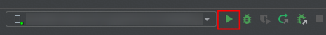
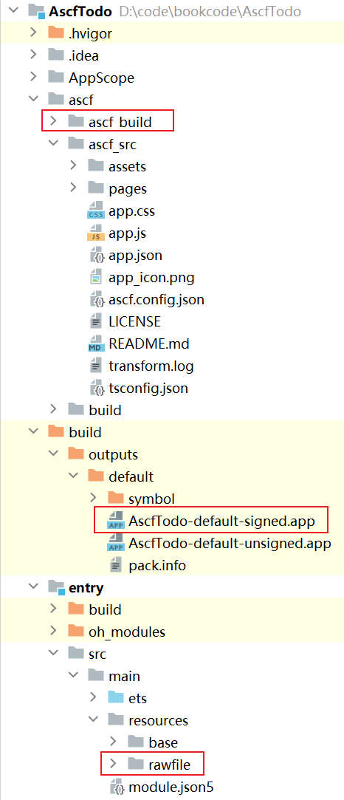
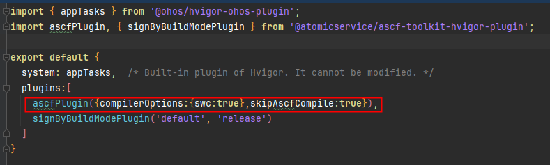

开发者点击右上角运行按钮，就可以自动编译运行元服务。重新构建也会重新编译元服务。

## ASCF构建产物说明

ASCF构建后会将ascf/ascf\_src的内容编译到entry/src/main/resources/rawfile，分包编译到ascf\_build目录下。

然后使用hvigor，在release模式下将项目编译为APP包（默认保存位置为build/outputs/default/AscfTodo-default-signed.app）。在debug模式下将项目编译为HAP/HSP（如果存在分包，主包默认保存位置在entry/build，分包默认保存位置在ascf\_build/subPkgName/build下面的HAP和HSP）。

* ASCF构建产物为HarmonyOS元服务的HAP/HSP/APP包，产物遵循HarmonyOS的[注意事项](https://developer.huawei.com/consumer/cn/doc/harmonyos-guides/ide-compile-build)。
* 请注意代码资产保护。ascf/ascf\_src目录编译时会被打包进rawfile产物中，由于构建产物中包含JS源码，因此请勿将敏感信息存放在该目录下。
* 以debug模式构建的包中的js默认会包含sourcemap内容，可以使用命令行指令中devtool参数关闭。请勿将debug包发给不信任的人，避免源码泄露。

控制编译元服务的行为，可以通过修改项目根路径下hvigorfile.ts文件中plugins字段的ascfPlugin方法中添加参数。

使用参数可以参考[命令行指令选项](https://developer.huawei.com/consumer/cn/doc/atomic-ascf/run-ascf-cli#命令行指令选项)。

compilerOptions参数表示编译模式，默认为babel模式，目前还支持swc模式。

skipAscfCompile参数可以跳过hvigor插件编译，防止覆盖命令行编译的结果。
