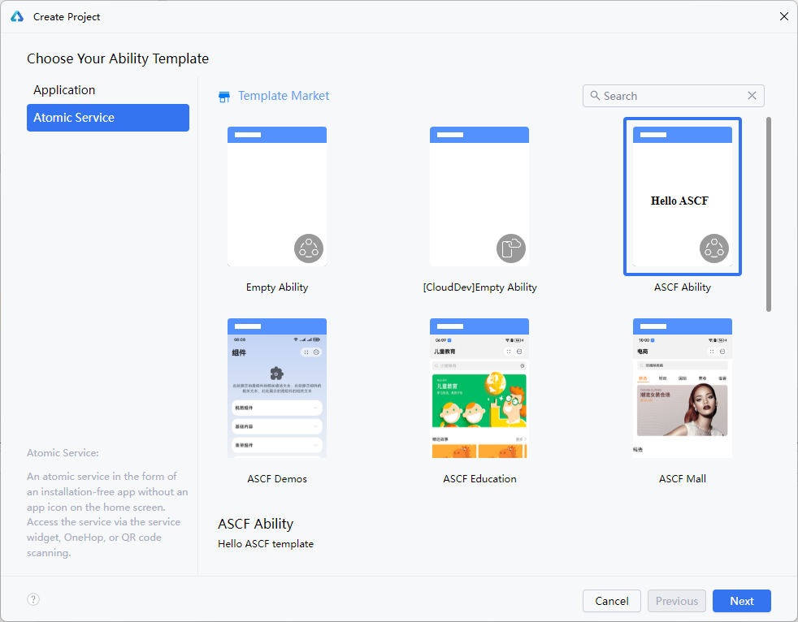
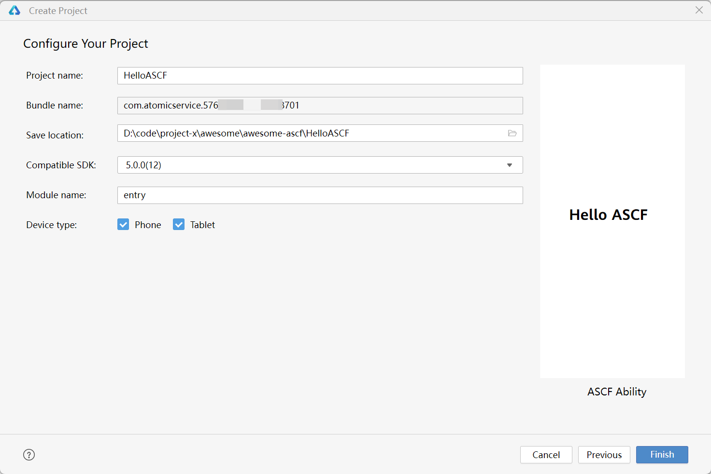

开发者也可以在DevEco Studio中创建新工程，来构建元服务。

1. 打开DevEco Studio，在欢迎页单击**Create Project**，创建一个新工程。
2. 选择创建“**Atomic Service**”，选择**ASCF Ability**模板，然后单击**Next**。

   

   也可以自行选择对应的行业模板进行体验开发。当前已提供教育、电商、新闻、阅读和外卖模板。
3. 填写工程相关信息，单击**Finish**。关于各个参数的详细介绍，请参考[创建一个新的工程](https://developer.huawei.com/consumer/cn/doc/harmonyos-guides/ide-create-new-project)。

   

   创建完成后，和普通元服务的工程类似，默认已经配置了ASCF相关依赖和构建脚本，构建过程中会自动编译ASCF源码。

## 使用默认工程

项目模板中会默认有一个Hello ASCF工程。配置好签名后，即可以本地调试运行。运行效果如下：

