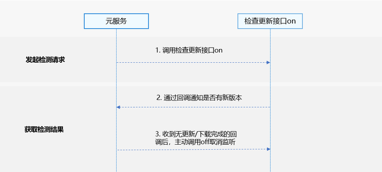

应用市场更新功能为元服务开发者提供监听/取消监听元服务更新检查功能，实现当元服务有/无新版本时提醒元服务开发者的能力，并且在有新版本时能实现自动下载并通知开发者。

## 场景介绍

对于元服务开发者程序内偶遇重大bug、安全问题等紧急修复并且开发者已上架最新版本到应用市场的场景下，提供了监听元服务更新检查功能，使开发者有途径有能力主动升级。

## 业务流程



1. 元服务调用监听元服务更新检查接口。
2. 元服务调用on接口通过回调的方式通知对应元服务是否有新版本。
3. 元服务收到无新版本/已下载完成的回调以后调用off主动取消监听。

## 接口说明

应用市场更新服务提供以下接口，具体API说明详见[接口文档](https://developer.huawei.com/consumer/cn/doc/harmonyos-references/store-updatemanager)。

| 接口名 | 描述 |
| --- | --- |
| [on](https://developer.huawei.com/consumer/cn/doc/harmonyos-references/store-updatemanager#updatemanageronupdatechange)(type: 'updateChange', callback: Callback<[UpdateSessionState](https://developer.huawei.com/consumer/cn/doc/harmonyos-references/store-updatemanager#updatesessionstate)>, timeout?: number): void | 监听元服务更新检查接口，用于给元服务提供监听更新检查能力。 |
| [off](https://developer.huawei.com/consumer/cn/doc/harmonyos-references/store-updatemanager#updatemanageroffupdatechange)(type: 'updateChange', callback?: Callback<[UpdateSessionState](https://developer.huawei.com/consumer/cn/doc/harmonyos-references/store-updatemanager#updatesessionstate)>): void | 取消元服务更新检查监听接口，与on接口配合使用。 |

## 开发步骤

1. 导入updateManager 模块及相关公共模块。

   ```
   import { updateManager } from '@kit.AppGalleryKit';
   import { hilog } from '@kit.PerformanceAnalysisKit';
   import { abilityManager } from '@kit.AbilityKit';
   ```
2. 构造参数。

   入参为Callback<[UpdateSessionState](https://developer.huawei.com/consumer/cn/doc/harmonyos-references/store-updatemanager#updatesessionstate)>类型的callback。

   ```
   let callback = (state: updateManager.UpdateSessionState) => {
         if (state.code === updateManager.RequestErrorCode.NO_UPGRADE) {
           hilog.info (0, 'TAG', `on success, no need update`);
           updateManager.off('updateChange');
         } else if (state.code === updateManager.RequestErrorCode.NEED_UPGRADE) {
           hilog.info (0, 'TAG', `on success, need update`);
         } else if (state.code === updateManager.RequestErrorCode.DOWNLOADED) {
           hilog.info (0, 'TAG', `on success, need update and download success`);
           // 在接收到下载完成的回调以后需要主动off取消监听。
           updateManager.off('updateChange');
           // 这一步开发者可以通过弹窗等方式提示用户新版本已准备好，是否重启元服务。
           abilityManager.restartSelfAtomicService(getContext());
        }
   };
   ```
3. 调用[on](https://developer.huawei.com/consumer/cn/doc/harmonyos-references/store-updatemanager#updatemanageronupdatechange)方法，进行元服务更新检查的事件监听。

   ```
   try {
     updateManager.on('updateChange', callback, 20);
   } catch (error) {
     hilog.error(0, 'TAG', `on Error.code is ${error.code}, message is ${error.message}`);
   }
   ```
