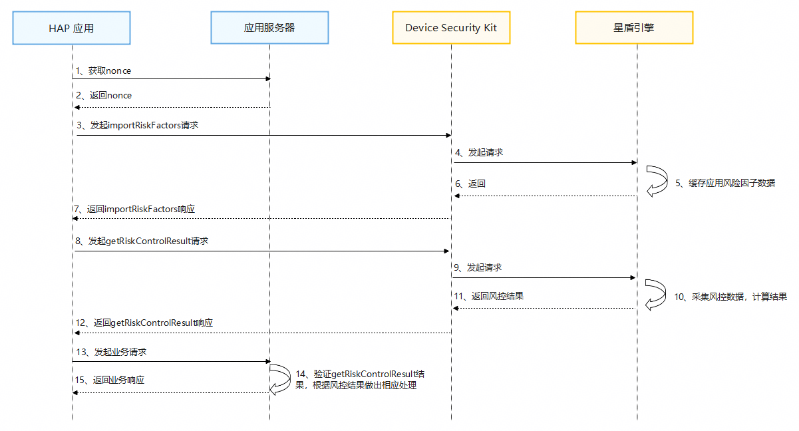

## 场景介绍

从26.0.0 版本开始，新增支持星盾机密风控引擎。

星盾机密风控引擎是一款基于端侧机密计算空间的风控解决方案，依托系统开放风险因子及App专属风险因子，在安全隔离的高安可信环境中，助力业务定制化配置风险识别策略与规则，高效完成风险研判。

依托机密计算环境，保障数据可算不可取、可知不可见、风控策略规则可用不泄露的安全环境。星盾引擎提供灵活、自主、丰富的策略规则配置能力，同时具备接入星盾机密风控引擎的App间联防联控协作机制。

例如在电信防诈场景下，应用使用星盾机密风控引擎识别支付/转账场景下的涉诈风险过程：

1. 在AGC上申请该特性权限，并构建防诈风控策略规则下发至端侧机密计算空间。
2. 在支付/转账环节调用Device Security Kit的[getRiskControlResult](https://developer.huawei.com/consumer/cn/doc/harmonyos-references/devicesecurity-riskcontrolengine-api#getriskcontrolresult)接口获取自定义防诈风控策略结果。
3. 为增强检测能力，应用可通过调用Device Security Kit的[importRiskFactors](https://developer.huawei.com/consumer/cn/doc/harmonyos-references/devicesecurity-riskcontrolengine-api#importriskfactors)接口将App专属风险因子写入端侧机密计算空间，结合系统风险因子，综合设置风险识别规则，用于场景化风险检测。

## 约束与限制

* 风控评分能力支持Phone、Tablet、PC/2in1设备。
* 每个应用在单台设备上，每天最多可以调用10次。

## 业务流程



**流程说明：**

1. **元服务应用获取nonce。**

   元服务应用在调用[importRiskFactors](https://developer.huawei.com/consumer/cn/doc/harmonyos-references/devicesecurity-riskcontrolengine-api#importriskfactors)和[getRiskControlResult](https://developer.huawei.com/consumer/cn/doc/harmonyos-references/devicesecurity-riskcontrolengine-api#getriskcontrolresult)接口时，需传入随机生成的nonce值。返回的检测结果中将包含该nonce值，开发者可通过校验此值确认响应与请求的对应关系，并防范重放攻击。

   

   * nonce值必须为16至66字节之间，有效值为base64编码范围。
   * 推荐的做法是，每次请求都从服务器随机生成新的nonce值。
2. **元服务应用导入应用风险因子数据。**

   Device Security Kit收到请求后，会将应用风险因子数据写入星盾风控引擎，该数据可结合系统风险因子综合参与风控计算。

   元服务应用也可以跳过导入风险因子步骤，直接调用[getRiskControlResult](https://developer.huawei.com/consumer/cn/doc/harmonyos-references/devicesecurity-riskcontrolengine-api#getriskcontrolresult)接口发起风控评分请求。
3. **元服务应用发起风控评分请求。**

   Device Security Kit收到请求后，首先调用星盾机密风控引擎，风控引擎采集风控数据，计算风控评分，最后通过[getRiskControlResult](https://developer.huawei.com/consumer/cn/doc/harmonyos-references/devicesecurity-riskcontrolengine-api#getriskcontrolresult)接口将完整的风控评分结果返回给元服务应用
4. **元服务应用服务器中验证检测结果。**

   当风控评分结果返回后，元服务应用通过解析JWS（JSON Web Signature）格式的返回值先进行签名验证，再根据Payload中的各风控因子项的结果进行相关风控处理。

## 接口说明

以下是星盾机密风控引擎相关接口，更多接口及使用方法请参见[API参考](https://developer.huawei.com/consumer/cn/doc/harmonyos-references/devicesecurity-riskcontrolengine-api)。

| 接口名 | 描述 |
| --- | --- |
| importRiskFactors(data: ImportData): Promise<void> | 导入应用风险因子数据。 |
| getRiskControlResult(params: RiskControlDetectionRequest): Promise<RiskControlDetectionResponse> | 风控评分结果。 |

## 开发步骤

1. 导入Device Security Kit模块及相关公共模块。

   ```
   import { riskControlEngine } from '@kit.DeviceSecurityKit';
   import { BusinessError } from '@kit.BasicServicesKit';
   import { hilog } from '@kit.PerformanceAnalysisKit';
   import { cryptoFramework } from '@kit.CryptoArchitectureKit';
   import { util } from '@kit.ArkTS';
   ```
2. 调用getRiskControlResult接口获取风控评分结果。

   ```
   const TAG = "riskControlEngineJsTest";

   // 导入应用风险因子数据
   let data: riskControlEngine.ImportData = {
     appFactorData: [
       { factorName: "factor_1", factorValue: 3600 },
       { factorName: "factor_2", factorValue: false }
     ],
     nonce: base64.encodeToStringSync(randData.data) // 16-66字节随机数
   };
   try {
     hilog.info(0x0000, TAG, 'ImportRiskFactors begin.');
     await riskControlEngine.importRiskFactors(data);
     hilog.info(0x0000, TAG, 'Succeeded in importRiskFactors.');
   } catch (err) {
     let e: BusinessError = err as BusinessError;
     hilog.error(0x0000, TAG, 'ImportRiskFactors failed: %{public}d %{public}s', e.code, e.message);
   }
   ```
3. 调用getRiskControlResult接口获取风控评分结果。

   ```
   const TAG = "riskControlEngineJsTest";

   let rand = cryptoFramework.createRandom();
   let len = 32;
   let randData = rand.generateRandomSync(len);
   let base64 = new util.Base64Helper();
   // 准备风控检测请求
   const request: riskControlEngine.RiskControlDetectionRequest = {
     policyName: "Policy_1001", // 风险策略
     nonce: base64.encodeToStringSync(randData.data) // 16-66字节随机数
   };

   try {
     hilog.info(0x0000, TAG, 'Getting risk control score begin.');
     const response: riskControlEngine.RiskControlDetectionResponse =
    await riskControlEngine.getRiskControlResult(request);
     // 结果格式为JSON Web Signature (JWS)，需按规范解析验证
     hilog.info(0x0000, TAG, 'Risk control score result: %{public}s', response.result);
   } catch (err) {
     const e: BusinessError = err as BusinessError;
     hilog.error(0x0000, TAG, 'GetRiskControlScore failed: %{public}d %{public}s', e.code, e.message);
   }
   ```
4. 在元服务应用服务器中验证检测结果。

   风险控制接口响应结果，格式为JSON WEB签名（JWS），具体步骤如下：

   1. 解析JWS，获取风险控制评分结果的Header、Payload、Signature。

      **JWS的Header字段如下：**

      ```
      {
        "alg": "ES256",    // 数字签名算法，ES256表示为SHA256withECDSA。
        "typ": "JWS",      // 固定值JWS。
        "x5c": ["","",""]  // Device Security Kit服务器对JWS签名的证书链，包含3级证书。x5c[0]为给JWS签名的证书，x5c[1]为华为设备二级CA，x5c[2]为华为设备ROOT CA。
      }
      ```

      **JWS的Payload字段如下：**

      ```
      {
        "nonce": "xxxxxxxxx",    // 调用getRiskControlResult接口时传入的nonce值Base64编码。
        "RiskDetectionOutput": {
          "status": 0,        // 状态
          "result": "1"      // 风控评分结果
        }
      }
      ```
   2. 从Header中获取证书链，使用[Huawei CBG Device Attestation Root CA](https://pki.consumer.huawei.com/ca/cer/Huawei_CBG_ECC_Device_Attestation_Root_CA.cer)证书对其进行验证。
   3. 校验证书链中是否包含3级证书，并确认证书链中x5c[0]证书的Common Name是否为Harmony OS Device Attestation Service。
   4. 从Signature中获取签名，校验其签名。
   5. 从Payload中获取风控评分结果。
