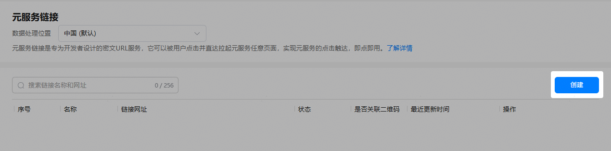
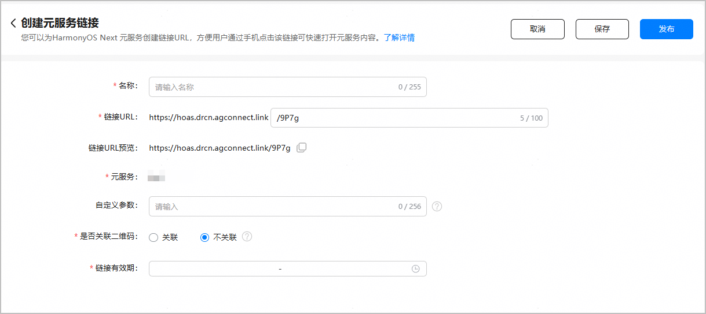
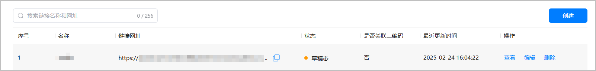
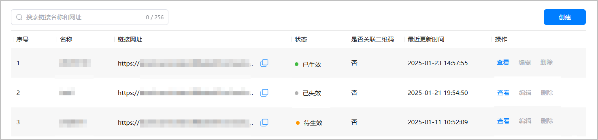
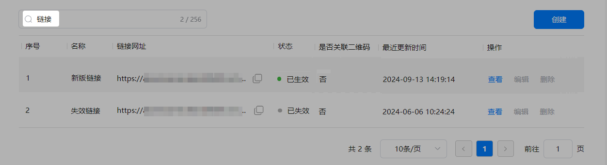
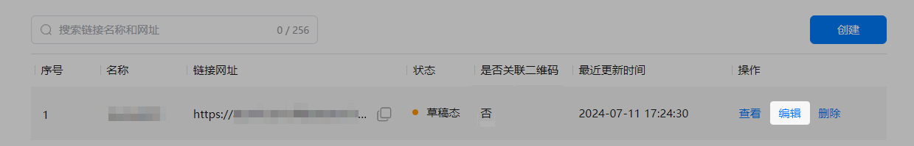

## 简介

元服务链接是专为元服务开发者设计的密文URL服务，可以直达元服务任意页面。作为开发者，您可以为自己的元服务生成并配置专属的元服务链接，同时设置其有效期，精准把握用户访问的时效与范围，将用户在时效内引导至元服务任意指定页面。

例如：当用户接收到“手机充值”的元服务链接后，他们可以通过点击该链接直接跳转至相应的元服务页面，实现一步直达的便捷体验。

## 使用场景

* **适用于社交分享内容传播场景**：对于有高频分享场景的元服务，通过链接形式配合华为分享能力不仅简化了分享内容，还为用户提供了便捷流程的访问途径，提升用户体验。
* **适用于唤醒沉默用户、激发用户活跃度的场景**：对于需要快速获得用户注意或启动特定功能的元服务，元服务链接配合短信或者PUSH消息能够减少用户操作步骤，提升服务响应速度。
* **适用于日常营销推广，广告优质引流的场景**：在元服务推广营销过程中，元服务链接作为广告内容与用户的桥梁，能有效引导用户进入并体验元服务，增强广告转化率。

## 约束与限制

从5.0.0(12)版本开始，支持Phone、Tablet设备。

## 前提条件

* 您的账号是[企业开发者](https://developer.huawei.com/consumer/cn/doc/start/edrna-0000001062678489)账号。
* 您已在[AppGallery Connect](https://developer.huawei.com/consumer/cn/service/josp/agc/index.html)（简称AGC）上，[创建项目](https://developer.huawei.com/consumer/cn/doc/app/agc-help-create-project-0000002242804048)且[创建元服务](https://developer.huawei.com/consumer/cn/doc/app/agc-help-create-atomic-service-0000002247795706)。
* 您已在AGC[开通App Linking服务](https://developer.huawei.com/consumer/cn/doc/AppGallery-connect-Guides/agc-applinking-enable-0000001058870473)。

## 接入元服务链接开发指导

### 创建元服务链接

1. 登录[AppGallery Connect](https://developer.huawei.com/consumer/cn/service/josp/agc/index.html)，点击“快速开始”中的“元服务一站式平台”卡片。

   
2. 在左上角下拉列表选择要创建链接的元服务。

   
3. 左侧导航选择“基础服务 > 元服务链接”，点击元服务链接页面右上角的“创建”。

   

   如果您尚未开通App Linking服务，将进入App Linking介绍页面，请点击“立即使用”并[设置数据处理位置](https://developer.huawei.com/consumer/cn/doc/app/agc-help-data-location-0000002277923065#section154810363471)。

   
4. 创建元服务链接，点击“保存”或者“发布”。

   

   | 参数 | 说明 |
   | --- | --- |
   | 名称 | 配置元服务链接的名称。 |
   | 链接URL | 配置元服务链接：  前缀为平台固定域名，开发者不能修改或自定义；后缀字符串，默认由AGC自动生成，如需自行定义，应确保该字符串唯一且长度不超过100位。  说明：  后缀字符串只能包含英文字母（a-z、A-Z）、数字（0-9）、下划线“\_”和连字符“-”。 |
   | 链接URL预览 | 预览完整的元服务链接，支持复制。  说明：  （可选）开发者在使用元服务链接时，支持在链接URL后拼接动态自定义参数，用于精确定位到元服务指定页面。无需在AGC平台进行额外配置，直接拼接**?**加**key=value**键值对，多个键值对之间以“&”分隔。  链接示例：https://hoas.drcn.agconnect.link/9P7g**?****key1=value1&key2=value2**  具体请参见[使用动态自定义参数跳转到指定的页面](#section1620481746)。 |
   | 元服务 | 需要配置链接的元服务的名称，支持复制。 |
   | （可选）自定义参数 | 配置静态自定义参数，用于精确定位到元服务指定页面。需要按key=value的键值对形式输入，多个键值对之间以“&”分隔。例如：key1=value1&key2=value2&key3=value3...  具体请参见[使用静态自定义参数跳转到指定的页面](#section125451919568)。 |
   | 是否关联二维码 | 是否将元服务与普通链接二维码进行关联。  本章节仅介绍如何使用元服务链接进行跳转，请选择“不关联”。  说明：  如果希望用户扫描普通链接二维码后跳转到元服务，请选择“关联”并参见[使用普通链接二维码跳转元服务](https://developer.huawei.com/consumer/cn/doc/atomic-guides/atomic-qrlinking)。 |
   | 链接有效期 | 链接有效期生效时间段需在1~90天范围内；结束时间必须晚于当前时间。 |

* 点击“保存”后，元服务链接为“草稿态”，您可以[查看元服务链接](#section1622082711157)、[修改草稿态元服务链接](#section1851363511152)或者[删除元服务链接](#section325544141614)。

  
* 点击“发布”后，AGC会判断当前时间是否在链接有效期内，并实时更新元服务链接状态：“待生效”、“已生效”或“已失效”，此时元服务链接将不支持编辑和删除操作。

  

### （可选）使用动态自定义参数跳转到指定的页面

开发者在AGC生成元服务链接后，可在链接URL的末尾添加动态自定义参数，从而精确定位到元服务指定页面。

链接示例：https://hoas.drcn.agconnect.link/9P7g**?****key1=value1&key2=value2**

其中，?后为动态参数，由开发者自行拼接，无需在AGC平台进行额外配置。


在[通过系统浏览器或ArkWeb拉起元服务](#section151221828161112)的场景中，不支持使用动态自定义参数。

代码示例：在元服务的Ability（如EntryAbility）的onCreate()或者onNewWant()生命周期回调中添加如下代码，以处理传入的链接。

```
import { AbilityConstant, UIAbility, Want } from '@kit.AbilityKit';
import { hilog } from '@kit.PerformanceAnalysisKit';
import { url } from '@kit.ArkTS';
export default class EntryAbility extends UIAbility {
  onCreate(want: Want, launchParam: AbilityConstant.LaunchParam): void {
    // 从want中获取传入的链接信息。
    // 如传入的url为：https://hoas.drcn.agconnect.link/9P7g?action=showall
    let uri = want?.uri;
    if (uri) {
      // 从链接中解析query参数，拿到参数后，开发者可根据自己的业务需求进行后续的处理。
      try {
        let urlObject = url.URL.parseURL(uri);
        let action = urlObject.params.get('action');
        // 例如，当action为showall时，展示所有的节目。
        if (action === "showall"){
          // ...
        }
        // ...
      } catch (error) {
        hilog.error(0x0000, 'testTag', `Failed to parse url.`);
      }
    }
  }
}
```

### （可选）使用静态自定义参数跳转到指定的页面

开发者在创建元服务链接时，可设置静态自定义参数来精确定位到元服务指定页面。使用场景有如下两种：

* 场景一：元服务链接直接跳主包页面，无需传递subPackageName。
* 场景二：元服务链接跳转到子包时，需要配置subPackageName参数，指定子包名称。

  

  subPackageName是系统保留KEY，仅用于子包提前安装，请勿作为静态自定义参数使用。

开发者跳转到指定页面，可以通过静态自定义参数，在运行时解析然后跳转到指定页面。跳转子页面实现示例：

* 示例一：使用router路由方式进行页面跳转。
  1. 在AGC上配置元服务链接时，需要将页面路径配置到静态自定义参数中，示例如下：

     ```
     pagePath=pages/SubPage
     ```

     

     如果需要跳转到分包的页面，则pagePath需要配置为：@bundle:包名（bundleName）/模块名（moduleName）/路径/页面所在的文件名，例如：pagePath=@bundle:com.atomicservice.123456789/library/ets/pages/SubPage
  2. 在元服务的Ability（如EntryAbility）的onCreate()生命周期回调中解析从AGC传入的静态自定义参数，并在onWindowStageCreate()生命周期回调中实现跳转到指定页面。

     ```
     import { UIAbility, Want } from '@kit.AbilityKit';
     import { hilog } from '@kit.PerformanceAnalysisKit';
     import { window } from '@kit.ArkUI';

     export default class EntryAbility extends UIAbility {
       // 用来保存通过router方式从元服务链接跳转到指定的页面
       pagePath: string = '';

       onCreate(want: Want): void {
         this.resolvePagePath(want);
         hilog.info(0x0000, 'testTag', '%{public}s', 'Ability onCreate');
       }

         onWindowStageCreate(windowStage: window.WindowStage): void {
         // Main window is created, set main page for this ability
         hilog.info(0x0000, 'testTag', '%{public}s', 'Ability onWindowStageCreate');

         if(this.pagePath){
           windowStage.loadContent(this.pagePath, (err) => {
             if (err.code) {
               hilog.error(0x0000, 'testTag', '%{public}s', `Failed to load the content, cause: ${JSON.stringify(err)}`);
               return;
             }
             hilog.info(0x0000, 'testTag', '%{public}s', 'Succeeded in loading the content.');
           });
         }
         else{
           windowStage.loadContent('pages/Index', (err) => {
             if (err.code) {
               hilog.error(0x0000, 'testTag', '%{public}s', `Failed to load the content, cause: ${JSON.stringify(err)}`);
               return;
             }
             hilog.info(0x0000, 'testTag', '%{public}s', 'Succeeded in loading the content.');
           });
         }
       }

       resolvePagePath(want: Want){
         // 从want中获取传入的链接信息。如传入的url为：https://hoas.drcn.agconnect.link/9P7g
         let uri = want?.uri;
         hilog.info(0x0000, 'testTag', '%{public}s', `uri is: ${uri}`);
         if (uri) {
           // 解析通过router跳转的页面
           this.pagePath =  want.parameters?.['pagePath'] as string;
           hilog.info(0x0000, 'testTag', '%{public}s', `pagePath is: ${this.pagePath}`);
         }
       }
     }
     ```

* 示例二：使用Navigation路由跳转到指定NavDestination。
  1. 在AGC上配置元服务链接时，需要将NavDestination页面名称配置到静态自定义参数中，示例如下：

     ```
     navRouterName=ProductList
     ```

     

     + 静态自定义参数navRouterName指定需要跳转的NavDestination，取值为自定义pageMap方法中相应的值或者系统路由表routerMap中相应的name值（例如示例中的ProductList）。
     + 如果需要分包中的NavDestination，则需要在静态自定义参数配置中增加配置subPackageName，指定需要跳转的NavDestination所在的分包名称，例如需要跳转到名称为product这个分包中的NavDestination（系统路由表中NavDestination对应的名称为ProductDetail），则静态自定义参数配置为subPackageName=product&navRouterName=ProductDetail。
  2. 在元服务的Ability（如EntryAbility）的onCreate()生命周期回调中解析从AGC传入的静态自定义参数，并通过LocalStorage共享到UI界面。

     ```
     import { UIAbility, Want } from '@kit.AbilityKit';
     import { hilog } from '@kit.PerformanceAnalysisKit';
     import { window } from '@kit.ArkUI';

     export default class EntryAbility extends UIAbility {
       // 用来共享ability中的对象到页面中
       storage: LocalStorage|null = null;

       onCreate(want: Want): void {
         hilog.info(0x0000, 'testTag', '%{public}s', `want in onCreate is ${JSON.stringify(want)}`);
         this.resolveNavigationRouter(want);
         hilog.info(0x0000, 'testTag', '%{public}s', 'Ability onCreate');
       }

       onDestroy(): void {
         hilog.info(0x0000, 'testTag', '%{public}s', 'Ability onDestroy');
       }

       onWindowStageCreate(windowStage: window.WindowStage): void {
         // Main window is created, set main page for this ability
         hilog.info(0x0000, 'testTag', '%{public}s', 'Ability onWindowStageCreate');
         windowStage.loadContent('pages/Index', this.storage, (err) => {
           if (err.code) {
             hilog.error(0x0000, 'testTag', '%{public}s', `Failed to load the content. cause: ${JSON.stringify(err)}`);
             return;
           }
           hilog.info(0x0000, 'testTag', '%{public}s', 'Succeeded in loading the content.');
         });
       }

       resolveNavigationRouter(want: Want){
         // 从want中获取传入的链接信息，如传入的url为：https://hoas.drcn.agconnect.link/9P7g
         let uri = want?.uri;
         hilog.info(0x0000, 'testTag', '%{public}s', `uri is: ${uri}`);
         if (uri) {
           // 解析Navigation跳转页面的静态自定义参数
           const navRouterName =  want.parameters?.['navRouterName'] as string;
            hilog.info(0x0000, 'testTag', '%{public}s', `navRouterName is: ${navRouterName}`);

           const subPackageName =  want.parameters?.['subPackageName'] as string;
           hilog.info(0x0000, 'testTag', '%{public}s', `subPackageName is: ${subPackageName}`);

           let para: Record<string, string> = { 'navRouterName': navRouterName , 'subPackageName': subPackageName};
           this.storage = new LocalStorage(para);
         }
       }
     }
     ```
  3. 在pages/Index中跳转到指定NavDestination。

     ```
     import { NavPushPathHelper } from '@kit.ArkUI';
     import { BusinessError } from '@kit.BasicServicesKit';
     import { hilog } from '@kit.PerformanceAnalysisKit';

     @Entry({ useSharedStorage: true })
     @Component
     struct Index {
       pathStack: NavPathStack = new NavPathStack();
       helper: NavPushPathHelper = new NavPushPathHelper(this.pathStack);
       @LocalStorageProp('subPackageName') subPackageName:string = '';
       @LocalStorageProp('navRouterName') navRouterName:string = '';

         build() {
         // 把页面栈对象传入Navigation
         Navigation(this.pathStack) {
             // 首页的页面内容
         }
         .title('Main');
       }
       aboutToAppear(): void{
         if(this.navRouterName){
           if(this.subPackageName){
             this.helper.pushPath(this.subPackageName, { name: this.navRouterName }, false)
               .then(() => {
                 hilog.info(0x0000, 'testTag', '%{public}s', 'Succeeded in pushing the route page.');
               })
               .catch((error: BusinessError) => {
                 hilog.info(0x0000, 'testTag', '%{public}s', `Failed to push the route page, code: ${error.code}, message: ${error.message}.`);
               });
           }
           else{
             this.pathStack.pushPathByName(this.navRouterName, null, false);
           }
         }
       }
     }
     ```

### 查看元服务链接

1. 查看元服务链接列表。

   支持在元服务链接页面的搜索框内，输入链接名称或网址可以进行模糊查询。

   
2. 查看元服务链接信息详情。

   点击目标元服务链接“操作”列的“查看”，即可查看元服务链接的基本信息。

   

### 修改草稿态元服务链接

点击“操作”列的“编辑”，可进入编辑界面进行内容修改，完成后选择“保存”或者“发布”。



### 删除元服务链接

仅“草稿态”的元服务链接支持删除，点击“操作”列的“删除”，在弹框中点击“确认”，即可删除元服务链接。


## 使用元服务链接拉起元服务

### 通过openLink接口拉起元服务

拉起方应用通过[UIAbilityContext.openLink()](https://developer.huawei.com/consumer/cn/doc/harmonyos-references/js-apis-inner-application-uiabilitycontext#openlink12)接口，传入目标元服务链接，从而拉起目标元服务。

openLink接口提供“以App Linking打开元服务”的方式进行目标元服务页跳转，开发者可根据业务需求进行编译。

若有匹配的元服务，则直接打开目标元服务；否则，抛异常给开发者进行处理。

为验证元服务链接的配置是否正确，请参照如下示例代码：

1. 在“entry/src/main/ets/common”目录下添加GlobalContext.ets文件，开发初始化和获取应用上下文的接口。

   ```
   import { common } from '@kit.AbilityKit';

   export class GlobalContext {
     private static context: common.UIAbilityContext;

     public static initContext(context: common.UIAbilityContext): void {
       GlobalContext.context = context;
     }

     public static getContext(): common.UIAbilityContext {
       return GlobalContext.context;
     }
   }
   ```
2. 在“entry/src/main/ets/entryability/EntryAbility.ets”文件中导入GlobalContext，在onCreate方法中使用GlobalContext.initContext(this.context)初始化全局应用上下文。
3. 在“entry/src/main/ets/pages/Index.ets”文件中，使用[UIAbilityContext.openLink()](https://developer.huawei.com/consumer/cn/doc/harmonyos-references/js-apis-inner-application-uiabilitycontext#openlink12)接口打开元服务。

   ```
   import { BusinessError } from '@kit.BasicServicesKit';
   import { hilog } from '@kit.PerformanceAnalysisKit';
   import { GlobalContext } from '../common/GlobalContext';

   @Entry
   @Component
   struct Index {
     build() {
       Button('start link', { type: ButtonType.Capsule, stateEffect: true })
         .width('87%')
         .height('5%')
         .margin({ bottom: '12vp' })
         .onClick(() => {
           let context = GlobalContext.getContext();
           // link可替换成开发者自行配置的元服务链接
           let link: string = "https://hoas.drcn.agconnect.link/9P7g";
           context.openLink(link)
             .then(() => {
               hilog.info(0x0000, 'testTag', '%{public}s', 'Succeeded in opening the link.');
             })
             .catch((error: BusinessError) => {
               hilog.error(0x0000, 'testTag', `Failed to open link, code: ${error.code}, message: ${error.message}`);
             })
         })
     }
   }
   ```

以“手机充值”元服务为例，代码中link若为该元服务首页的链接，当拉起方应用成功触发链接，弹窗提示“‘应用名’是否打开元服务”，点击“打开”则成功实现链接跳转元服务功能。

接口openLink还可以设置appLinkingOnly参数：

* 当参数设为true时：若系统查找到匹配的元服务，则直接打开目标元服务；否则抛异常给开发者进行处理。
* 当参数设为false或者默认时：若系统查找到匹配的元服务，则直接打开目标元服务；若检测到元服务链接非法或失效，则会拉起web界面。

```
context.openLink(link, { appLinkingOnly: true })
.then(() => {
  hilog.info(0x0000, 'testTag', '%{public}s', 'Succeeded in opening the link.');
})
```

### 通过系统浏览器或ArkWeb拉起元服务

ArkWeb深度集成了App Linking的能力，当用户在系统浏览器或者集成ArkWeb的元服务网页上点击某个链接时，若有链接匹配的元服务，系统会通过App Linking能力跳转至该元服务档案页，引导用户点击【打开元服务】，从而拉起目标元服务。


该场景不支持使用动态自定义参数。

### 报错场景

1. 元服务链接过期失效后，系统提示报错如下：
   * 当appLinkingOnly参数设为true时：点击链接会跳转失败，抛出openlink failed的错误码"16000019"。
   * 当appLinkingOnly参数设为false或者默认时：会使用浏览器打开链接地址，展示异常错误页面。
2. 输入链接检测为非元服务链接，如应用链接或无效链接等，系统提示报错如下：
   * 当appLinkingOnly参数设为true时：优先判别是否为应用链接，如果为应用链接则会跳转至本地预安装的应用服务页面；否则在点击链接时会跳转失败，系统抛出openlink failed的错误码"16000019"。
   * 当appLinkingOnly参数设为false或者默认时：优先判别是否为应用链接，如果为应用链接，则会跳转至本地预安装的应用服务页面；否则尝试通过浏览器网页打开。
