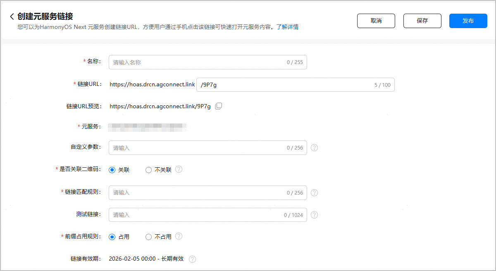
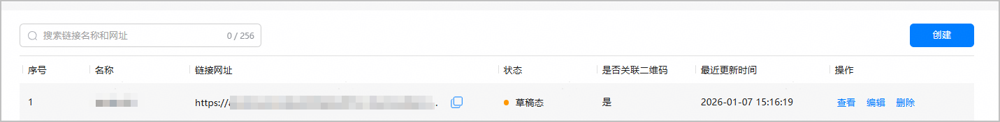
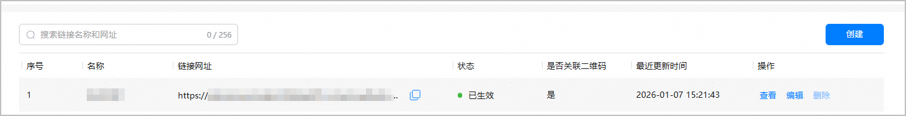
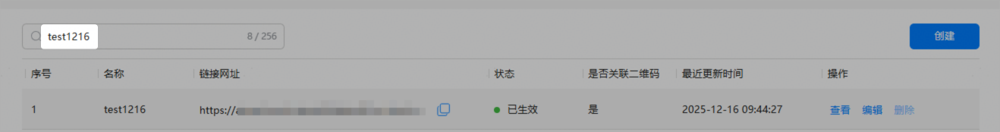
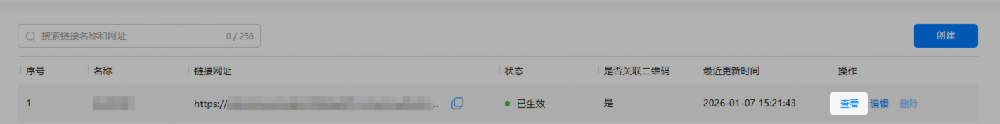
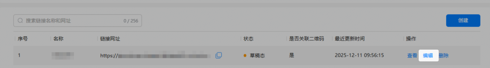
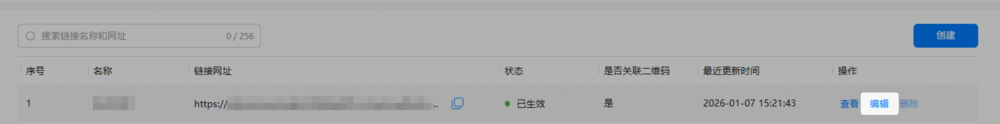
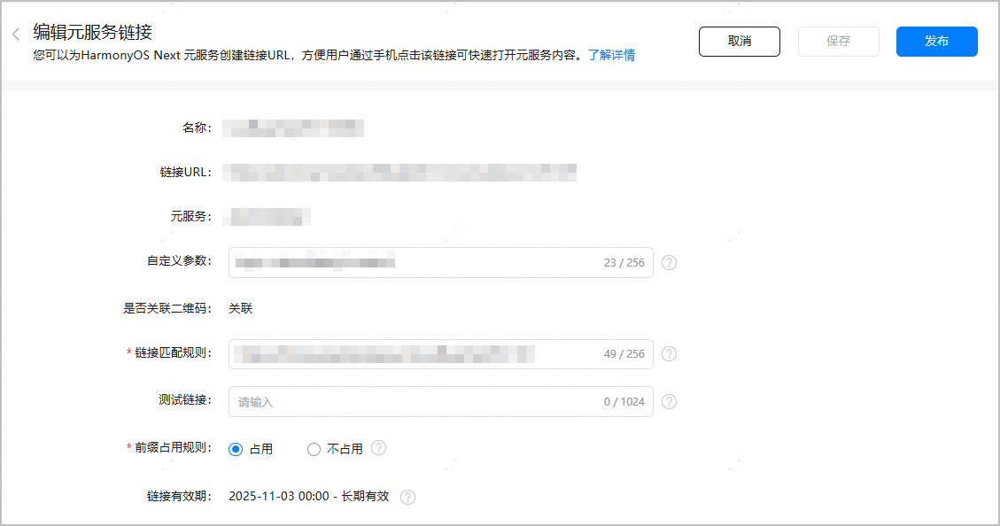
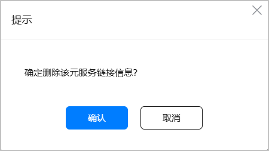

## 简介

普通链接二维码是通过工具对网页链接进行编码后生成的，与元服务链接生成的二维码相对应。当开发者使用普通链接二维码关联元服务时，不受元服务链接固定域名的限制，可以使用自己的域名，复用现有的二维码资源，从而促进引流。同时，用户只需扫描二维码，无需手动输入网址，即可快速访问指定的元服务页面，提升用户体验。

## 使用场景

* **适用于活动推广场景：**通过生成包含活动链接的二维码，用户可以轻松参与活动，提高活动的曝光率和参与度。
* **适用于线上/线下下单场景**：用户扫描二维码即可直达元服务页面，进行选购下单操作，提升订单转化率。
* **适用于客服咨询、技术支持场景：**二维码可以快速引导用户进入服务页面，简化操作流程，提高服务效率。

## 约束与限制

从5.1.1(19)版本开始，支持Phone、Tablet设备。

## 前提条件

* 您的账号是[企业开发者](https://developer.huawei.com/consumer/cn/doc/start/edrna-0000001062678489)账号。
* 您已在[AppGallery Connect](https://developer.huawei.com/consumer/cn/service/josp/agc/index.html)（简称AGC）上，[创建项目](https://developer.huawei.com/consumer/cn/doc/app/agc-help-create-project-0000002242804048)且[创建元服务](https://developer.huawei.com/consumer/cn/doc/app/agc-help-create-atomic-service-0000002247795706)。
* 您已在AGC[开通App Linking服务](https://developer.huawei.com/consumer/cn/doc/AppGallery-connect-Guides/agc-applinking-enable-0000001058870473)。

## 接入普通链接二维码开发指导

1. [建立域名与元服务关联关系](#section2707831131517)。
2. [将元服务关联二维码链接](#section48651523147)。
3. [（可选）获取二维码的码值](#section64441417155120)。

### 建立域名与元服务关联关系

在开发者的网站域名服务器上做如下配置。后续配置该网站域名时，系统会通过此文件确认哪些元服务才是合法归属于此域名的，使链接更加安全可靠。

1. 创建域名配置文件applinking.json，内容如下：

   ```
   {
    "applinking": {
      "atomicServices": [
        {
          "appIdentifier": "1234567"
        }
      ]
    }
   }
   ```

   

   * appIdentifier填写创建元服务时生成的APP ID，获取方式请参见[查看应用信息](https://developer.huawei.com/consumer/cn/doc/app/agc-help-view-app-info-0000002282674569)。
   * 同一个网站域名可以关联多个元服务，只需要在"atomicServices"列表里放置多个"appIdentifier"元素即可，其中每个"appIdentifier"元素对应每个元服务。
2. 将配置文件放在域名服务器的固定目录下：

   https://*domain.name*/.well-known/applinking.json

   例如域名为www.example.com，则必须将applinking.json文件放在如下位置：

   https://www.example.com/.well-known/applinking.json

### 将元服务关联二维码链接

1. 登录[AppGallery Connect](https://developer.huawei.com/consumer/cn/service/josp/agc/index.html)，点击“快速开始”中的“元服务一站式平台”卡片。

   
2. 在左上角下拉列表选择要关联二维码链接的元服务。

   
3. 左侧导航选择“基础服务 > 元服务链接”，点击元服务链接页面右上角的“创建”。

   

   如果您尚未开通App Linking服务，将进入App Linking介绍页面，请点击“立即使用”并[设置数据处理位置](https://developer.huawei.com/consumer/cn/doc/app/agc-help-data-location-0000002277923065#section154810363471)。

   
4. 创建元服务链接，点击“保存”或者“发布”。

   

   | 参数 | 说明 |
   | --- | --- |
   | 名称 | 配置元服务链接的名称。 |
   | 链接URL | 配置元服务链接：  前缀为平台固定域名，开发者不能修改或自定义；后缀字符串，默认由AGC自动生成，如需自行定义，应确保该字符串唯一且长度不超过100位。  说明：  后缀字符串只能包含英文字母（a-z、A-Z）、数字（0-9）、下划线“\_”和连字符“-”。 |
   | 链接URL预览 | 预览完整的元服务链接，支持复制。  说明：  （可选）开发者在使用元服务链接时，支持在链接URL后拼接动态自定义参数，用于精确定位到元服务指定页面。无需在AGC平台进行额外配置，直接拼接**?**加**key=value**键值对，多个键值对之间以“&”分隔。  链接示例：https://hoas.drcn.agconnect.link/9P7g**?****key1=value1&key2=value2**  具体请参见[使用动态自定义参数跳转到指定的页面](https://developer.huawei.com/consumer/cn/doc/atomic-guides/atomic-applinking#section1620481746)。 |
   | 元服务 | 需要配置链接的元服务的名称，支持复制。 |
   | （可选）自定义参数 | 配置静态自定义参数，用于精确定位到元服务指定页面。需要按key=value的键值对形式输入，多个键值对之间以“&”分隔。例如：key1=value1&key2=value2&key3=value3...  具体请参见[使用静态自定义参数跳转到指定的页面](https://developer.huawei.com/consumer/cn/doc/atomic-guides/atomic-applinking#section125451919568)。 |
   | 是否关联二维码 | 是否将元服务与普通链接二维码进行关联。  本章节介绍如何使用普通链接二维码跳转元服务，请选择“关联”。  说明：  如果选择“不关联”，请参见[使用元服务链接跳转元服务](https://developer.huawei.com/consumer/cn/doc/atomic-guides/atomic-applinking)。 |
   | 链接匹配规则 | 配置跳转元服务的二维码链接的匹配规则。  注意：  请提前[建立域名与元服务关联关系](#section2707831131517)，否则链接匹配规则校验不通过，无法成功发布元服务链接。  **链接匹配规则组成部分：** 1. （必选）协议：仅支持http或https，精确匹配。 2. （必选）域名：精确匹配。 3. （可选）子路径：    1. 如果链接匹配规则以/结尾，则匹配任意以该规则为前缀的子路径。    2. 如果链接匹配规则不以/结尾，则不支持子路径匹配：       1. {协议+域名+子路径}与链接匹配规则一致，匹配成功。       2. {协议+域名+子路径}与链接匹配规则不一致时，匹配失败。 4. （可选）动态参数：在URL中的“?”后，采用前缀匹配（即必须以链接匹配规则中配置的动态参数开始）。  **链接匹配规则示例：**  * 示例1：https://www.example.com/a 二维码链接可以是**https://www.example.com/a**、**https://www.example.com/a?t=2**等结构，不能是**https://www.example.com/a****/****b**的结构。 * 示例2：https://www.example.com/a/ 二维码链接可以是**https://www.example.com/a/****b**、**https://www.example.com/a/b?t=1**、**https://www.example.com/a/b?t=1****&f=2**等结构。 * 示例3：https://www.example.com/a?t=1 二维码链接必须以**https://www.example.com/a?t=1**开头，可以是**https://www.example.com****/a?t=1**、**https://www.example.com/a?t=1****&f=2**等结构，不能是**https://www.example.com/a?t=12**的结构。 **链接匹配规则限制：**  1. 链接匹配规则具有全局唯一性，不能配置完全相同的链接匹配规则。 2. 每个元服务最多关联100个链接匹配规则。 |
   | （可选）测试链接 | 填写用于测试的二维码完整链接。如果测试链接和**链接匹配规则**不符合，界面将提示配置错误。  此步骤用于提前验证配置的链接匹配规则，确保配置的二维码链接能准确跳转到元服务。  多个测试链接使用英文分号分隔，例如：https://www.example.com/a/b;https://www.example.com/a/b?t=1 |
   | 前缀占用规则 | 选择是否占用符合二维码匹配规则的所有子规则。  默认选择占用，表示其他元服务不可配置该元服务设置的前缀匹配规则的子规则。 |
   | 链接有效期 | 链接有效期默认为长期有效。 |

* 点击“保存”后，元服务链接为“草稿态”，您可以[查看元服务链接](#section1622082711157)、[修改草稿态元服务链接](#section1851363511152)或者[删除元服务链接](#section325544141614)。

  

  如果您填写了测试链接，可以通过扫描配置的测试链接对应的二维码，验证是否能够成功跳转到元服务，以确保元服务页面的路由逻辑准确无误。

  
* 点击“发布”后，元服务链接会立即生效，您可以[查看元服务链接](#section1622082711157)或者[修改发布态元服务链接](#section541460111110)，但不支持删除。

### 查看元服务链接

1. 查看元服务链接列表。

   支持在元服务链接页面的搜索框内，输入链接名称或网址可以进行模糊查询。

   
2. 查看元服务链接信息详情。

   点击目标元服务链接“操作”列的“查看”，即可查看元服务链接的基本信息。

   

### 修改草稿态元服务链接

点击“操作”列的“编辑”，可进入编辑界面进行内容修改，完成后选择“保存”或者“发布”。



### 修改发布态元服务链接

如果您的元服务链接状态为“已生效”，则支持编辑操作。

1. 点击“操作”列的“编辑”，进入编辑界面。

   
2. 修改元服务链接相关内容，完成后不可保存，只支持点击“发布”，发布后立即生效。

   

   仅支持修改“自定义参数”、“链接匹配规则”、“测试链接”和“前缀占用规则”。

   

### 删除元服务链接

仅“草稿态”的元服务链接支持删除，点击“操作”列的“删除”，在弹框中点击“确认”，即可删除元服务链接。



## 使用普通链接二维码拉起元服务

当元服务链接与普通链接二维码关联后，用户可以通过扫描二维码拉起目标元服务。

## （可选）获取二维码的码值

用户扫描普通链接二维码时，会将二维码的码值传递给元服务。开发者可以根据二维码码值，引导用户跳转至不同的元服务页面或提供不同的业务服务，例如扫码点餐、扫码注册会员等。

二维码码值可以从want的orgScanCode参数中读取，示例代码如下：

```
import { AbilityConstant, UIAbility, Want } from '@kit.AbilityKit';
import { hilog } from '@kit.PerformanceAnalysisKit';
import { url } from '@kit.ArkTS';
export default class EntryAbility extends UIAbility {
  onCreate(want: Want, launchParam: AbilityConstant.LaunchParam): void {
    // 从want中获取传入的码值信息。
    // 如传入的码值信息url为：https://www.example.com/programs?action=showall
    let orgScanCode = want?.parameters?.orgScanCode as string;
    if (orgScanCode) {
      // 从链接中解析query参数，拿到参数后，开发者可根据自己的业务需求进行后续的处理。
      try {
        let urlObject = url.URL.parseURL(orgScanCode);
        let action = urlObject.params.get('action');
        // 例如，当action为showall时，展示所有的节目。
        if (action === "showall"){
          // ...
        }
        // ...
      } catch (error) {
        hilog.error(0x0000, 'testTag', `Failed to parse orgScanCode.`);
      }
    }
  }
}
```
