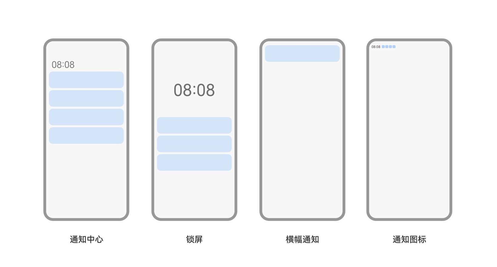

Push Kit（推送服务）是华为提供的消息推送平台，建立了从云端到终端的消息推送通道。所有HarmonyOS元服务可通过集成Push Kit，实现向元服务实时推送消息，使消息易见，构筑良好的用户关系，提升用户的感知度和活跃度。

## 产品优势

**稳定的消息发送通道**

Push Kit通过提供系统级长连接，即使元服务进程不在也能实时推送消息。

## 推送消息提示场景

推送消息指的是元服务**通过Push Kit发送的**，在华为终端设备上显示的通知消息。显示场景主要包括通知中心、锁屏、横幅、桌面图标角标与通知图标。

有关各场景的详细说明请参见[通知提示场景](https://developer.huawei.com/consumer/cn/doc/design-guides/system-features-notification-0000001793074217#section162699204401)。

元服务消息没有桌面图标角标。

## 推送消息类型

Push Kit支持元服务推送以下消息类型：

| 消息类型 | 说明 |
| --- | --- |
| [基于账号的服务通知订阅消息](https://developer.huawei.com/consumer/cn/doc/atomic-guides/push-as-subscription) | 当登录华为账号的用户同意订阅消息后，元服务可基于服务通知模板向用户发送订阅消息。当前仅支持一次性订阅模板。  适用场景：适用于外卖取餐、物流订单、活动提醒等各类服务通知场景，实际支持场景以服务通知提供的模板类型为准。 |
| [基于账号的服务动态消息](https://developer.huawei.com/consumer/cn/doc/atomic-guides/push-as-timeline) | 通过服务动态消息，开发者可以基于订单向用户推送关键节点的动态消息，及时提醒用户订单进度。  适用场景：外卖自取、外卖配送、酒店民宿入住、航班出行等场景。 |

## 约束和限制

### 影响送达率的因素说明

Push Kit致力于提供安全可靠的系统级消息发送通道，保障消息成功送达。影响消息送达率的因素：

* 终端设备是否在线。如果设备离线，Push Kit会缓存消息，待设备上线后，再将消息推送给设备。
* 终端设备上元服务是否被卸载。
* 终端设备的网络状况是否稳定。
* 终端设备的安全控制策略。

### 推送消息的及时性

在终端设备网络条件良好且不拥堵情况下，Push Kit将使用智能推送策略以减少推送消息的时延。

### 推送消息长度与数量限制

* 消息体最大不能超过4096Bytes。
* 消息发送量，单个元服务每天最多推送3000条消息到单个设备上。

### 网络受限说明

如果终端设备连接的网络配置了防火墙，也会影响消息的送达率，请检查以下端口号是否被禁用。

端口号：

* 5223
* 443

终端设备连接的推送服务器的IP是动态分配的，无法通过配置IP白名单方式放行。建议连接不受限的网络或放通以上端口。

### 支持的国家/地区

Push Kit当前[支持的设备](https://developer.huawei.com/consumer/cn/doc/harmonyos-guides/push-kit-introduction#支持的设备)中Wearable设备支持的国家请参见[支持的国家/地区](https://developer.huawei.com/consumer/cn/doc/harmonyos-guides/push-country)，其他设备仅支持中国境内（不包含中国香港、中国澳门、中国台湾）。
