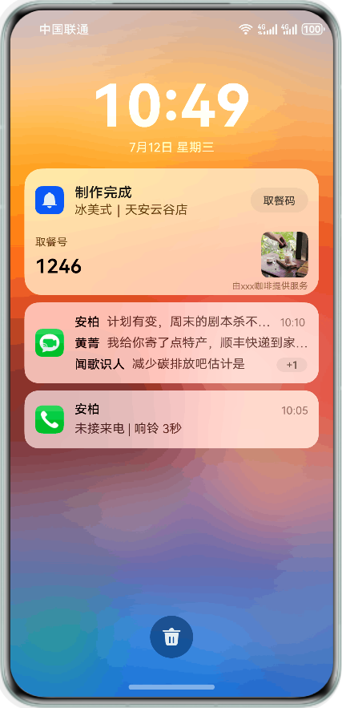
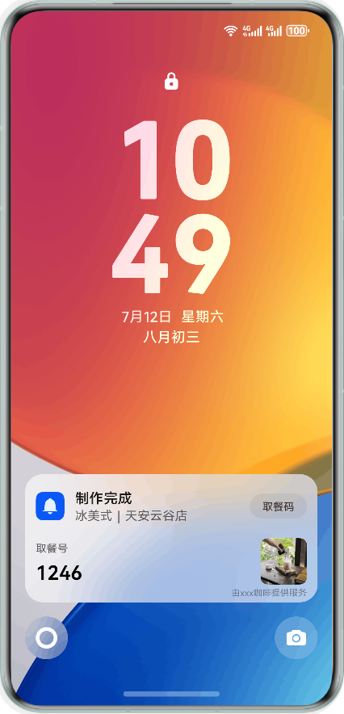
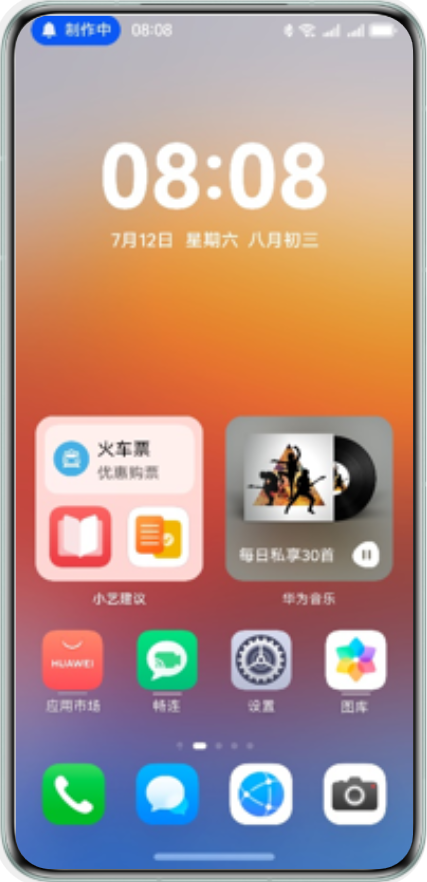
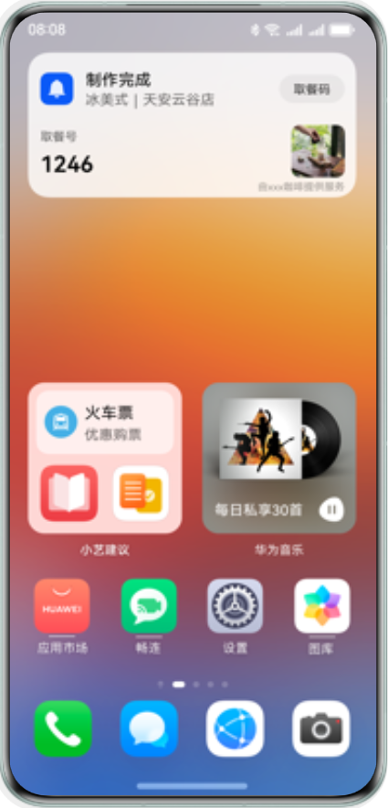
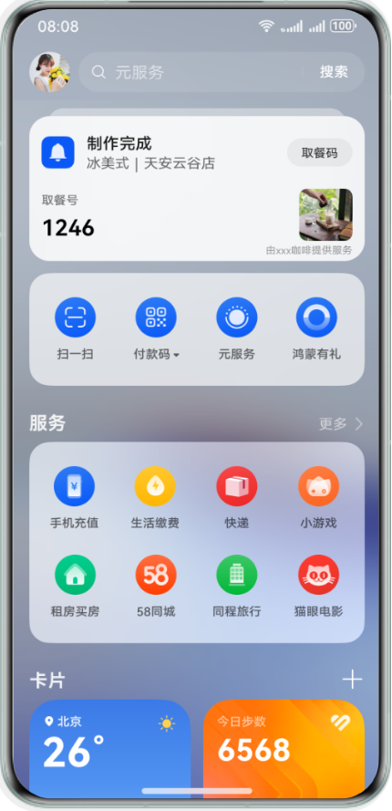
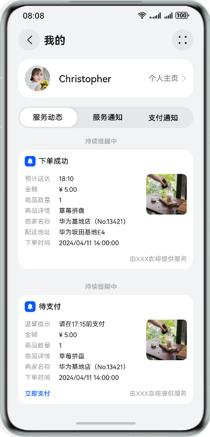
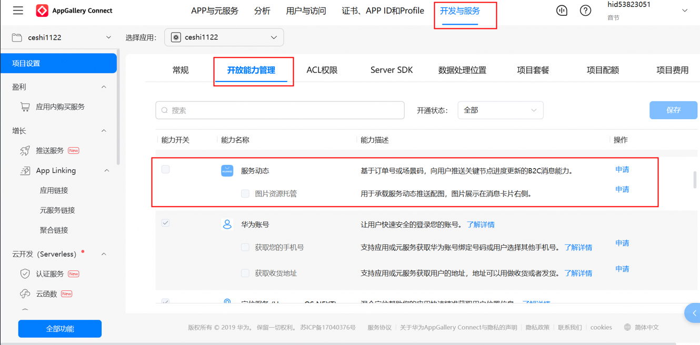
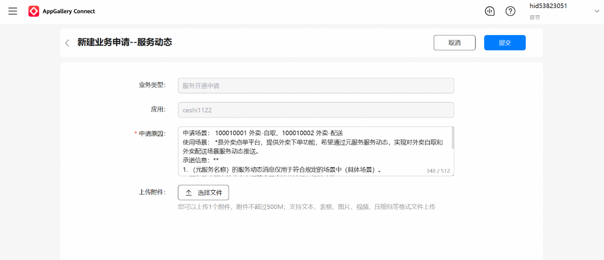

## 场景介绍

服务动态消息是提供给开发者的B2C（Business-to-Customer）消息能力，通过服务动态消息，开发者可以基于华为支付订单号或用户前端场景化button获取到的code，向用户推送关键节点的动态消息，及时提醒用户订单进度，帮助用户聚焦正在进行的任务，方便快速查看和即时处理的通知形态。

服务动态消息具有一定特点，具体如下：

**实时活动有明显的起终点**

该事件或服务需要持续一段时间，有明确的开始和结束，而非单点的提醒或信息。

例：打车、外卖等从事件开始到结束需要经历一段时间；单点提醒，则不适用。

**实时活动的时效性**

该内容为正在进行或即时发生的事件或服务的提醒，在特定时间段内，及时提供给用户有价值的信息。

例：打车行程中、外卖配送中等正在进行的用户活动；2天后的机票，在刚买时不提醒，而在出发前提示，具体提醒时间根据业务实际情况确定。

**实时活动的连续性**

服务动态所展示的内容需要根据事件状态变动更新，以确保用户看到最新的状态。

例：打车场景中，会基于司乘状态变化而呈现呼叫车辆中、司机接驾中、司机到达上车点、前往目的地中、待支付、已支付等状态。而优惠券过期提醒，话费充值提醒不具备变化性，不属于服务动态消息。

在展示形态上，服务动态支持在通知中心、锁屏、状态栏、负一屏等位置展示，主要有两种展示形式：胶囊态（在状态栏显示胶囊状态，点击状态栏胶囊后可展开为悬浮卡片）和卡片态。

效果图如下，真实样式请以实际效果为准：

**表1** 状态效果图

| 通知中心 | 锁屏 | 状态栏 | 负一屏状态机 | 负一屏消息盒子 |
| --- | --- | --- | --- | --- |
|  |  | 胶囊状态：    悬浮卡片：   |  |  |

## 服务动态场景准入原则

* 服务动态是用户非常关注，且需要反复查看或快捷操作的场景和活动。
* 活动本身具有明显的开始和结束时间，也代表着该活动的进行是有时限的。
* 用户对接收到该活动的通知有明确的预期，通常为用户主动行为触发，而非一些信息推荐。
* 需要确保展示内容对用户有足够的价值，不可用于营销、广告场景。

## 服务动态场景模板

场景模板有对应的类目要求，符合类目要求的元服务才可以申请使用相应的场景模板（场景模板 配置参数请见[服务动态参数说明](https://developer.huawei.com/consumer/cn/doc/harmonyos-references/push-api-service-timeline-param)示例说明）。

目前支持的服务动态场景模板如下：

| **场景标识****sceneId** | **场景名称** | **子场景标识****subSceneId** | **子场景名称** | **适用类目** | **Code获取方式** |
| --- | --- | --- | --- | --- | --- |
| 10001 | 外卖 | 100010001 | 外卖-自取 | 美食-外卖/生鲜/咖啡 | 华为支付订单号 |
| 100010002 | 外卖-配送 | 美食-外卖/生鲜/咖啡 | 华为支付订单号 |
| 10003 | 酒店民宿入住 | 100030001 | 酒店民宿入住 | 旅游-住宿/酒店/民宿/度假村 | 华为支付订单号 |
| 10005 | 取号排队 | 100050001 | 排队取号 | 金融理财-银行、生活服务-公共服务、旅游-旅游/景区服务 | * 华为支付订单号 * 通过前端场景化button获取 |
| 100050002 | 挂号就诊 | 医疗-门诊预约/医院/体检 | * 华为支付订单号 * 通过前端场景化button获取 |
| 100050003 | 排队就餐 | 美食-餐馆/点餐 | * 华为支付订单号 * 通过前端场景化button获取 |
| 10011 | 景区预约 | 100110001 | 景区预约 | 旅游-景区服务/游乐场 | 华为支付订单号 |
| 10018 | 演出提醒 | 100180001 | 演出提醒 | 休闲娱乐-演出票务 | 华为支付订单号 |
| 10019 | 景区小交通 | 100190001 | 景区小交通 | 旅游-旅游/景区服务、出行导航-交通票务 | 华为支付订单号 |
| 10021 | 打车出行 | 100210001 | 打车出行 | 出行导航- 用车/网约车/出租车/顺风车/拼车 | * 华为支付订单号 * 通过前端场景化button获取 |
| 10022 | 打卡 | 100220001 | 打卡路线 | 旅游-旅游/行程助手/旅游攻略/行程记录 | 华为支付订单号 |
| 10023 | 预约参观 | 100230001 | 展馆预约 | 生活服务 | * 华为支付订单号 * 通过前端场景化button获取 |

## 接入指导

### 明确服务场景

开发者首先需要明确自己的服务场景，根据对应的服务动态场景进行申请和接入。可参考[服务动态场景模板](#section442012142311)查询平台开放的场景。

### 申请权益

开发者按照[申请权益](#section592010820304)，向平台申请服务动态权益，平台运营审核通过后才可以进行接入。

### 明确code获取方式

该code在本次服务进程中唯一，后续开发者更新用户的服务状态均通过此code进行。

* 将华为支付订单号作为code。

  当用户在元服务内调用华为支付收银台进行支付，开发者可获得华为支付订单号[sysTransOrderNo](https://developer.huawei.com/consumer/cn/doc/harmonyos-references/payment-sys-query-order)，可直接作为code。

  

  + 仅支持当前元服务的华为支付订单号，请勿使用其他元服务、APP支付等来源的订单号。
  + 待支付状态下，开发者可通过商户订单号[mercOrderNo](https://developer.huawei.com/consumer/cn/doc/harmonyos-references/payment-merc-query-order)查询某笔订单的支付状态。
* 从HarmonyOS 6.0开始，支持通过前端场景化button获取code，只有符合场景要求的场景，才可以使用[服务动态授权码Button](https://developer.huawei.com/consumer/cn/doc/atomic-guides/scenario-fusion-button-atomic-getservicecode)获取code。

  开发者需要在前端将触发服务的button组件的 openType 的值设置为functionalButtonComponentManager.OpenType.REQUEST\_SUBSCRIBE\_MESSAGE。当用户点击 button 后，获取平台提供的授权码code。

  

  平台会对相关button组件进行规范性使用的检测，包括是否存在诱导用户点击、通过与卡片无关的按钮获取code等行为，请合理使用组件。

### 激活卡片

针对将华为支付订单号作为code，开发者需在支付完成后调用服务端接口[send](https://developer.huawei.com/consumer/cn/doc/harmonyos-references/push-api-service-timeline-send) 传入初始化卡片状态与状态相关字段（参考[推送服务动态消息的消息体](#section193181855934)），用以首次激活code，后续才可以继续通过[send](https://developer.huawei.com/consumer/cn/doc/harmonyos-references/push-api-service-timeline-send)更新服务的动态。

针对通过前端场景化button获取code，开发者需要在获取后24小时内调用服务端接口[send](https://developer.huawei.com/consumer/cn/doc/harmonyos-references/push-api-service-timeline-send)传入初始化卡片状态与状态相关字段，用以首次激活code，后续才可以继续通过[send](https://developer.huawei.com/consumer/cn/doc/harmonyos-references/push-api-service-timeline-send)更新服务的动态。

超过24小时未激活，后续不允许使用该code创建服务动态。

### 更新卡片状态

code激活后，开发者可调用服务端接口[send](https://developer.huawei.com/consumer/cn/doc/harmonyos-references/push-api-service-timeline-send)传入需更新的卡片状态与状态相关字段（参考[推送服务动态消息的消息体](#section193181855934)）。卡片更新需在子场景的事件有效期内完成，超过子场景的事件有效期，或状态无可变更的下一状态时（如状态更新到“订单已完成”），不再允许开发者更新。


服务动态在通知中心、锁屏、状态栏位置的卡片展示规格，需同时遵循实况窗生命周期管控规格，不符合设计规范的方案将不被予以开通服务动态正式权限。为了确保用户看到内容的时效性，请您确保对实况窗内容进行及时更新。

* 单个实况窗的生命周期最长不超过8小时，超过8小时后，系统会认为实况窗结束。即单个事件所有的卡片状态更新需在8小时内完成。
* 在实况窗超过2小时未更新时，系统将隐藏实况窗在状态栏胶囊和锁屏的展示，保留通知中心展示；超过4小时未更新，系统会认为实况窗结束，并从各个展示入口清除该实况窗。

### 推送服务动态消息的消息体

以外卖场景外卖自取子场景为例，示例如下。更多详情请见[服务动态推送API接口](https://developer.huawei.com/consumer/cn/doc/harmonyos-references/push-api-service-timeline-send)。

```
// Request URL
POST https://push-api.cloud.huawei.com/v1/[projectId]/service_timeline/send

// Request Header
Authorization: Bearer eyJr*****OiIx---****.eyJh*****iJodHR--***.QRod*****4Gp---****

// Request Body
{
    "appId": "5**********7",
    "toOpenId": "A**********O",
    "sceneId": "10001",
    "subSceneId": "100010001",
    "code": "3**********7",
    "content": {
        "status": 3,
        "expireTime": 60,
        "orderTime": 1716191520,
        "amount": "¥ 18.00",
        "productCount": 1,
        "productName": "霸气芒果",
        "productImg": "image_test_1",
        "merchantName": "威**********店",
        "pickupNumber": "1668",
        "pickupTime": "16:08",
        "remainOrders": "5单/共5杯",
        "waitTime": "10-20分钟",
        "button": {
            "type": 1,
            "text": "取餐码",
            "action": "https://***",
            "uri": "https://***"
        },
        "clickAction": {
            "type": 1,
            "action": "https://***",
            "uri": "https://***"
        },
        "appendButtons": [
            {
                "type": 1,
                "text": "取餐码",
                "action": "https://***",
                "uri": "https://***"
            }
        ]
    }
}
```

* [projectId]：项目ID，登录[AppGallery Connect](https://developer.huawei.com/consumer/cn/service/josp/agc/index.html)网站，选择“开发与服务”，在项目列表中选择对应的项目，左侧导航栏选择“项目设置”，在该页面获取。
* Authorization：JWT格式字符串，可参见[Authorization](https://developer.huawei.com/consumer/cn/doc/harmonyos-references/push-scenariozed-api-request-struct#section20573634202313)获取。
* appId：元服务的APP ID，元服务的APP ID，登录[AppGallery Connect](https://developer.huawei.com/consumer/cn/service/josp/agc/index.html)网站，选择“APP与元服务”，左侧导航栏选择“应用信息 > 基本信息”，在该页面获取。
* toOpenId：接收者（用户）账号登录的openID。使用从端侧上报的openID，或请求华为账号服务器[获取用户信息](https://developer.huawei.com/consumer/cn/doc/atomic-guides/account-atomic-silent-login)。可参考元服务[账号使用规范](https://developer.huawei.com/consumer/cn/doc/design-guides/accounts-0000001967444380)进行华为账号登录的设计和接入。

* sceneId：场景标识。详情请见[服务动态发送场景说明](https://developer.huawei.com/consumer/cn/doc/harmonyos-references/push-api-service-timeline-param#section159496312255)。
* subSceneId：子场景标识。详情请见[服务动态发送场景说明](https://developer.huawei.com/consumer/cn/doc/harmonyos-references/push-api-service-timeline-param#section159496312255)。
* code：授权码，用于服务动态消息推送和更新。详见[明确code获取方式](#section14481552115811)。
* content：服务动态指定状态参数。服务动态消息推送必须以状态节点类型为“起始节点”状态开始推送，以“结束节点”状态结束服务动态消息。详情请见[请求体结构说明](https://developer.huawei.com/consumer/cn/doc/harmonyos-references/push-api-service-timeline-send#section16714723163811)。定义Button、clickAction、appendButtons点击模板卡片后的跳转页面，仅限跳转当前元服务内页面。
* clickAction：卡片点击事件，可通过携带data字段在点击后将数据传递给元服务。详情请参考[点击消息动作](https://developer.huawei.com/consumer/cn/doc/atomic-guides/push-as-send-sub-noti#section83531248142116)。
* button：卡片按钮点击事件，可通过携带data字段在点击后将数据传递给元服务。详情请参考[点击消息动作](https://developer.huawei.com/consumer/cn/doc/atomic-guides/push-as-send-sub-noti#section83531248142116)。

业务响应码报错问题请参考[业务响应码](https://developer.huawei.com/consumer/cn/doc/harmonyos-references/push-api-service-timeline-send#section167716192114)。

## 申请权益

1. 登录[AppGallery Connect](https://developer.huawei.com/consumer/cn/service/josp/agc/index.html)网站，选择“开发与服务”。
2. 在项目列表选择项目，并在应用列表下选择需要申请服务动态功能的应用。
3. 进入“项目设置 > 开放能力管理”页面，点击“服务动态”对应的“申请”。
4. 推送服务动态消息，还需同时申请“图片资源托管”子能力（服务动态消息卡片右侧展示的图片）。详情可以查看[状态效果图](#table35371427573)。

   
5. 参考“申请原因”中的模板，提供申请必需的相关信息，包括申请场景、使用场景、应用基础信息，然后点击“提交”按钮。

   

   返回“开放能力管理”页面，原“申请”变为“申请中”，1~3个工作日内反馈申请结果，请留意互动中心的“服务开通申请”信息。

   

   申请通过后，互动中心会发送通知给您，同时“申请中”会变为置灰显示的“申请”，至此，应用已成功开启服务动态/图片资源托管开放能力。

   


* ProjectID: 项目ID，登录[AppGallery Connect](https://developer.huawei.com/consumer/cn/service/josp/agc/index.html)网站，选择“开发与服务”，在项目列表中选择对应的项目，左侧导航栏选择“项目设置”，在该页面获取。
* AppID：元服务的APPID，登录[AppGallery Connect](https://developer.huawei.com/consumer/cn/service/josp/agc/index.html)网站，选择“APP与元服务”，左侧导航栏选择“应用信息 > 基本信息”，在该页面获取。
* ClientID：元服务ClientID，登录[AppGallery Connect](https://developer.huawei.com/consumer/cn/service/josp/agc/index.html)网站，选择“开发与服务”，在项目列表中选择对应的项目，左侧导航栏选择“项目设置 > 常规 > 应用 > OAuth 2.0客户端ID（凭据）”找到应用的Client ID。
* 如您在申请过程中有任何疑问，可通过邮箱atomicservice@huawei.com联系我们。

## 常见问题

如有疑问，请参阅[服务动态接入FAQ](https://developer.huawei.com/consumer/cn/doc/atomic-faqs/faqs-dynamic-access)以获取更多帮助。
