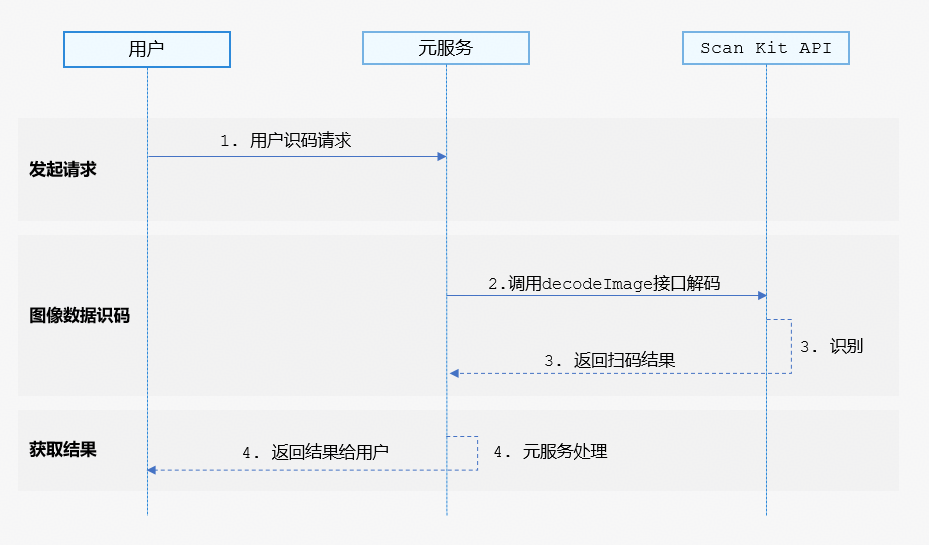

从26.0.0版本开始，新增支持图像数据识码能力。

## 基本概念

图像数据识码能力支持对NV21像素格式图像中的码图进行扫描识别，并获取信息。

## 场景介绍

图像数据识码能力支持对NV21像素格式图像中的条形码、二维码、MULTIFUNCTIONAL CODE进行识别，并获得码类型、码值、码位置、期望图像放大倍数等信息。该能力可用于一图单码和一图多码的识别，比如条形码、付款码等。

## 业务流程



1. 用户向元服务发起识码请求。
2. 元服务通过调用Scan Kit的decodeImage接口识别码图。
3. Scan Kit通过回调返回识别结果。
4. 元服务向用户返回扫码结果。

## 接口说明

识别图像数据中的码图，以Promise形式返回识别结果。具体API说明详见[接口文档](https://developer.huawei.com/consumer/cn/doc/harmonyos-references/scan-imagedecode)。

| 接口名 | 描述 |
| --- | --- |
| [decodeImage](https://developer.huawei.com/consumer/cn/doc/harmonyos-references/scan-imagedecode#detectbarcodedecodeimage)(image: [ByteImage](https://developer.huawei.com/consumer/cn/doc/harmonyos-references/scan-imagedecode#byteimage), options?: scanBarcode.[ScanOptions](https://developer.huawei.com/consumer/cn/doc/harmonyos-references/scan-scanbarcode-api#scanoptions)): Promise<[DetectResult](https://developer.huawei.com/consumer/cn/doc/harmonyos-references/scan-imagedecode#detectresult)> | 启动图像识码，通过传入ByteImage类型的图像数据信息返回识别结果。使用Promise异步回调。 |

## 开发步骤

图像数据识码能力支持对NV21像素格式图像中的条形码、二维码、MULTIFUNCTIONAL CODE进行识别，并返回码类型、码值、码位置（码图最小外接矩形左上角和右下角的坐标，QR码支持返回四个点坐标）、期望图像放大倍数等信息。

以下示例为调用detectBarcode.decodeImage接口获取码图信息。

1. 导入图像识码接口和相关接口模块，该模块提供了图像识码参数和方法，导入方法如下。

   ```
   import { detectBarcode, scanBarcode, scanCore } from '@kit.ScanKit';
   import { BusinessError } from '@kit.BasicServicesKit';
   import { hilog } from '@kit.PerformanceAnalysisKit';
   ```
2. 调用detectBarcode.decodeImage接口解析图像数据。

   ```
   @Entry
   @Component
   struct DetectImagePage {
     build() {
       Column() {
         Button('Promise with options')
           .backgroundColor('#0D9FFB')
           .fontSize(20)
           .fontColor($r('sys.color.comp_background_list_card'))
           .fontWeight(FontWeight.Normal)
           .align(Alignment.Center)
           .type(ButtonType.Capsule)
           .width('90%')
           .height(40)
           .margin({ top: 5, bottom: 5 })
           .onClick(() => {
             // 定义识码参数options
             let options: scanBarcode.ScanOptions = {
               scanTypes: [scanCore.ScanType.ALL],
               enableMultiMode: true
             };
             // 获取NV21像素格式数据，例如从resources/rawfile目录下读取图像数据
             this.getUIContext()
               .getHostContext()?.resourceManager
               .getRawFileContent('qrcode_NV21_image_1080X1920.yuv')
               .then((imageData: Uint8Array) => {
                 let byteImage: detectBarcode.ByteImage = {
                   byteBuffer: imageData.buffer,
                   width: 1080,
                   height: 1920,
                   format: detectBarcode.ImageFormat.NV21
                 };
                 try {
                   // 调用图像识码接口
                   detectBarcode.decodeImage(byteImage, options).then((data: detectBarcode.DetectResult) => {
                     hilog.info(0x0001, '[Scan Sample]',
                       `Succeeded in getting DetectResult by promise with options, result is ${JSON.stringify(data)}`);
                   }).catch((err: BusinessError) => {
                     hilog.error(0x0001, '[Scan Sample]',
                       `Failed to get DetectResult by promise with options. Code: ${err.code}, message: ${err.message}`);
                   });
                 } catch (err) {
                   hilog.error(0x0001, '[Scan Sample]',
                     `Failed to detectBarcode. Code: ${err.code}, message: ${err.message}`);
                 }
               })
               .catch((err: BusinessError) => {
                 hilog.error(0x0001, '[Scan Sample]',
                   `Failed to read image. Code: ${err.code}, message: ${err.message}`);
               })
           });
       }
       .width('100%')
       .height('100%')
       .alignItems(HorizontalAlign.Center)
       .justifyContent(FlexAlign.Center)
     }
   }
   ```

## 模拟器开发

暂不支持模拟器开发，调用接口会返回错误信息“Emulator is not supported.”
