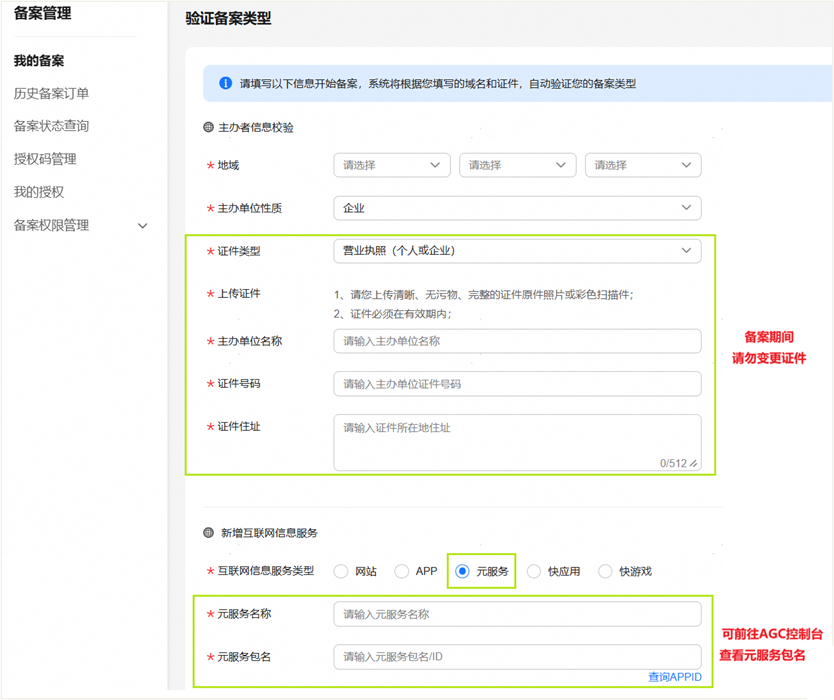
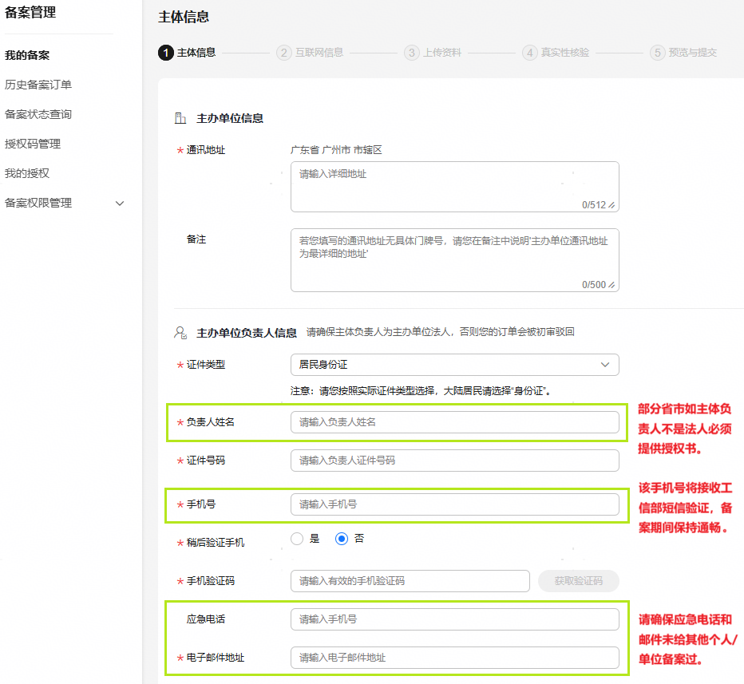
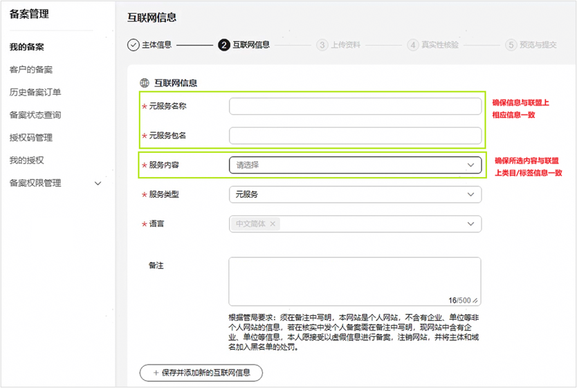
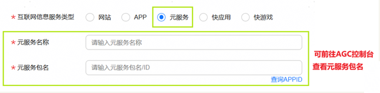
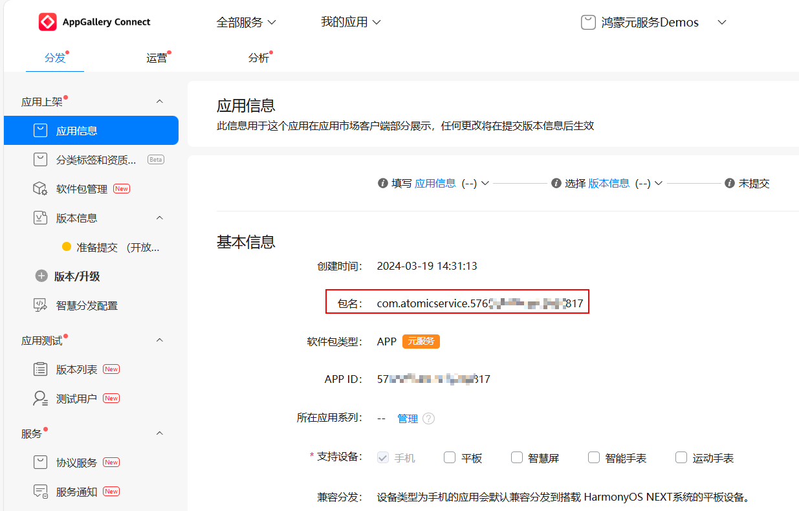
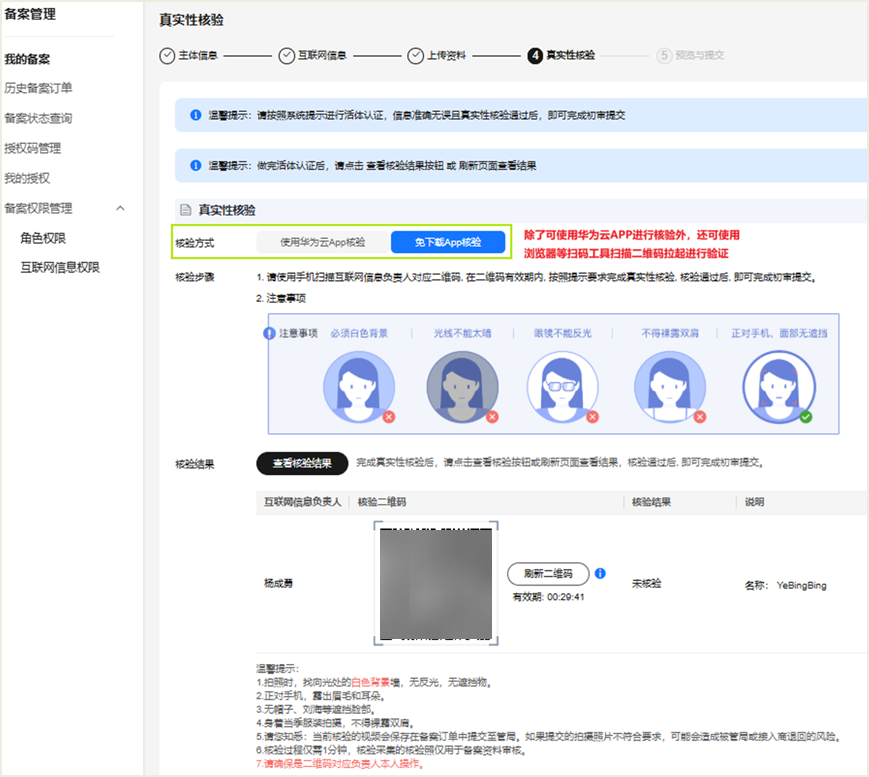
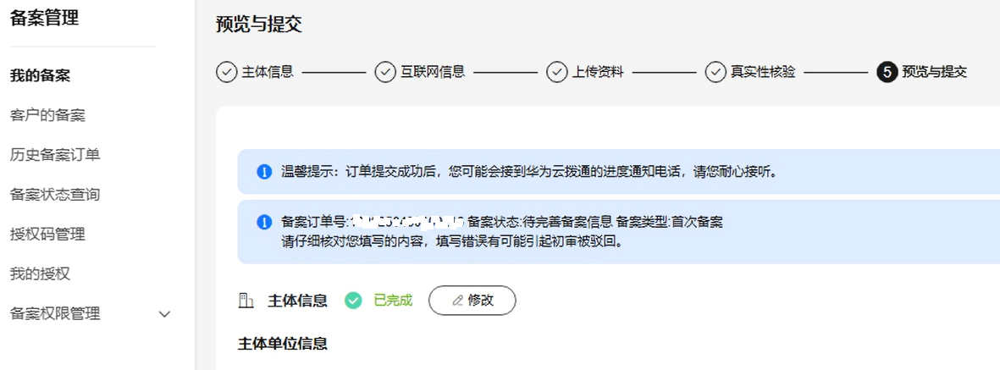
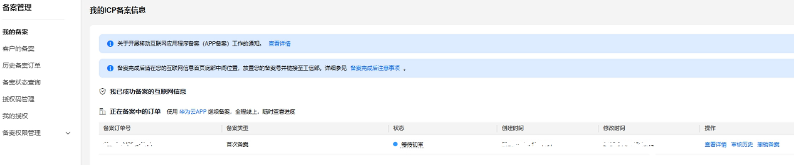

在华为云核准（备案）系统中首次核准（备案）主体信息和元服务信息。操作步骤如下：

1. 登录[华为云核准（备案）系统](https://beian.huaweicloud.com/?utm_source=HUAWEI%2BDeveloper&utm_adplace=AdPlace099034)，填写主办单位信息、互联网信息，完成后点击“验证核准（备案）类型”，其中**“元服务包名”使用“com.atomicservice.\*\*\*”格式的包名**。在弹出的窗口中点击“下一步”。

   
2. 在“主体信息”页面填写主办单位信息、负责人信息，完成后点击“下一步，填写互联网信息”。

   
3. 在“互联网信息”页面填写互联网信息、负责人信息，完成后点击“下一步，上传资料”；请确保“服务内容”所选内容与联盟的类目/标签信息一致（路径：[我的元服务](https://developer.huawei.com/consumer/cn/service/josp/agc/index.html#/myApp)-进入相应元服务-应用信息-应用分类）。

   在“备注”处，建议说明元服务具体内容，否则可能会被通信管理局驳回，在广东、江西、河南、福建、天津等地区需特别注意。

   **特别注意**：“元服务包名”处，**确保是包名**：com.atomicservice.XXXXXXXXXXXXXX 格式。

   

   

   请参考这个路径来获取包名：

   
4. 在“上传资料”页面根据提示上传提前准备的附件材料，完成后点击“下一步，真实性核验”。

   
5. 在“真实性核验”页面由互联网信息负责人进行人脸视频核验，完成后提交初审；其中“免下载App核验”方式可通过浏览器等扫码工具扫描核验二维码进行验证。

   
6. 所有信息完成填写后，对内容进行预览确认并提交初审。

   
7. 华为工作人员将在3~5个工作日内进行审核，将以短信或邮件形式通知审核结果，请耐心等待，且保持手机畅通。若需要修改核准（备案）信息，将以邮件形式通知。

   
8. 华为平台人工初审通过后，请前往工信部网站核验短信验证码，详情请参见[工信部核验核准（备案）短信](https://developer.huawei.com/consumer/cn/doc/atomic-guides/atomic-service-filing-sms)。若初审被驳回，请点击“继续核准（备案）”修改信息后重新提交审核。
