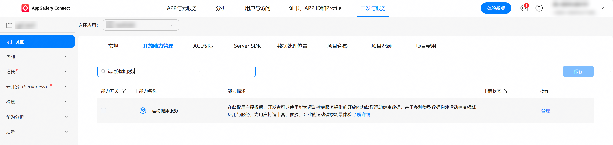
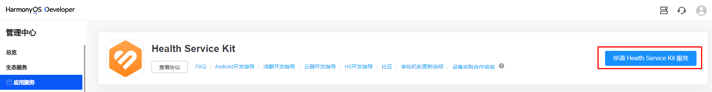
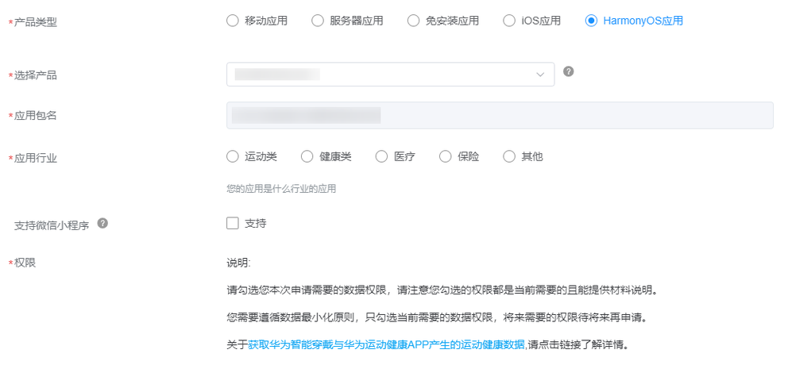
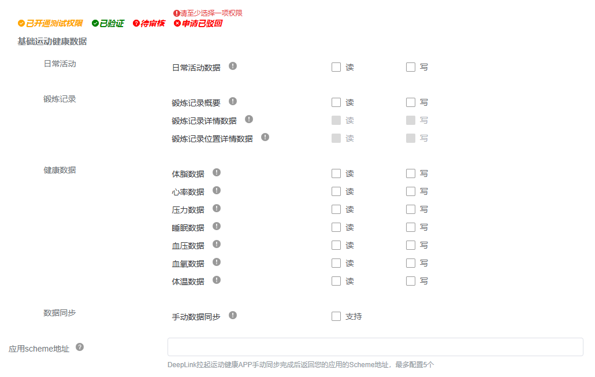
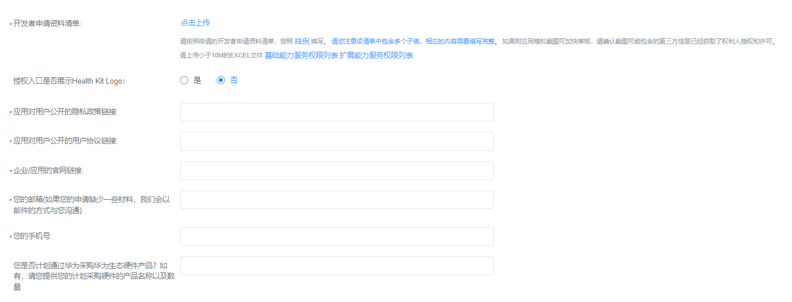
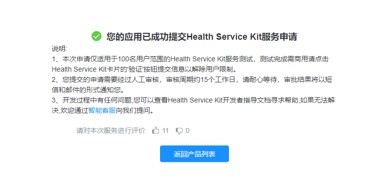
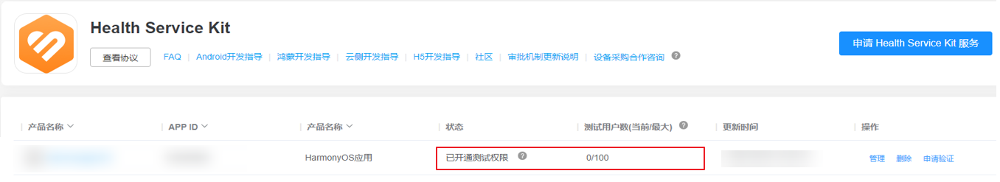
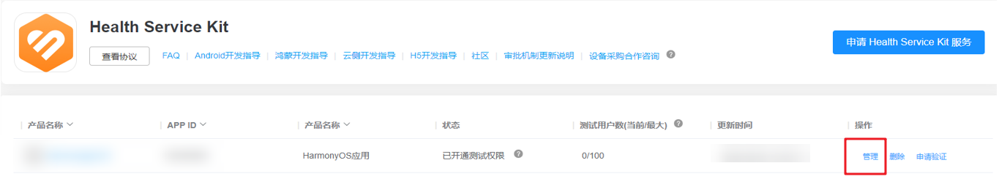

申请运动健康服务前，请先参考[应用开发准备](https://developer.huawei.com/consumer/cn/doc/atomic-guides/atomic-dev-preparation)，确认开发环境并完成[创建项目](https://developer.huawei.com/consumer/cn/doc/app/agc-help-create-project-0000002242804048)、[创建元服务](https://developer.huawei.com/consumer/cn/doc/app/agc-help-create-atomic-service-0000002247795706)、[添加公钥指纹](https://developer.huawei.com/consumer/cn/doc/atomic-guides/atomic-dev-preparation#section53459230820)等基本准备工作，再继续进行以下开发活动。

1. 登录[AppGallery Connect](https://developer.huawei.com/consumer/cn/service/josp/agc/index.html#/)，选择**开发与服务**。
2. 在项目列表选择项目，并在应用列表下选择需要申请运动健康服务的应用。
3. 进入**项目设置** > **开放能力管理**页面，点击**运动健康服务**对应的**管理**。

   

   

   暂不支持团队账号下的成员账号独立使用运动健康开发服务，详情请参见[团队账号](https://developer.huawei.com/consumer/cn/doc/start/team-account-guides-0000001053785552)。
4. 单击**申请Health Service Kit服务**，同意协议后，进入数据权限申请页面。

   
5. 产品类型选择**HarmonyOS应用**，并填写申请信息，勾选产品必需申请的数据权限。

   

   * 添加运动健康服务时，遵循权限最小化原则。数据访问权限应与业务相符，不可申请超出业务范围或者暂不使用的权限。
   * 在应用或服务发布后，华为会对权限使用情况进行不定期抽查，抽查形式包括但不限于对已发布的应用进行抽样检查、对API调用情况进行监控、派遣专员核查等。您可以通过在申请运动健康服务前签署的合作协议，了解核查标准以及核查后的处理方式。
   * 数据类型对应的OAuth权限请参见[权限说明](https://developer.huawei.com/consumer/cn/doc/atomic-guides/health-permission-description-as)。

   

   
6. 为保障用户隐私和数据安全，运动健康服务需要开发者反馈相关材料和信息，以确保应用向用户请求数据权限是合理的。

   

   请在提交材料前先阅读[申请被驳回的常见问题](#申请被驳回的常见问题)，以避免在您的申请材料中出现同类问题。

   
7. 申请开通测试权限。

   您提交的申请需要经过人工审核，审核周期约10个工作日，请耐心等待，审批结果将以短信和邮件的形式通知您。

   * 如果提交的材料不满足要求，审批将不能通过，请您根据短信或邮件通知中的驳回原因进行修改并重新提交。重新提交的审核周期约为10个工作日，如有其他疑问，请通过[智能客服](https://developer.huawei.com/consumer/cn/customerService/#/bot-dev-top/faq-top/faq-talk-top)反馈。
   * 如果审批通过，即可进入“已开通测试权限”阶段，应用可调用相应的接口获取运动健康服务数据进行测试开发。

     

     + 由于数据缓存原因，请开通测试权限24小时后进行测试验证。
     + 当前审核通过仅以开发测试为目的，测试阶段有用户数量的限制，仅前100位用户可使用您申请应用中的华为运动健康服务。为解除用户数量限制，请在应用完成开发测试验证后提交验证申请，具体请参见[申请验证获取正式权限](https://developer.huawei.com/consumer/cn/doc/atomic-guides/health-verification-as)。
     + 测试权限开通后，请于半年内完成[申请验证获取正式权限](https://developer.huawei.com/consumer/cn/doc/atomic-guides/health-verification-as)操作，否则平台将关闭您已开通测试权限。

     

     
8. 权限管理。

   若您的业务范围发生变动，需要修改相应的数据权限，您可以单击“管理”更新权限再次提交申请。

   

## 申请被驳回的常见问题

以下为申请服务被驳回的高频典型问题，请您在申请前阅读以下内容以避免在您的申请材料中出现下述问题，若您已提交申请并被驳回，也可参考以下解决方案修改申请材料并重新提交。

### 权限说明缺失

要求：申请的每一个读/写数据权限都要在材料中说明。

解决办法：您提交的申请材料页签1和页签2中说明的权限少于所申请的权限，请检查填写的权限与所申请的权限是否一一对应，在页签1和页签2中补齐所申请的每一项权限的使用说明。

如您申请的数据读/写权限的使用场景在应用开发过程中发生变化，请在申请验证前更新申请材料清单。

### 图标使用不规范

要求：图标的使用需遵循[标志使用规范](https://developer.huawei.com/consumer/cn/doc/atomic-guides/health-logo-usage-regulations-as)。

解决办法：您提交的申请材料中涉及华为运动健康图标展示的场景，按照[标志使用规范](https://developer.huawei.com/consumer/cn/doc/atomic-guides/health-logo-usage-regulations-as)中要求的视觉效果进行呈现。

### 必选内容未填写

要求：申请材料中每个标注“必填”的页签都需要填写。

解决办法：您提交的申请材料中存在未填写的页签，尤其是企业开发者需要填写“企业介绍”页签，若您为个人开发者，请填写“开发者信息”，并明确个人所在科研机构或大学等。

### 企业、事业单位/政府机构、社会团体实缴注册资本不符合审核要求

要求：

* 企业申请资质要求：企业以实缴注册资本为准，申请访问开放等级为基础的用户数据，企业实缴注册资本不低于50万元；申请访问开放等级为高阶的用户数据，企业实缴注册资本不低于500万元。申请主体存续且成立时间需1年以上；
* 事业单位/政府机构申请资质要求：如果申请主体为事业单位或政府机构，可免除资金和成立年限要求。事业单位或政府机构委托的企业，需遵循企业申请资质要求。
* 社会团体申请资质要求：社会团体以活动资金（注册资本）为准，申请访问开放等级为基础的用户数据，活动资金不低于50万元；申请访问开放等级为高阶的用户数据，活动资金不低于500万元。申请主体存续且成立时间需1年以上。

* 以上企业实缴注册资本数据以[国家企业信用信息公示系统](https://shiming.gsxt.gov.cn/socialuser-use-rllogin.html)中最新年报数据为准。
* 数据类型开放等级请参见[数据开放总览](https://developer.huawei.com/consumer/cn/doc/atomic-guides/health-data-overview-as)。

解决办法：如您的资质不符合以上要求，需要由符合以上企业资质的公司作为保证人并提供[《担保函》](https://hihealthbase-drcn.things.hicloud.com/healthkit/fileServer/getFile/plain/LetterOfGuarantee/000/001/044/0000100000000001044.20240829085301.15837223380444256799724543157536%3A20740817085749%3A100005355%3A74FF407FD53387BAD61AF7C51B2DCBEBCE0EC5FFC338E4F7C2195D89F3106821.docx)。您需要通过**hihealth@huawei.com**邮箱提供如下文件：

* 载明保证人对外担保流程的公司[《章程》](https://hihealthbase-drcn.things.hicloud.com/healthkit/fileServer/getFile/plain/statutes/000/001/044/0000100000000001044.20240829085730.86499642368766203545820936006783%3A20740817085749%3A100005355%3ADBD975A8478DC681283B75DE2AD73917B3B11446827CA32763910C56B2011CE8.zip)。
* 符合保证人章程要求的决策文件：

  + 章程有要求的，按照章程要求提供决策文件，如[《股东（大）会决议》](https://hihealthbase-drcn.things.hicloud.com/healthkit/fileServer/getFile/plain/ResolutionsOfTheGeneralMeetingOfShareholders/000/001/044/0000100000000001044.20240829085550.66240541508468222081094814610251%3A20740817085749%3A100005355%3A0DF623C5340C5C2A75AC88E1C70DD1248910F4DD0968E2F3D423115AECC7F718.docx)、[《董事会决议》](https://hihealthbase-drcn.things.hicloud.com/healthkit/fileServer/getFile/plain/BoardResolutions/000/001/044/0000100000000001044.20240829085405.06563984710416568033892947175751%3A20740817085749%3A100005355%3A6783AF40DA74BA3C3004374A5227EE819ED6A32A905290498BCE1BEB1E7C9976.docx)等。
  + 章程无要求的，提供过半数表决权股东签字/盖章的[《股东（大）会决议》](https://hihealthbase-drcn.things.hicloud.com/healthkit/fileServer/getFile/plain/ResolutionsOfTheGeneralMeetingOfShareholders/000/001/044/0000100000000001044.20240829085550.66240541508468222081094814610251%3A20740817085749%3A100005355%3A0DF623C5340C5C2A75AC88E1C70DD1248910F4DD0968E2F3D423115AECC7F718.docx)。
  + 公司为公司股东或者实际控制人提供担保的，必须经股东会或者股东大会决议，相关股东或受相关实际控制人支配的股东，不得参加表决，且表决由出席会议的其他股东所持表决权的过半数通过。
  + 上市公司提供担保，需要公开披露。
* 保证人盖章的[《担保函》](https://hihealthbase-drcn.things.hicloud.com/healthkit/fileServer/getFile/plain/LetterOfGuarantee/000/001/044/0000100000000001044.20240829085301.15837223380444256799724543157536%3A20740817085749%3A100005355%3A74FF407FD53387BAD61AF7C51B2DCBEBCE0EC5FFC338E4F7C2195D89F3106821.docx)。

《担保函》、《股东（大）会决议》文件中的“保证最高限额”，保留一个选项。

### 个人开发者接入资质不符合审核要求

要求：个人开发者应用未上架华为应用市场，或者个人开发者应用非移动应用，暂不开放运动健康服务数据；申请访问开放等级为基础的用户数据，个人开发者不得有个人信用不良记录。开放等级为高阶的用户数据暂不向个人开发者开放。数据开放等级请参见[数据开放总览](https://developer.huawei.com/consumer/cn/doc/atomic-guides/health-data-overview-as)。

解决办法：将您的移动应用上架至华为应用市场，或重新注册企业开发者账号申请运动健康服务；申请运动健康服务时，仅勾选开放等级为“基础”的用户数据。

若仍未解决您的申请被驳回的问题，您可以选择以下方式寻求帮助：

1. 通过华为开发者联盟的[智能客服](https://developer.huawei.com/consumer/cn/customerService/#/bot-dev-top/faq-top/faq-talk-top)获取快速帮助。
2. 通过[在线提单](https://developer.huawei.com/consumer/cn/support/feedback/#/)获取人工帮助。
3. 通过华为开发者论坛的[运动健康](https://developer.huawei.com/consumer/cn/forum/block/huawei-hihealth)板块寻查答案或提问。

提交问题后，通常会在1~2个工作日内收到回复。有时需要您进一步澄清问题，请及时关注进展并予以回复，以便更好地解决问题。
