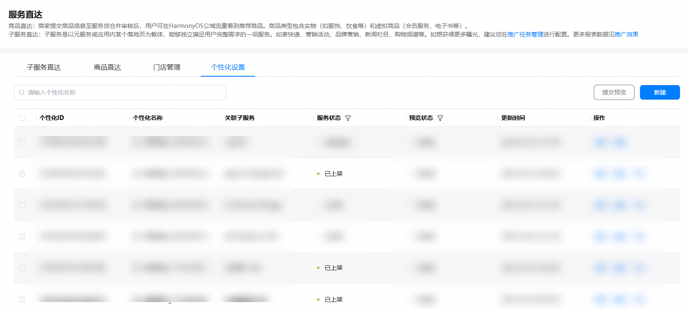
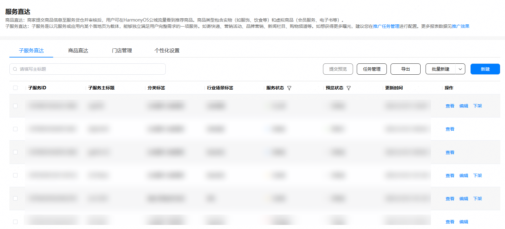
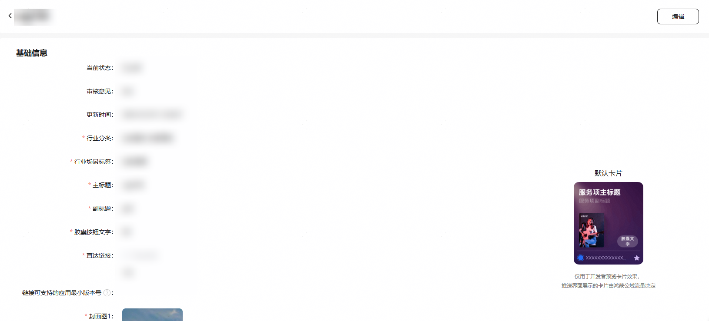
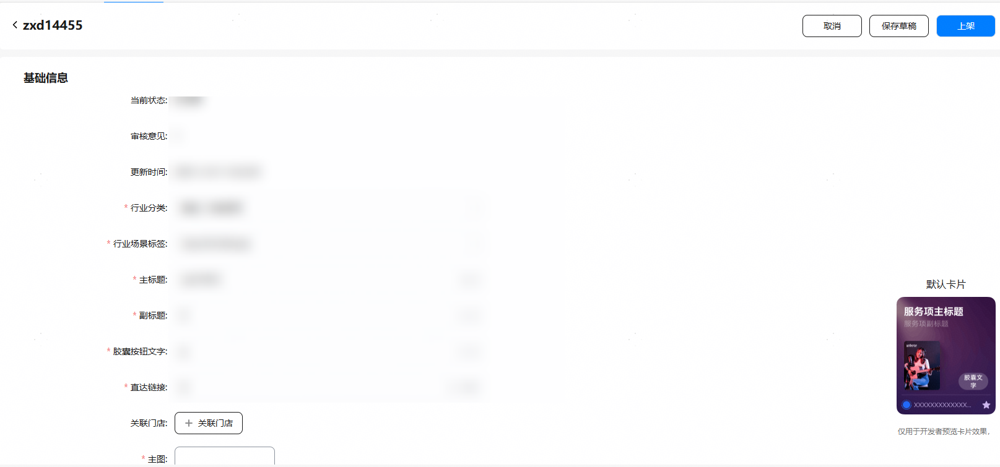

1. 对于已通过审核、子服务状态为“已上架”的子服务，开发者可进行更新子服务的操作。

   

   进行更新操作的方式有两种：
   * 在“子服务直达”页签中的操作栏点击“编辑”。
   * 在“子服务直达”页签中的操作栏点击“查看”后，再点击“编辑”。

   

   

2. 点击“编辑”后进入编辑页中，开发者可以对子服务的信息进行更新。

   

3. 更新完成后，点击“上架”，将更新后的子服务进行重新上架操作，由平台进行审核，子服务状态由“已上架”变更为“待审核”。

   

   子服务更新后，如果平台仍在审核当中，面向鸿蒙公域流量仅展示已上架子服务信息，不展示待审核状态的子服务信息。
