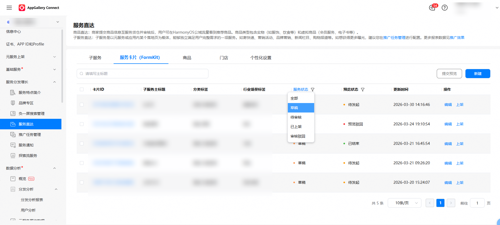
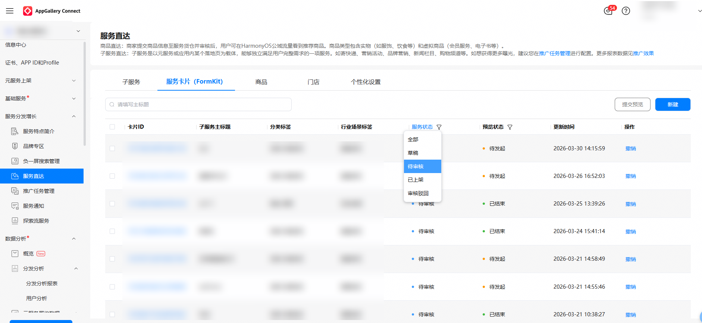
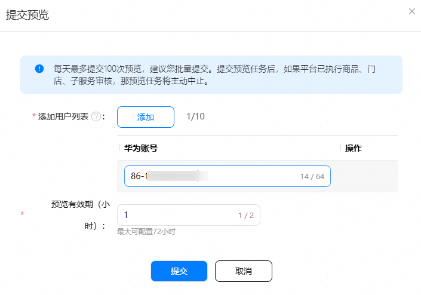

1. 在服务卡片（FormKit）界面，选择“草稿”或“待审核”卡片，点击提交预览，即可在负一屏探索流看到此卡，并进行预览测试。

   

   
2. 输入要测试的华为账号，点击提交即可发起预览。

   

   

   支持输入邮箱或手机号，手机号的格式必须是国家码-手机号。
3. 使用鸿蒙手机，先在系统设置中打开开发者选项，之后进入负一屏 > 头像>右上角图标 >设置 >探索，打开开发者测试开关。之后您可在负一屏探索流可见已提交预览的卡片。
