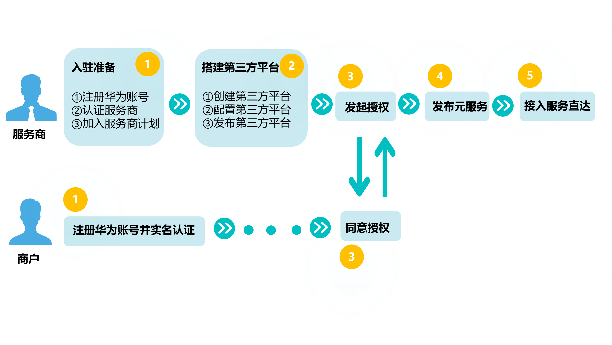

如图为服务商代商家接入服务直达的流程。

为了实现对用户精准推荐，本地生活类的商品，需要先提交门店，再提交商品。电商类的商品，则无需传入门店信息，可直接提交商品。

**适用范围**

仅元服务。

**如何具备元服务的服务商资质**

需完成**[HarmonyOS开发服务商](https://developer.huawei.com/consumer/cn/partner/development-provider)**的入驻。具体请参见[服务商操作指南](https://developer.huawei.com/consumer/cn/doc/SPPartnerCenter-develop-Guides/sp_partner-hmos_develop_partner_guide-0000002101543573)。

**如何准备商家资质**

商家必须拥有开发者账号，否则无法创建商家应用。服务商根据产品要求，引导商家完成对应资质认证。

| 序号 | 操作步骤 | 说明 |
| --- | --- | --- |
| 1 | 账号注册 | 请参考[开发者账号注册](https://developer.huawei.com/consumer/cn/doc/start/registration-and-verification-0000001053628148)。 |
| 2 | 实名认证 | 请参考如下：[开发者企业账号实名认证](https://developer.huawei.com/consumer/cn/doc/start/ht-edrna-0000001154848578)。 |

商家资质的注册账号仅支持企业开发者，不支持个人开发者。

**如何搭建第三方平台**

搭建第三方平台步骤如下：

| 序号 | 操作步骤 | 说明 |
| --- | --- | --- |
| 1 | [准备材料](https://developer.huawei.com/consumer/cn/doc/SPPartnerCenter-develop-Guides/fa_sp_template-create-platform-0000001486409992#section9881124695911) | 创建第三方平台前需准备可访问的平台网站、256\*256像素且图片大小不超过500KB的平台图标以及用于接收华为平台推送消息与事件接收的URL。 |
| 2 | [创建第三方平台](https://developer.huawei.com/consumer/cn/doc/SPPartnerCenter-develop-Guides/fa_sp_template-create-platform-0000001486409992) | 填写第三方平台基本信息、设置权限集、完成开发配置。 |
| 3 | [配置第三方平台](https://developer.huawei.com/consumer/cn/doc/SPPartnerCenter-develop-Guides/fa_sp_template-configure-platform-0000001556679226) | 编辑权限集、开发配置信息，或查看已设置的权限集及开发配置信息。 |
| 4 | [发布第三方平台](https://developer.huawei.com/consumer/cn/doc/SPPartnerCenter-develop-Guides/fa_sp_template-release-platform-0000001537649701) | 第三方平台创建并配置完成后，检查平台基本信息、开发配置信息准确无误后即可申请发布。审核通过后，第三方平台业务即可上线。 |

**如何完成商家授权**

商家授权流程如下：

| 序号 | 操作步骤 | 说明 |
| --- | --- | --- |
| 1 | [获取授权链接](https://developer.huawei.com/consumer/cn/doc/SPPartnerCenter-develop-Guides/fa_sp_template-merchant-0000001486729772) | 第三方平台审核通过后，即可与商家元服务建立授权关系，服务商可通过页面或接口获取授权链接。  **说明：**   * 如果商家采用**已有****元服务授权**模式授权，则需要商户先完成自行创建元服务对应的项目和应用。 * 如果商家采用**新增元服务授权**模式授权，则服务商向商家获取授权的同时会自动创建元服务对应的项目和应用。 |
| 2 | [商家确认授权](https://developer.huawei.com/consumer/cn/doc/SPPartnerCenter-develop-Guides/fa_sp_template-merchant-confirm-0000001556200346) | 服务商获取授权链接后，将授权链接集成到服务商的网站中，商家通过授权链接完成授权。 |
| 3 | [（可选）商家管理授权](https://developer.huawei.com/consumer/cn/doc/SPPartnerCenter-develop-Guides/fa_sp_template-merchant-manage-0000001607039153) | 商家确认授权后，可进行更新授权和解除授权等操作。 |
| 4 | [查看已授权元服务信息](https://developer.huawei.com/consumer/cn/doc/SPPartnerCenter-develop-Guides/fa_sp_template-view-authorization-0000001556359626) | 商家确认授权后，服务商可在第三方平台查看已授权元服务的信息。 |

**如何发布元服务**

请按照[HarmonyOS开发服务商开发指南](https://developer.huawei.com/consumer/cn/doc/SPPartnerCenter-develop-Guides/sp_partner-hmos_develop_develop_guide-0000002102828869)开发并上架元服务。

**如何通过API接入服务直达**

1. 配置[鉴权方式](https://developer.huawei.com/consumer/cn/doc/atomic-guides/instant-service-provider-authentication)。
2. 依次接入[图片管理](https://developer.huawei.com/consumer/cn/doc/atomic-guides/instant-service-image-management)、[门店管理](https://developer.huawei.com/consumer/cn/doc/atomic-guides/instant-service-store-management)及[商品管理](https://developer.huawei.com/consumer/cn/doc/atomic-guides/instant-service-offerings-management)。
