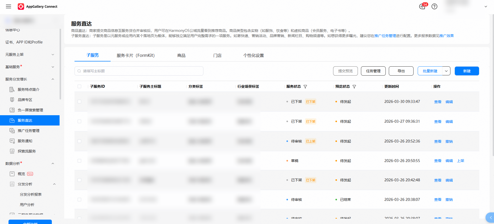
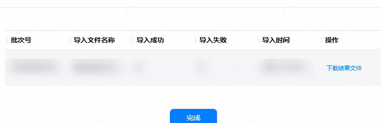
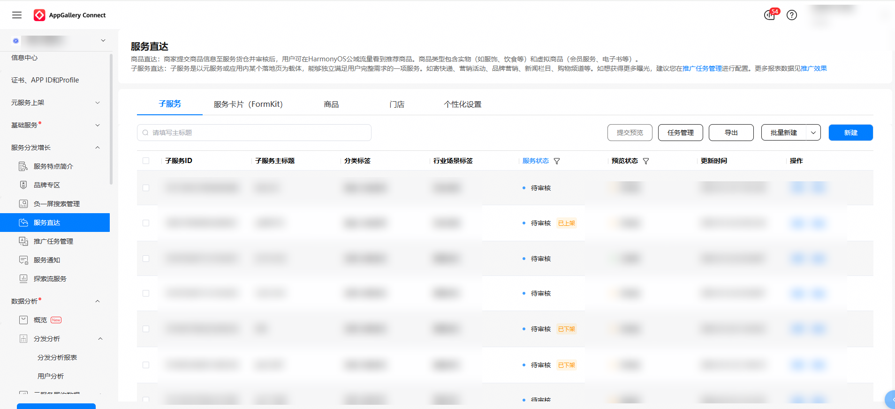

1. 在服务直达主界面，选择“子服务”页签，点击“批量新建”。

   
2. 点击“下载导入模板”。

   按照导入模板要求填写信息。

   
3. 点击“选择文件”。

   选择保存后的表格文件。点击“上传”。

   
4. 上传完成后，可在导入弹窗稍等片刻，查看导入结果。

   此页面可查看导入成功数、导入失败数，并可点击“下载结果文件”下载以查询导入失败的原因。

   
5. 导入完成后，可在子服务列表中查看子服务状态。

   
