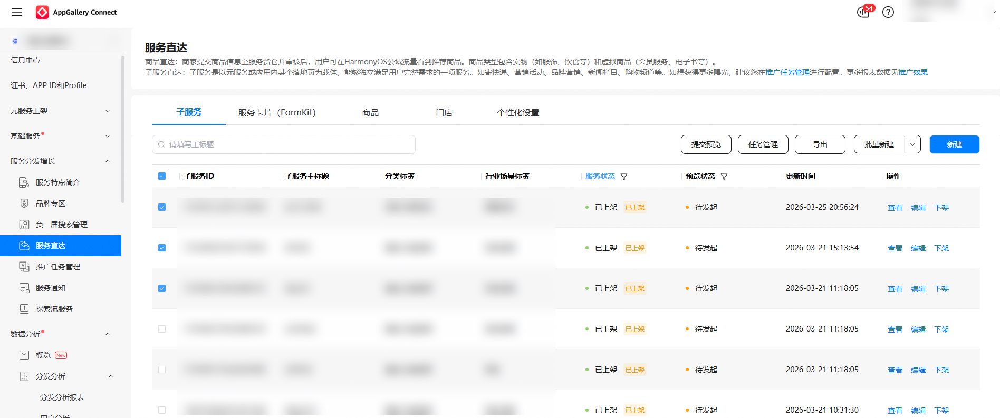
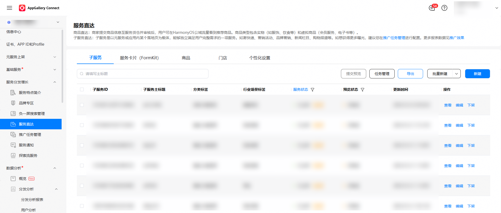
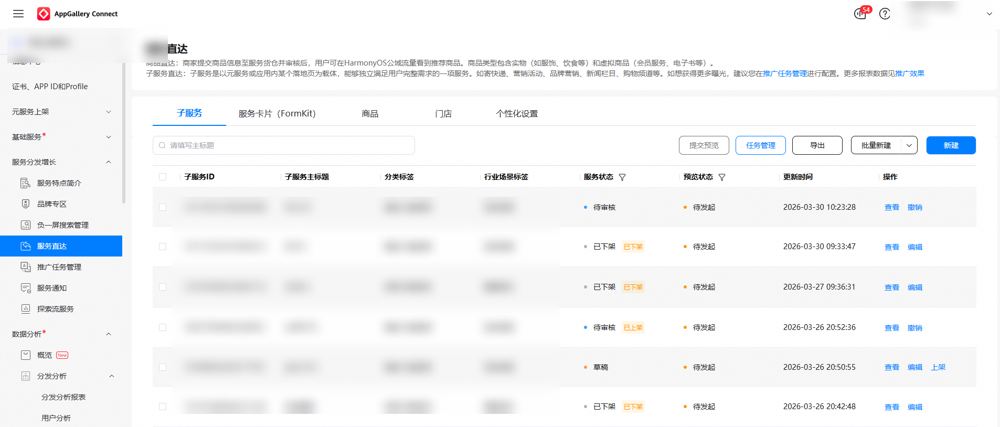
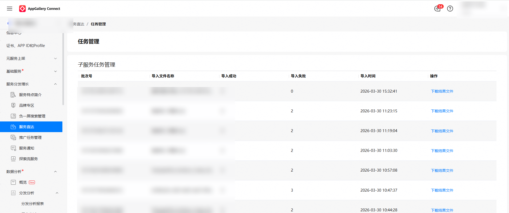
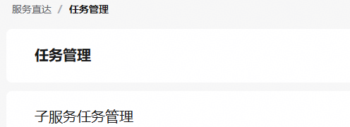
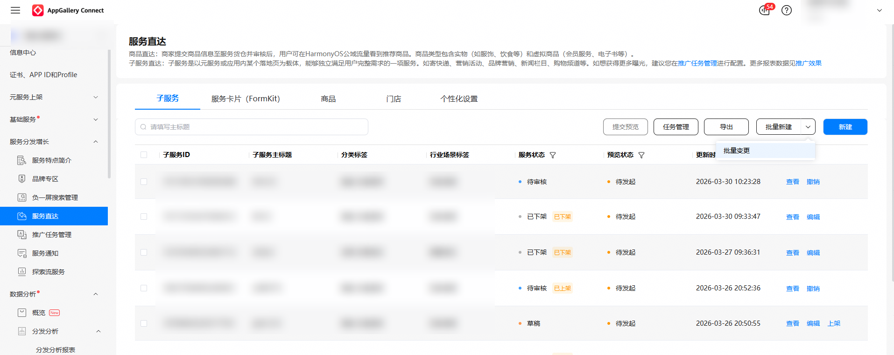
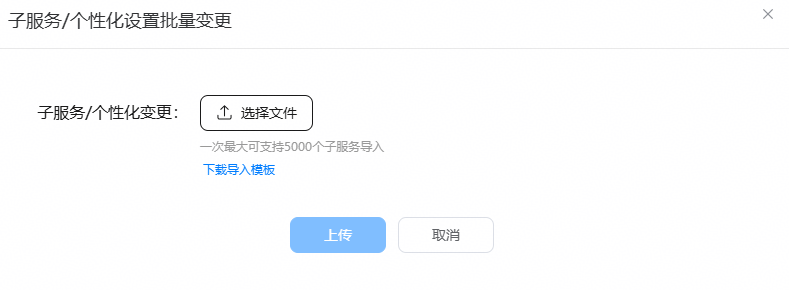

在子服务状态为“已上架”、“草稿”、“审核驳回”、“已冻结”、“已下架”状态时，开发者可以通过“批量变更”操作更新子服务信息并发起审核。

1. 在服务直达主界面，选择“子服务”页签，筛选出需要变更的子服务。

   
2. 点击“导出”。
   * 没有勾选项时，点击“导出”可导出全部子服务。
   * 存在已勾选商品时，点击“导出”仅导出已勾选子服务。

   
3. 导出完成后，点击“任务管理”，下载导出结果。

   

   
4. 编辑表格，修改子服务信息。
5. 点击“服务直达”,返回“子服务”页签。

   
6. 点击“批量变更”，上传编辑后的表格文件，点击“上传”按钮。

   

   
