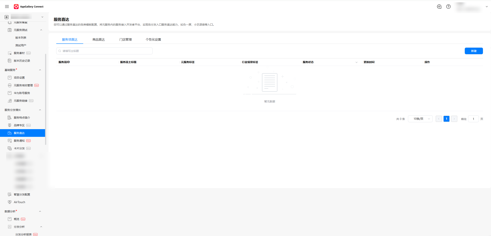
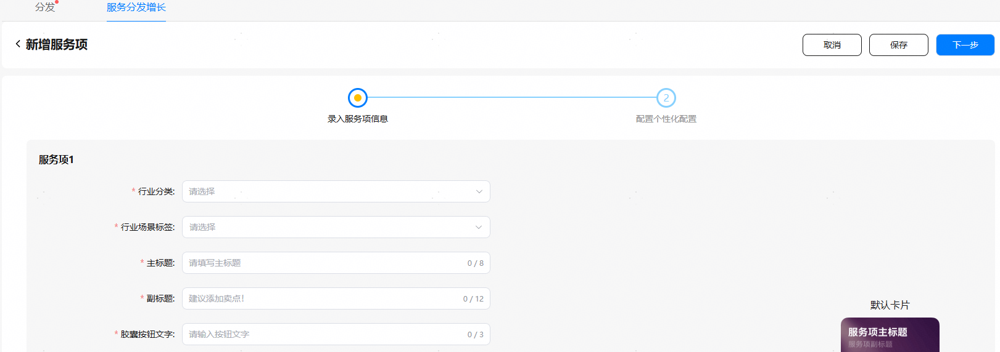
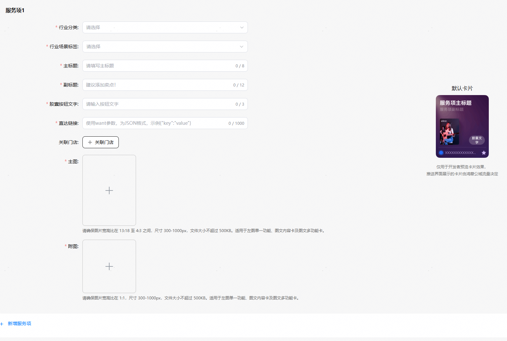
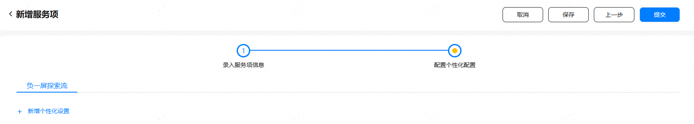
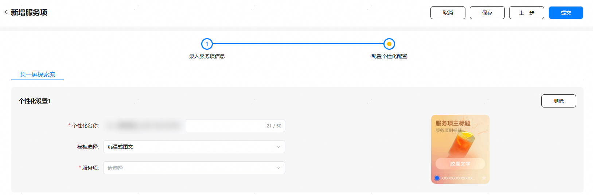
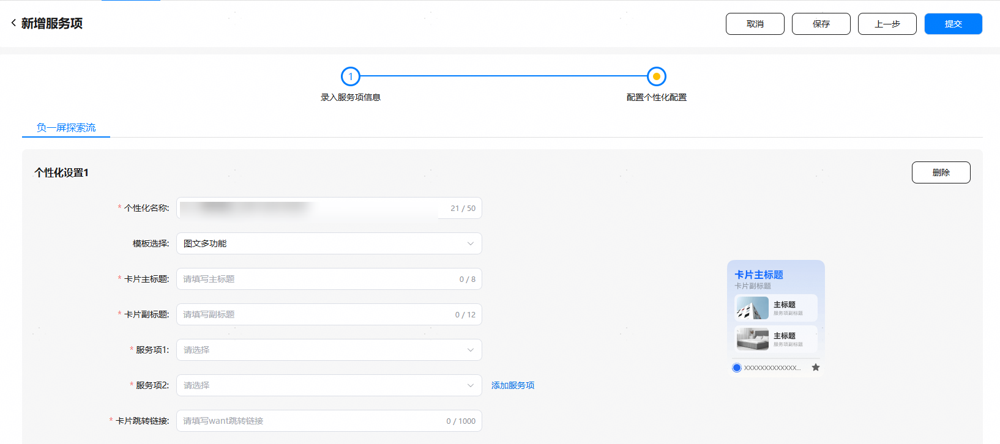
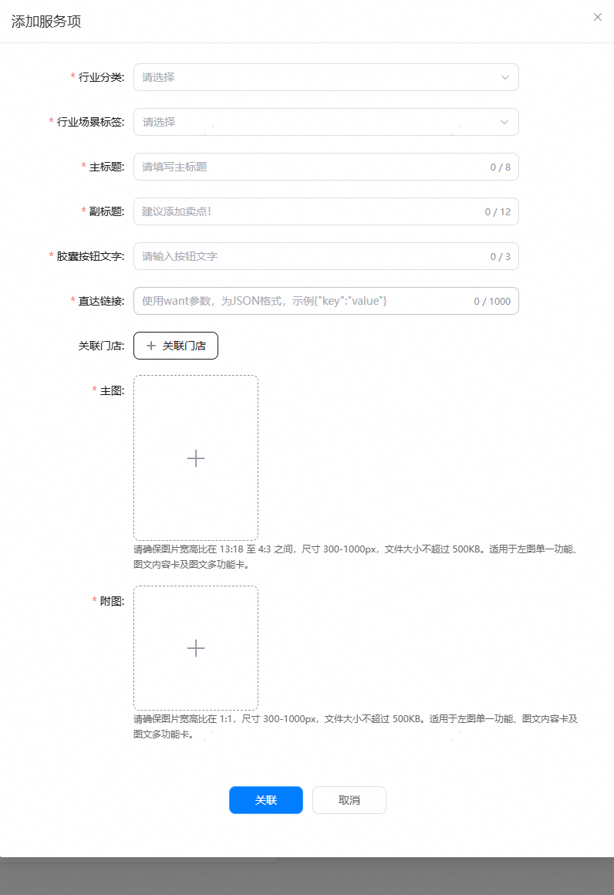
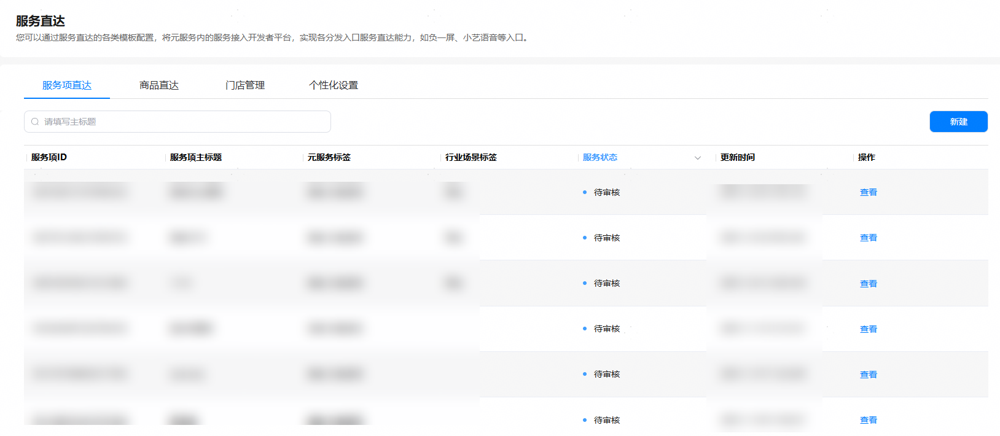
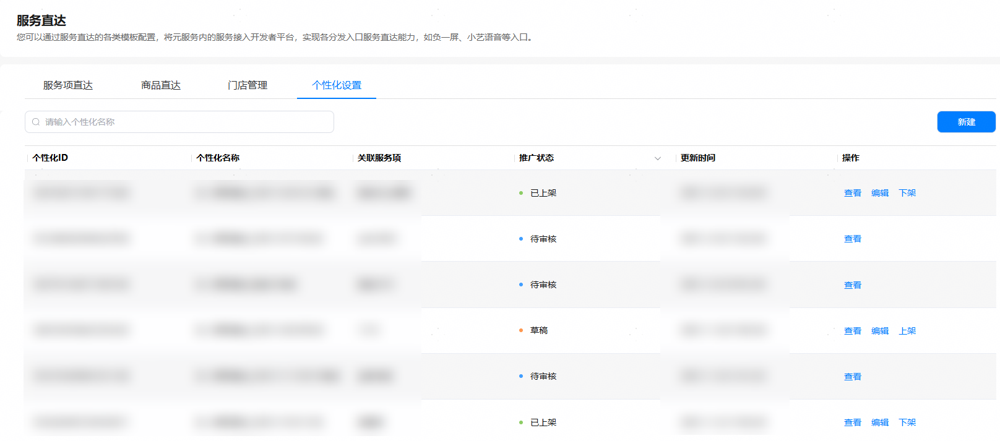

开发者可在此页签创建子服务后，再进行个性化设置。

1. 在服务直达主界面，选择“子服务直达”页签，点击“新建”。

   

2. 在“新增子服务”页录入子服务的相关信息，如图所示。

   

   

   

   * 子服务的主标题（title）在整个元服务内必须唯一。
   * 如果在个性化设置时，选择图文多功能，请录入2个子服务。
3. 如果有个性化设置的诉求，可在创建子服务后，点击“下一步”进入“配置个性化设置”界面，个性化设置页面是面向鸿蒙不同公域流量场提供的个性化素材配置，以满足各鸿蒙公域流量场的个性化用户体验。

   
4. 新增个性化设置（可选）
   * 负一屏探索流面向开发者提供三种模板：沉浸式图文、左图单一功能卡、图文多功能，右侧图片为对应模板的示例图。在子服务下拉框中可关联当前子服务。

     
   * 如选择“图文多功能”模板时，且在新建子服务时录入的子服务不足2个，则需要添加子服务的信息。

     
   * 点击“添加子服务”，输入完子服务的信息后，点击“关联”后即完成子服务的添加和所选模板的关联。

     
5. 点击“提交”后，子服务和个性化设置的状态将进入待审核。

   

   * 子服务状态说明：

     | 子服务状态 | 说明 |
     | --- | --- |
     | 草稿 | 开发者点击“保存”或“保存草稿”后，子服务状态变更为“草稿”。 |
     | 审核驳回 | 开发者提交子服务信息后，若平台审核不通过，子服务状态变更为“审核驳回”。 |
     | 待审核 | 开发者提交子服务信息后，若平台尚未完成审核，子服务状态变更为“待审核”。 |
     | 已上架 | 开发者提交子服务信息后，若平台通过审核，子服务状态变更为“已上架”。 |

   

   * 个性化设置状态说明：

     | 个性化设置状态 | 说明 |
     | --- | --- |
     | 草稿 | 开发者点击“保存草稿”后，个性化设置状态变更为“草稿”。 |
     | 审核驳回 | 开发者提交个性化设置信息后，若平台审核不通过，个性化设置状态变更为“审核驳回”。 |
     | 待审核 | 开发者提交个性化设置信息后，若平台尚未完成审核，个性化设置状态变更为“待审核”。 |
     | 已上架 | 开发者提交个性化设置信息后，若平台通过审核，个性化设置状态变更为“已上架”。 |
     | 已下架 | 开发者对“已上架”的个性化设置点击“下架”按钮后，个性化设置状态变更为“已下架”。处于“已下架”的个性化设置，开发者可进行查看、编辑、重复上架或保存草稿。 |
     | 已冻结 | 平台会周期性对已上架的个性化设置进行巡检，如发现个性化设置存在违规问题等，可能会导致个性化设置被处罚并冻结，个性化设置状态将变更为“已冻结”。处于“已冻结”的个性化设置，开发者可以查看详情、申请复核或下架。 |

     

     + 为方便开发者操作，允许开发者在创建子服务时，同步设置个性化数据。提交审核后，子服务和个性化设置是分开审核，子服务的审核状态不会影响个性化数据的审核结果。
     + 当子服务和个性化设置同时在架，才有机会面向鸿蒙公域流量场推送。
     + 开发者可单独管理子服务和个性化设置。
     + 开发者单独下架个性化后，子服务卡将不再公域流量推送。需要重新上架个性化才能继续推送流量。
