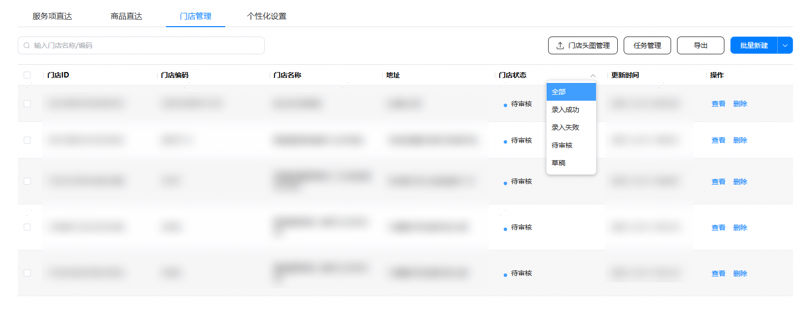
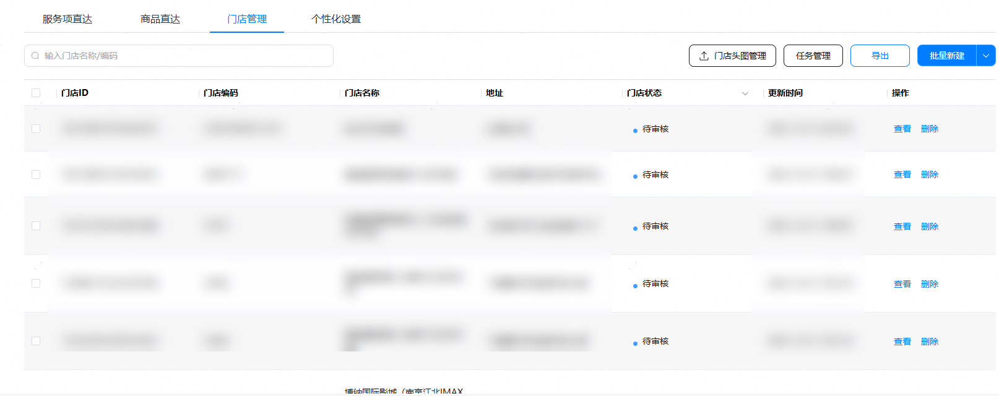
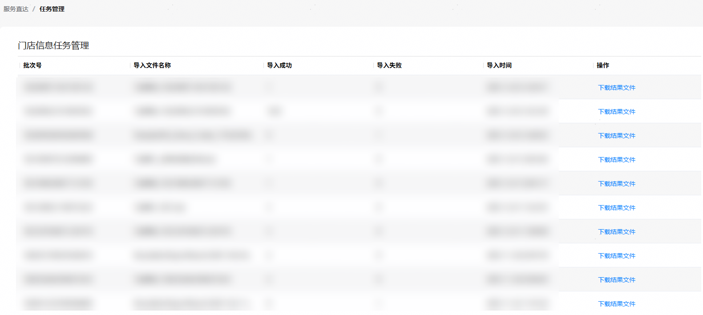
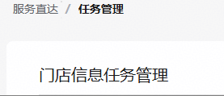
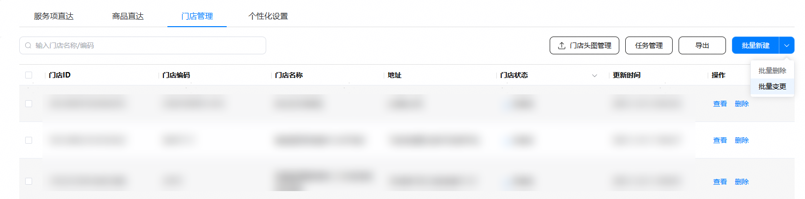

1. 在服务直达主界面，选择“门店管理”页签，根据门店状态或门店名称/编码筛选出需要变更的门店。

   
2. 点击“导出”。
   * 没有勾选项时，点击“导出”可导出全部门店。
   * 存在已勾选的门店时，点击“导出”仅导出已勾选门店。

   
3. 导出完成后，点击“任务管理”，下载导出结果。

   
4. 编辑表格，修改门店信息。
5. 点击“服务直达”,返回“门店管理”页签。

   
6. 点击“批量变更”，上传编辑后的表格文件，点击“上传”按钮。

   

   
