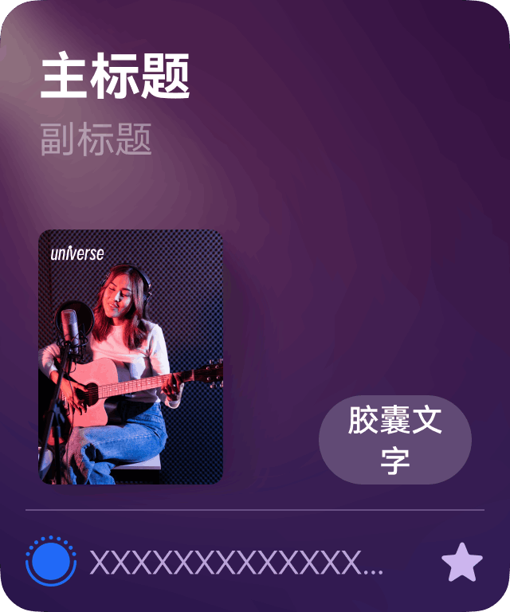
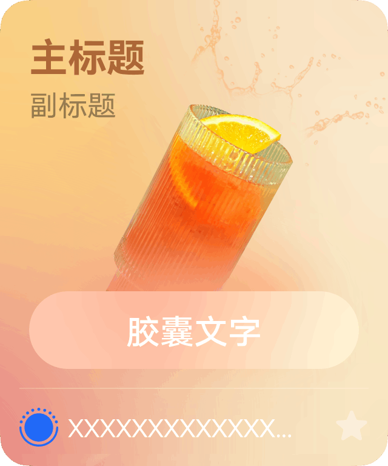
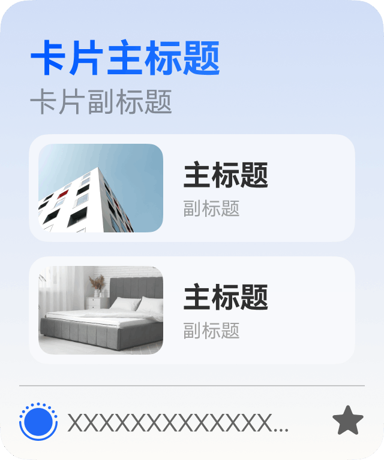

鸿蒙公域流量场给开发者提供多种卡片模板供开发者在配置时选择，开发者可根据素材选择不同的模板。

| 卡片模板名称 | 是否支持商品卡 | 是否支持门店卡 | 是否支持子服务卡 |
| --- | --- | --- | --- |
| 左图单一功能卡 | 支持 | 支持 | 支持 |
| 沉浸式图文卡 | 不支持 | 不支持 | 支持 |
| 图文多功能卡 | 不支持 | 不支持 | 支持 |

渲染效果最终以平台提供的能力为准，开发者只需要提供素材。

## 左图单一功能卡

| 字段 | 取值范围 |
| --- | --- |
| 主标题 | 最多不超过8个字。 |
| 副标题 | 最多不超过12个字。 |
| 胶囊文字 | 最多不超过3个字。 |
| 图片 | 取宽高比为1：1、像素300px-1000px、图片大小不超过500KB的图片，鸿蒙公域流量场会适当根据场景进行适当的裁剪，以适应不同的分发场景。建议您上传图片时确保 |
| 跳转链接 | 通过[openAtomicService API](https://developer.huawei.com/consumer/cn/doc/harmonyos-references/js-apis-inner-application-uiextensioncontext#openatomicservice12)跳转绑定的元服务。  链接格式为json字符串，内容为[want.parameters](https://developer.huawei.com/consumer/cn/doc/harmonyos-references/js-apis-app-ability-want)参数。  例如：  {"path":"page1", "productId":123} |

1、只有子服务卡支持定义胶囊文字，商品卡和门店卡由平台统一生成。如商品卡胶囊文字展示为“下单”。

2、如果选择左图单一功能卡，建议您尽量使用PNG图片以保障效果更加沉浸。

## 沉浸式图文卡

| 字段 | 取值范围 |
| --- | --- |
| 主标题 | 最多不超过8个字。 |
| 副标题 | 最多不超过12个字。 |
| 胶囊文字 | 最多不超过3个字。 |
| 图片规格 | 图片取宽高比为1：1的图片，鸿蒙公域流量场会适当根据展示场景进行适当的裁剪，以适应不同的分发场景。 |
| 跳转链接 | 通过[openAtomicService API](https://developer.huawei.com/consumer/cn/doc/harmonyos-references/js-apis-inner-application-uiextensioncontext#openatomicservice12)跳转绑定的元服务。  链接格式为json字符串，内容为[want.parameters](https://developer.huawei.com/consumer/cn/doc/harmonyos-references/js-apis-app-ability-want)参数。  例如：  {"path":"page1", "productId":123} |

## 图文多功能卡

| 字段 | 取值范围 |
| --- | --- |
| 卡片主标题 | 最多不超过8个字。 |
| 卡片副标题 | 最多不超过12个字 |
| 卡片跳转链接 | 通过[openAtomicService API](https://developer.huawei.com/consumer/cn/doc/harmonyos-references/js-apis-inner-application-uiextensioncontext#openatomicservice12)跳转绑定的元服务。  链接格式为json字符串，内容为[want.parameters](https://developer.huawei.com/consumer/cn/doc/harmonyos-references/js-apis-app-ability-want)参数。  例如：  {"path":"page1", "productId":123} |
| 主标题 | 最多不超过8个字。 |
| 副标题 | 最多不超过12个字。 |
| 胶囊文字 | 最多不超过3个字。 |
| 图片规格 | 图片取宽高比为1：1的图片，鸿蒙公域流量场会适当根据展示场景进行适当的裁剪，以适应不同的分发场景。 |
| 跳转链接 | 通过[openAtomicService API](https://developer.huawei.com/consumer/cn/doc/harmonyos-references/js-apis-inner-application-uiextensioncontext#openatomicservice12)跳转绑定的元服务。  链接格式为json字符串，内容为[want.parameters](https://developer.huawei.com/consumer/cn/doc/harmonyos-references/js-apis-app-ability-want)参数。  例如：  {"path":"page1", "productId":123} |
