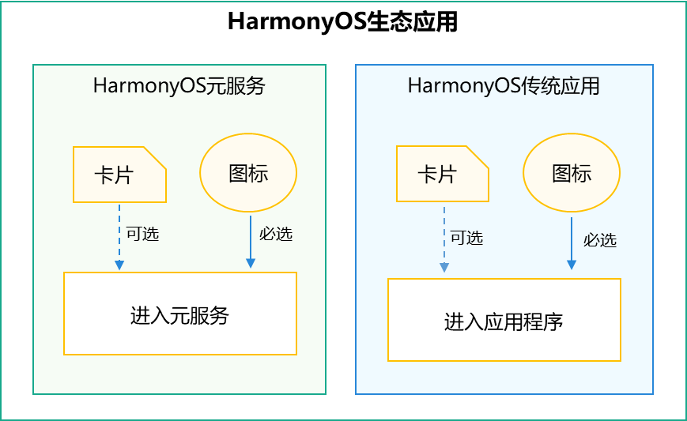
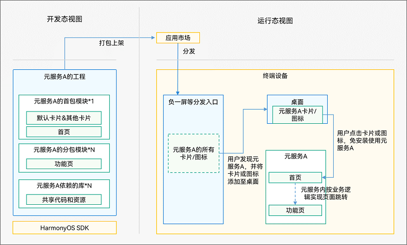

# 什么是元服务

> **注意**
>
> 从HarmonyOS NEXT Developer Preview1（对应API 11）版本开始：
> - HarmonyOS元服务只能采用"元服务API集"进行开发，且只支持Stage模型、只支持ArkTS接口；开发者在DevEco Studio中选择开发元服务时，工具将自动筛选"[元服务API集](https://developer.huawei.com/consumer/cn/doc/atomic-references/atomic-apis-intro)"。
> - 使用配套的HarmonyOS SDK开发的元服务，只能运行在系统软件版本为HarmonyOS NEXT Developer Preview1及以上版本的设备上。

在万物互联时代，人均持有设备量不断攀升，设备种类和使用场景更加多样，使得应用开发、应用入口变得更加复杂。在此背景下，应用提供方和用户迫切需要一种新的服务提供方式，使应用开发更简单、服务（如听音乐、打车等）的获取和使用更便捷。为此，HarmonyOS除支持传统的需要安装的应用（以下简称传统应用）外，还支持更加方便快捷的免安装的应用，即**元服务**。

元服务是HarmonyOS提供的一种轻量应用程序形态，具备秒开直达，纯净清爽；服务相伴，恰合时宜；即用即走，账号相随；一体两面，嵌入运行；AI智能，全域流转；高效开发，生而可信等特征。

元服务可独立上架、分发、运行，独立实现业务闭环，可大幅提升信息与服务的获取效率。

元服务基于HarmonyOS SDK（只能使用"[元服务API集](https://developer.huawei.com/consumer/cn/doc/harmonyos-references/development-intro-api)"）开发，支持运行在1+8+N设备上，供用户在合适的场景、合适的设备上便捷使用。

元服务的设计原则及规范，请查看[元服务设计指导](https://developer.huawei.com/consumer/cn/doc/design-guides/ux-guidelines-overview-0000001938867005)。

元服务与传统应用的对比请见下表。

**表1 元服务与传统应用对比**

| 区别 | 特征 | 载体 | API范围 | 经营 |
|---|---|---|---|---|
| **传统应用** | 手动下载安装 包大小无限制 按需使用 应用内或应用市场更新 功能齐全，开发成本高，周期长 | 跟随设备 | 全量API | 自主运营 人找应用成本高 |
| **元服务** | 免安装 包大小有限制 即用即走 自动更新 轻量化完整功能，开发成本较低 | 跟随华为账号 | 只能使用"元服务API集" | 支付、地图、广告等经营履约能力辅助经营 负一屏等系统分发入口帮助人找服务、服务找人 |

开发者基于经营目标、效率、成本、收益等因素，自主决定开发传统应用或元服务，也可以同时提供。

从应用程序入口看，下图展示了元服务与传统应用、服务卡片之间的关系。对于传统应用和元服务，均可选择服务卡片作为入口。

元服务在开发态和运行态的基本视图如下图所示。

关于元服务开发流程等更多内容，请见下文介绍。
