## 功能介绍

为了向用户提供更好的服务和更优的体验，Push Kit为元服务提供了基于账号的消息订阅能力。

元服务在“服务通知”中领用消息订阅模板后，根据模板向登录华为账号的用户发起订阅请求，当且仅当用户同意订阅后，元服务可向登录华为账号的用户推送订阅模板对应的消息，从而实现服务闭环。

在展示形态上，服务通知支持在锁屏、通知中心、横幅、负一屏等位置展示。

效果图如下，真实样式请以实际效果为准：

| 锁屏 | 通知中心 | 横幅 | 负一屏 |
| --- | --- | --- | --- |
| 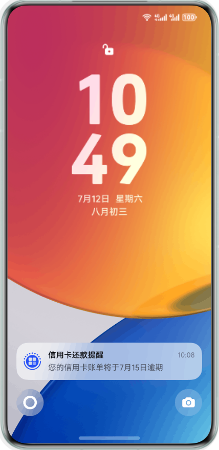 | 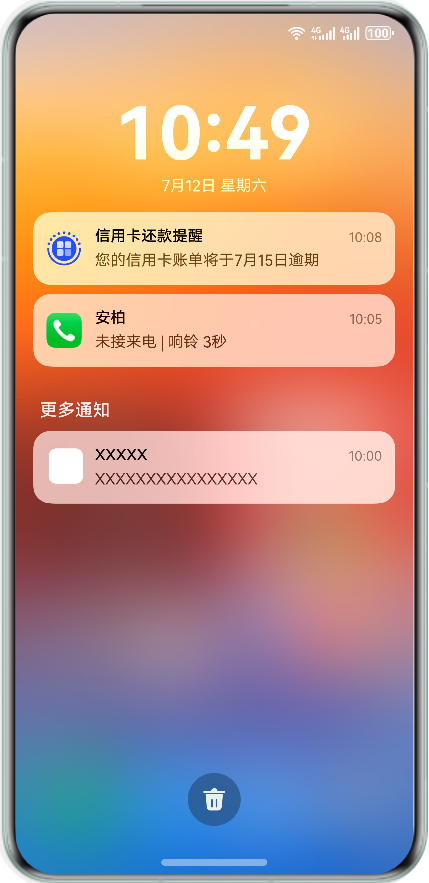 | 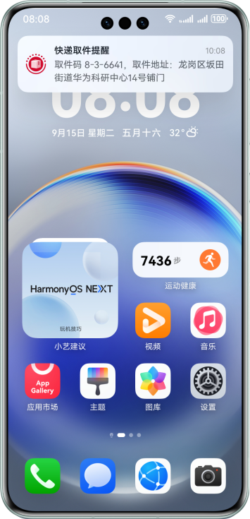 | 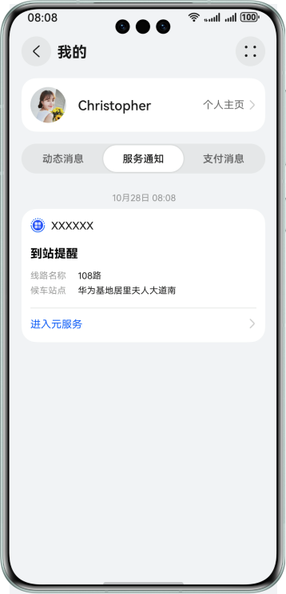 |

## 服务通知订阅消息分类

### 一次性订阅消息

一次性订阅消息用于解决用户使用元服务，后续服务环节的通知问题。

开发者在元服务中调用[serviceNotification.requestSubscribeNotification](https://developer.huawei.com/consumer/cn/doc/harmonyos-references/push-servicenotification#servicenotificationrequestsubscribenotification)()接口后，将向用户展示订阅授权弹窗，用户可打开自己想要接收的消息开关。用户订阅后，开发者可不限时间地下发一条对应的服务通知消息；每条消息可单独订阅或退订。

从HarmonyOS 6.0开始，一次性订阅面板支持“总是保持以上选择”设置项。当用户勾选 “总是保持以上选择” 之后，订阅消息会被添加到用户的元服务设置页，下次订阅调用[serviceNotification.requestSubscribeNotification](https://developer.huawei.com/consumer/cn/doc/harmonyos-references/push-servicenotification#servicenotificationrequestsubscribenotification)()不会再向用户弹窗，保持之前的选择，修改选择需要打开元服务通知管理设置页进行修改 。

用户订阅界面示例如下：

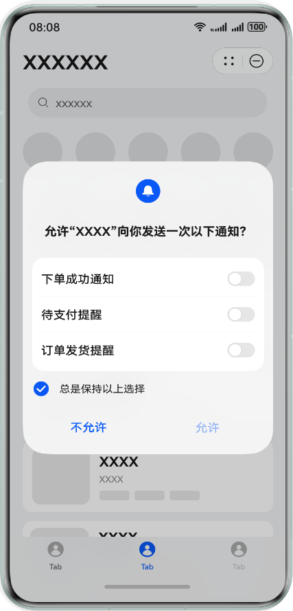

### 长期订阅消息

从HarmonyOS 6.0开始正式支持。

一次性订阅消息可满足元服务的大部分服务场景需求，但公共服务领域存在一次性订阅无法满足的场景，如电费缴费提醒、话费充值提醒、信用卡账单提醒等，需多次发送消息提醒。为便于服务，我们提供了长期订阅消息，用户订阅一次后，开发者可长期下发多条消息。

开发者在元服务中调用[serviceNotification.requestSubscribeNotification](https://developer.huawei.com/consumer/cn/doc/harmonyos-references/push-servicenotification#servicenotificationrequestsubscribenotification)()接口后，将向用户展示订阅授权弹窗，用户可打开自己想要接收的消息开关。在用户订阅长期订阅消息后，订阅消息会被添加到用户的元服务设置页，修改选择需要打开元服务通知管理设置页进行修改。

目前长期订阅消息仅向政务民生、银行、医疗等公共服务开放，后期将逐步支持到其他公共服务业务。

用户订阅界面示例如下：

## 开通服务通知

* 开通服务通知前，请确保元服务已经开通推送服务，详情见[开发准备](https://developer.huawei.com/consumer/cn/doc/atomic-guides/push-as-prepare)章节。
* 请确保元服务已通过[元服务分类标签和资质认证](https://developer.huawei.com/consumer/cn/doc/app/agc-help-release-atomic-class-tag-0000002293651518)，平台将依据您已认证的分类标签进行模板和权限管理。

1. 登录[AppGallery Connect](https://developer.huawei.com/consumer/cn/service/josp/agc/index.html)网站，选择“APP与元服务”。

   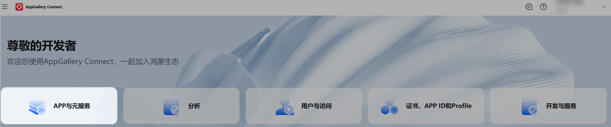
2. 选择需要推送订阅消息的元服务。

   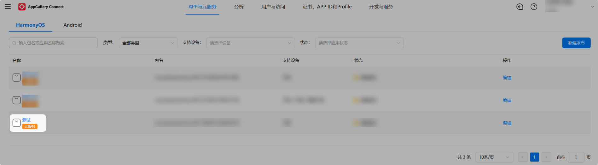
3. 点击元服务后，选择左侧导航栏的“服务分发增长 -> 服务通知”，进入服务通知页面点击开通，即可开通服务通知。

   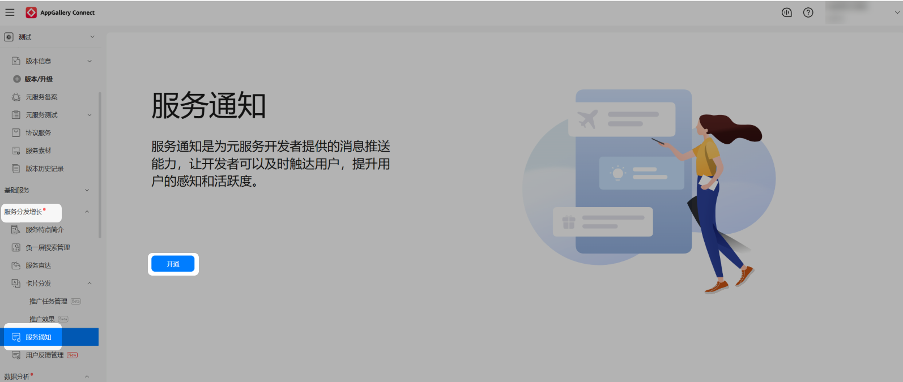

   也可在“全部功能”找到“服务通知”入口。

   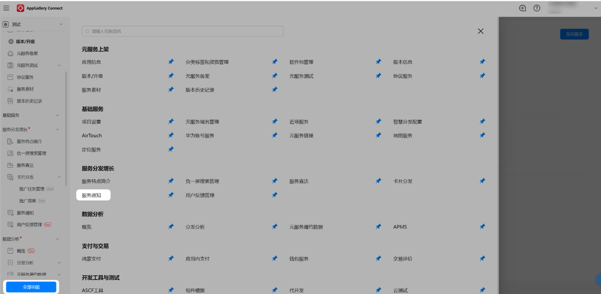

## 选用订阅模板

1. 开通服务通知后，在“我的模板”页签下点击“选用”按钮。

   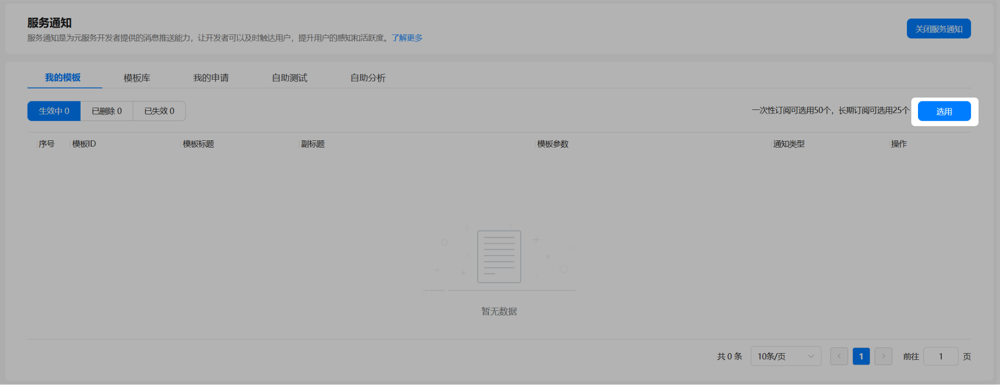
2. 跳转至公共模板库后，模板库基于已通过的分类标签展示当前元服务可选用的模板，按实际需要选用消息模板，支持一次性订阅消息模板、长期订阅消息模板，点击模板右侧的“选用”后进入模板详情页。

   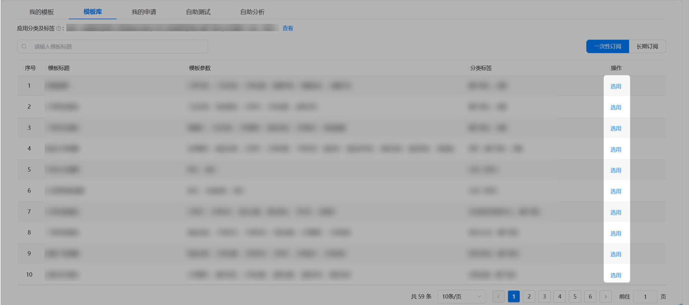

   

   若模板库中无匹配的业务场景模板，开发者可登录AGC平台，进入“模板库”页签，翻动至模板列表尾页底部，点击“没找到合适模板？点击查看”提交新模板申请。
3. 模板详情包括模板的基本信息与消息详情，其中消息详情项可按实际需要配置参数，配置后的消息卡片样式将实时展示在页面右侧，配置完成后点击“提交”。

   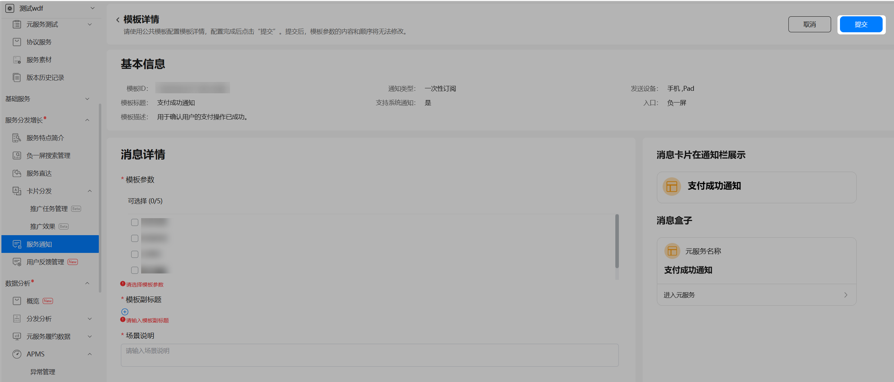

   * 基本信息：包括模板标题、模板描述等基本信息。
     + 模板ID：订阅消息对应的模板ID。
     + 模板标题：模板标题会展示在订阅弹窗与下发消息中。
     + 支持系统通知：当模板支持系统通知时，元服务订阅消息当前支持在锁屏和通知中心展示**。**
     + 通知类型：一次性订阅代表用户选择的订阅结果仅作用于本次消息下发；长期订阅代表用户选择的订阅结果可作用于后续多次消息下发，而无需用户再次进行订阅操作。
     + 入口：默认消息入口。
     + 模板描述：描述本模板的用途，模板描述的内容不会出现在订阅弹窗与下发消息中。
     + 发送设备：表示模板支持的设备类型。
   * 消息详情：包括模板参数、模板副标题和场景说明。
     + 模板参数：每个可领用模板有固定的模板参数，请根据实际需要勾选。
     + 模板副标题：分为固定词与占位符两种。固定词为不可替换部分，占位符可选择“模板参数”中已勾选的参数，最终由固定词和占位符组成完整的副标题，模板副标题总长度不超过1024个字节。模板副标题的内容将会体现在消息卡片中。
     + 场景说明：说明服务通知的服务场景，用于平台审核模板，内容不会体现在下发消息中。

   

   1. 通知栏消息仅展示模板副标题中的内容。消息下发后实际最多显示 3 行，超长则“…”截断，详情请见[通知详情](https://developer.huawei.com/consumer/cn/doc/design-guides/system-features-notification-0000001793074217#section848693515289)。
   2. 模板副标题中的内容须准确完整，不含营销信息，并且符合模板的使用场景。
4. 提交申请后回到服务通知页面，点击“我的申请”可查看审批进度。通常领用模板的审核时间为3-7个工作日，待当前状态为“已审批”时，此模板即为可用状态。

   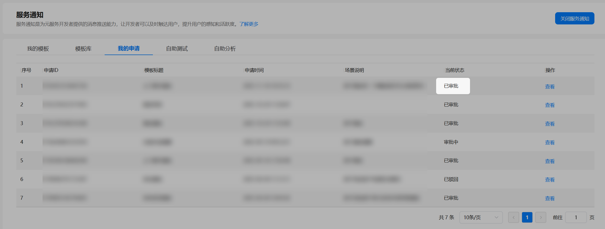
5. 审批完成后，在“我的模板”页签中查看模板ID及模板详情。

   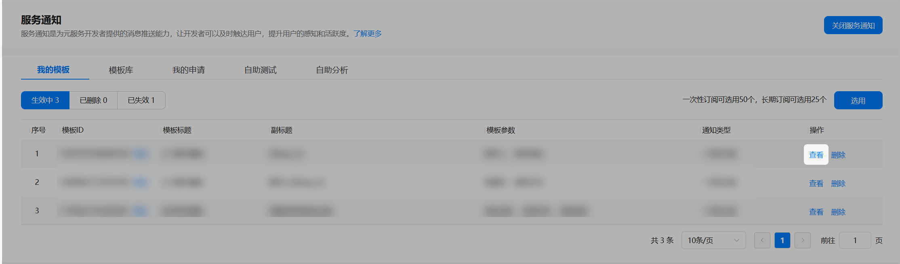

   “消息详情”下的“模板参数”与“模板副标题”中的花括号{{}}中（例如{{time\_1}}）的值即为模板消息下发时动态设置的参数，发送元服务订阅消息时请携带对应参数，详情见[推送基于账号的订阅消息](https://developer.huawei.com/consumer/cn/doc/atomic-guides/push-as-send-sub-noti)。

   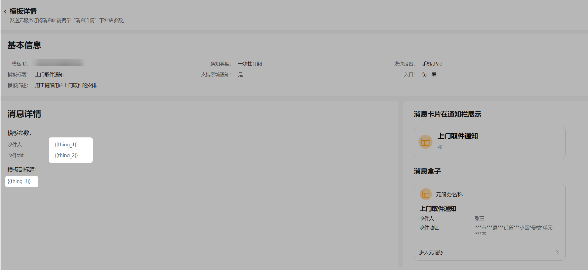

## 删除模板与恢复模板

1. 每个元服务可领用的一次性订阅模板不超过50个，长期订阅模板不超过25个，若领用模板有误或确定不使用，可在服务通知页面删除模板避免占用可领用数额。

   进入服务通知页面，在“我的模板”页签下点击删除按钮。

   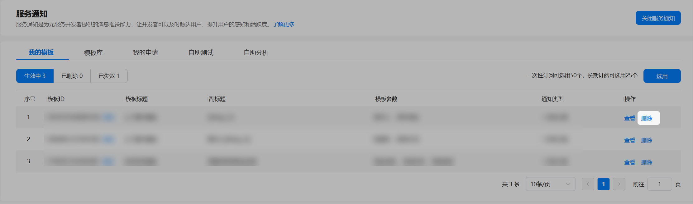

   确认删除影响后点击确定按钮。

   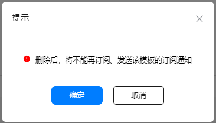
2. 在“我的模板”页签点击已删除，可查看已删除模板。

   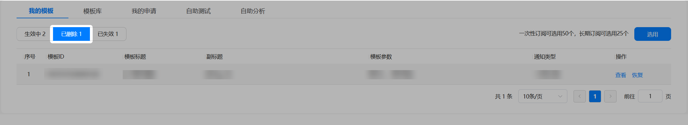
3. 若误删除，或想恢复已删除模板，请在已删除页面点击恢复按钮，重新领用模板。确认恢复后可继续使用此模板。恢复后将直接还原领用模板时选择的参数配置，无需重新进行配置。

   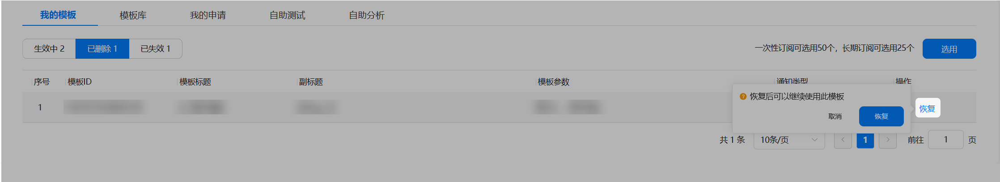

## 常见问题

如有疑问，请参阅[服务通知接入FAQ](https://developer.huawei.com/consumer/cn/doc/atomic-faqs/faqs-inform-access)以获取更多帮助。
