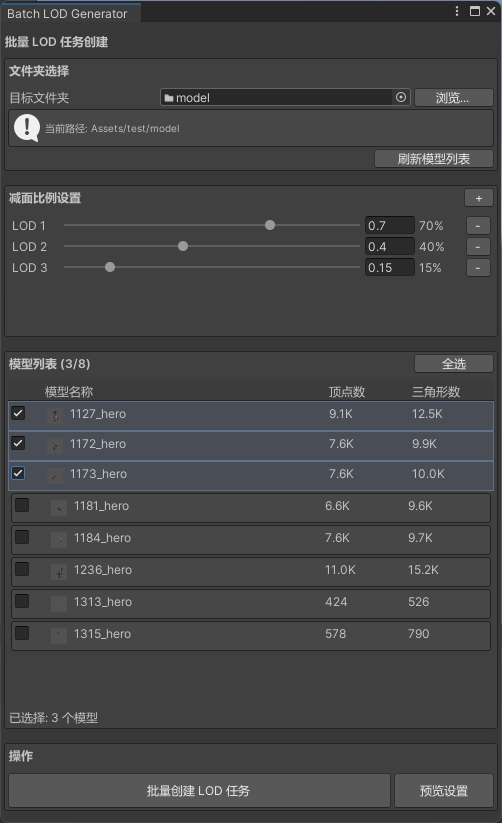
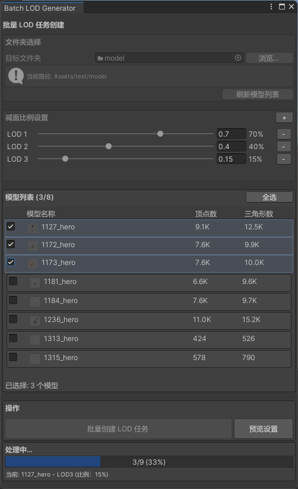
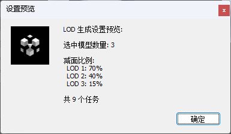
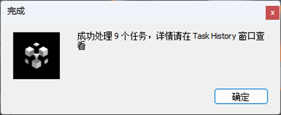

1. 顶部菜单栏选择“AILOD &gt; Batch LOD Generator”。

   
2. 在“Batch LOD Generator”窗口中执行如下操作：
   1. 点击“浏览”，选择游戏项目中Assets目录下的一个资源文件夹，该文件夹中包含的模型会展示在下方的模型列表中。
   2. 点击“+”，为模型设置减面比例，最多设置10个。例如，一个原始模型有1W面，减面比例为70%，则生成的结果大约有7K面。
   3. 在模型列表中勾选待简化的模型。例如，设置3个减面比例且选择3个模型，则一共会创建9个任务，且每个模型会生成3个减面比例的任务。
   4. 确认无误后，点击“创建LOD任务”，批量创建模型简化任务，且最多批量创建20个任务。

   
3. 向AILOD云端上传资源文件可能需要一些时间，请耐心等待。

   您可以通过进度条查看批量任务的创建进度。

   
4. 在批量任务创建过程中，您可以点击“预览设置”查看当前批量创建的任务数及减面比例。

   
5. 批量任务创建成功后，您可以查看任务执行状态并下载模型简化结果，详情请参见[下载模型简化结果](https://developer.huawei.com/consumer/cn/doc/games-guides/ailod-history-0000002513134850)。

   
