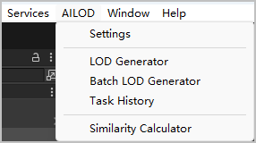
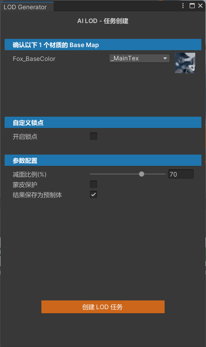
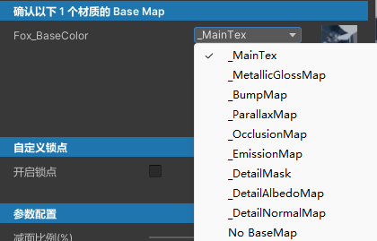
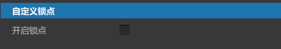
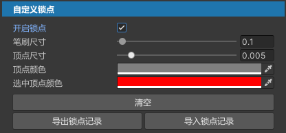
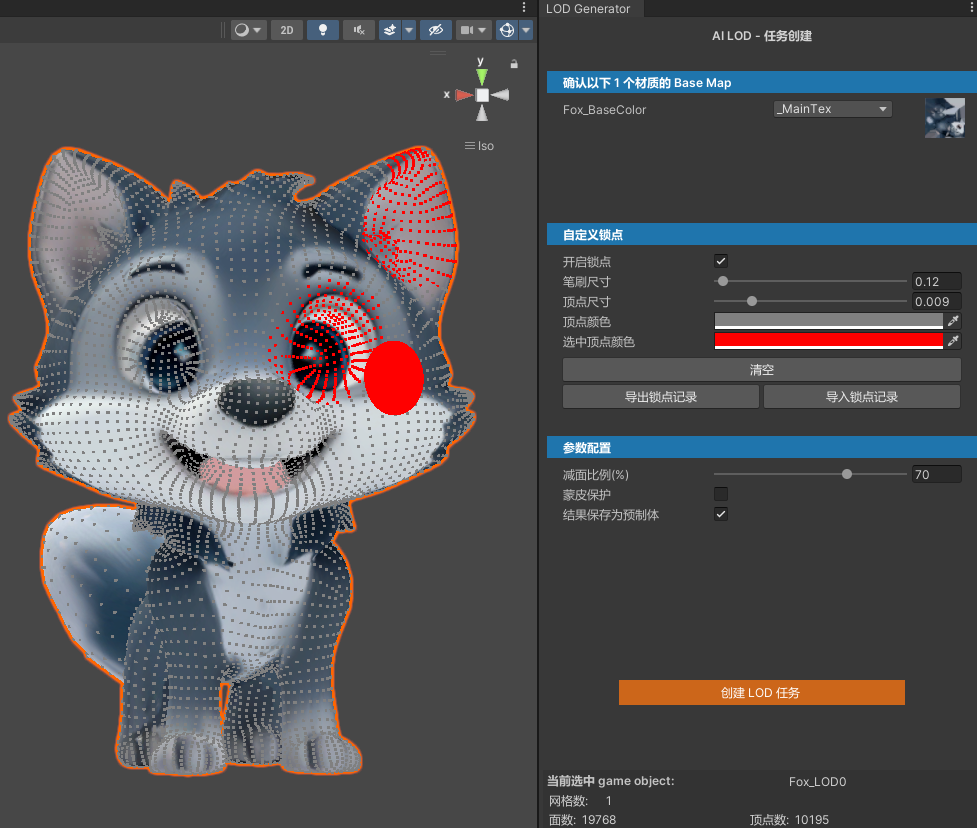
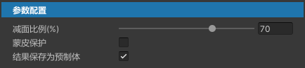
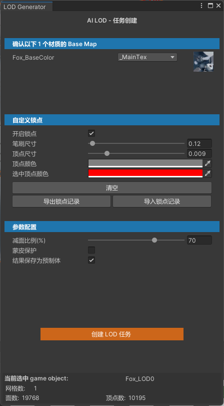
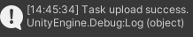

## 第一步：选择原始模型

1. 顶部菜单栏选择“AILOD &gt; LOD Generator”。

   
2. 在场景或Hierarchy窗口中，请选择一个game object对象，要求处于激活状态，且至少包含一个“Mesh Renderer”或“Skinned Mesh Renderer”组件。

   选中一个game object对象后，处于激活状态的子对象也将被视为选中。

   选好game object对象后，需要在“LOD Generator”窗口上逐一完成如下配置项：

   

## 第二步：选择贴图

AILOD使用视觉驱动算法，请为game object对象的每个材质选择基础颜色贴图（Base Color Map/Albedo Map/Diffuse Map）。

默认选择材质属性中的首张纹理。

若无贴图材质，您可以选择“No BaseMap”。

## （可选）第三步：自定义锁点

AILOD锁点功能是为了保护模型网格上被选中的顶点不被简化。

1. 若想保护模型上的顶点不被简化，请勾选“开启锁点”。

   
2. 在Scene窗口中，您可以使用任一方式选择想保护的顶点：
   * **方式一**：先在可视化面板上设置笔刷大小、顶点大小等参数，再使用笔刷在模型上刷选想保护的顶点。若想保存当前已选择的顶点，点击“导出锁点记录”，将顶点信息JSON文件保存至本地。
   * **方式二**：直接点击“导入锁点记录”，选择本地已保存的顶点信息JSON文件，加载锁点记录。

   

   | 配置项 | 说明 |
   | --- | --- |
   | 笔刷大小 | 笔刷半径大小。  单位是m，取值范围是[0.002,5]。  * 使用“Ctrl + 鼠标左键 + 鼠标左右滑动”快捷键，调整笔刷大小。 * 使用“Ctrl + Z”，撤销上一次刷选操作。 |
   | 顶点大小 | 顶点边长大小。  单位是m，取值范围是(0~0.05]。 |
   | 顶点颜色 | 未选中顶点的颜色。 |
   | 选中顶点颜色 | 已选中顶点的颜色。 |

   | 按钮 | 说明 |
   | --- | --- |
   | 清空 | 清空所有已选中顶点。 |
   | 导出锁点记录 | 选择本地路径，导出当前已选中的顶点信息到JSON文件。 |
   | 导入锁点记录 | 选择本地已保存的顶点信息JSON文件，加载锁点记录。 |

   例如，在Scene窗口使用红色笔刷选中模型的右眼和右耳朵后，效果图如下：

   

   

   该三维模型《Stylized Cartoon Fox》由原作者发布于[Stylized Cartoon Fox](https://www.fab.com/listings/ce06022a-70e9-45c1-8f7c-991820a47a75)平台，本文依据[Creative Commons Attribution 4.0 International（CC BY 4.0）](https://creativecommons.org/licenses/by/4.0/)许可协议使用。

## 第四步：配置减面参数

AILOD将根据您设置的配置项减少模型的多边形数量。配置项如下：

| 配置项 | 说明 |
| --- | --- |
| 减面比例 | 该配置项决定生成的LOD网格与原始网格三角形数量的百分比，范围为1%~99.9%。  例如，原始模型有1W面，设置比例为70%，则生成的结果大约有7K面。  说明：  因为算法会尝试保留动画关键区域周围的多边形，所以实际结果面数可能会高于您设置的目标比例对应的面数。 |
| 蒙皮保护 | 该配置项在简化含有骨骼蒙皮的模型时考虑骨骼权重信息。  勾选该选项后，可使模型在LOD简化后仍尽量正确保持原有的骨骼变形效果。 |
| 结果保存为预制体 | 该配置项与最终生成的结果文件相关：   * 勾选该选项：将在结果目录中生成一个预制体（Prefab）。 * 未勾选该选项：仅生成对应的Mesh资源文件。您可以自行将该Mesh挂载到已有game object上，或手动创建预制体（Prefab）进行使用。 |

## 第五步：创建任务

配置项完成后，点击“创建LOD任务”，即可创建单个模型简化任务。

单个任务创建成功后，您可以查看任务执行状态并下载模型简化结果，详情请参见[下载模型简化结果](/docs/dev/game-dev/ailod-history-0000002513134850)。

