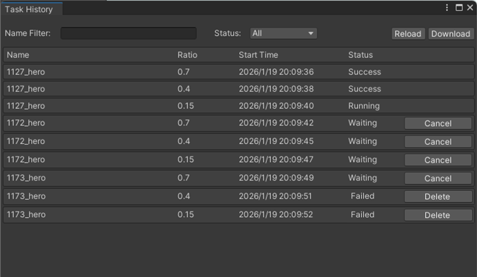
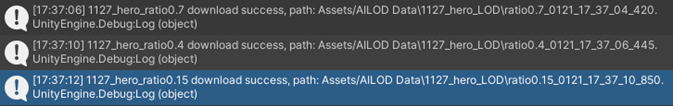
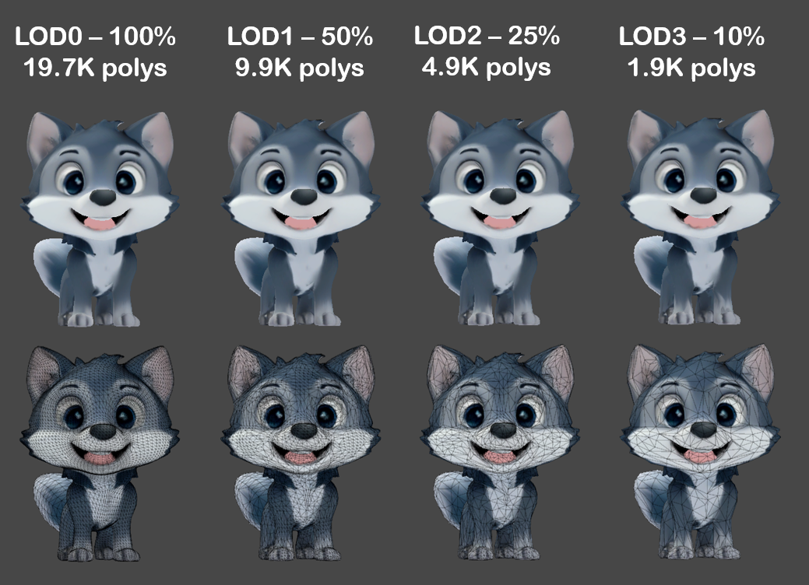

模型简化任务执行成功后，您可以将生成的LOD模型下载并运用到游戏场景中。

1. 顶部菜单栏选择“AILOD &gt; Task History”。

   
2. 在“Task History”窗口的任务列表中，查看任务执行状态，支持按模型名称模糊匹配查询，或按任务状态查询。

   

   | 参数 | 描述 |
   | --- | --- |
   | Name | 模型名称。 |
   | Ratio | 减面比例。 |
   | Start Time | 任务创建时间。 |
   | Status | 任务状态：  * Success：任务执行成功，表示可以下载。 * Running：任务执行中，表示AILOD云端正在为原始模型生成LOD模型。您可以点击“Reload”，实时更新任务状态。 * Waiting：任务排队中，表示正在等待其他任务释放计算资源。若无需执行该任务，您可以点击“Cancel”，取消任务。 * Failed：任务执行失败。您可以点击“Delete”，删除任务。 |
3. 在“Task History”窗口右侧点击“Download”，一键下载所有“Success”任务简化后的LOD模型。

   LOD模型保存目录为“Assets/AILOD Data/\&#123;game object名称\&#125;\_LOD/&#123;面数比例&#125;\_&#123;当前时间&#125;”。

   同时，任务列表将自动删除已下载过LOD模型的任务。

   
4. 您可以在Scene窗口中比对不同细节级别的LOD模型。比对效果图如下：

   

   

   该三维模型《Stylized Cartoon Fox》由原作者发布于[Stylized Cartoon Fox](https://www.fab.com/listings/ce06022a-70e9-45c1-8f7c-991820a47a75)平台，本文依据[Creative Commons Attribution 4.0 International（CC BY 4.0）](https://creativecommons.org/licenses/by/4.0/)许可协议使用。
