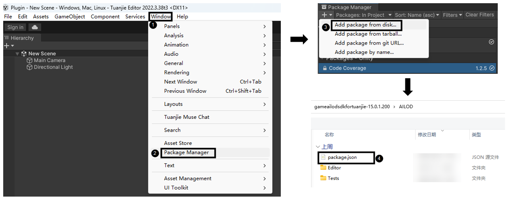
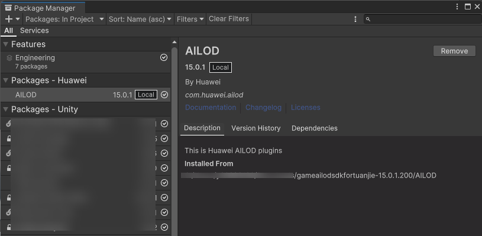

## 前提条件

已前往[下载地址](https://developer.huawei.com/consumer/cn/doc/AppGallery-connect-Library/ailod-sdk-0000002476766086)下载AILOD Package。

## 操作步骤

1. 在团结Hub中打开您的游戏工程。
2. 进入团结Editor，在顶部菜单栏选择“Window &gt; Package Manager”，在弹出的“Package Manager”窗口上，点击“Add package from disk”，将已下载的AILOD Package导入您的游戏工程。

   
3. Package导入成功后，您可以前往“Window &gt; Package Manager”查看AILOD Package。

   

   顶部菜单栏新增了“AILOD”菜单名。

   
