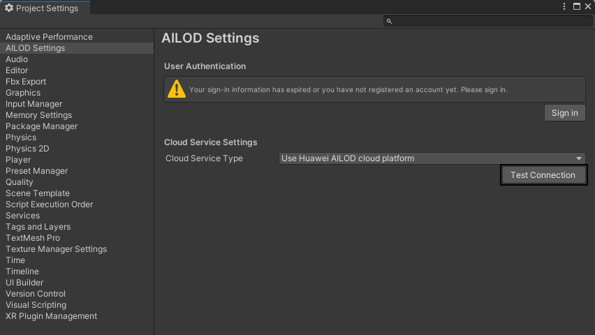

AILOD为端云协同工作，因此在使用期间需要保持网络畅通。

1. 在顶部菜单栏选择“AILOD &gt; Settings”，点击“Test Connection”，测试是否可以连接Huawei AILOD cloud platform。

   
2. 若连接失败请前往[FAQ](/docs/dev/game-dev/ailod-faq-0000002509054397#section1871719355282)查看解决方案。
