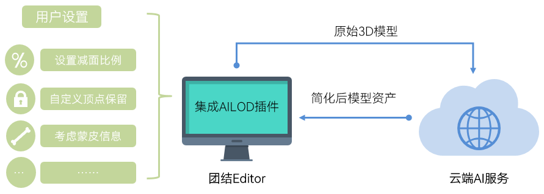

## 产品简介

细节层次（LOD，Level of Detail）是一种常见的游戏优化技术，根据物体与摄像机的距离，动态调整模型的细节程度，以此减少渲染开销，提升游戏性能。例如，靠近摄像机的物体使用高细节模型，远处的物体则切换为简化模型。

AILOD是一款LOD资产生成插件，致力于为游戏开发者提供智能的模型简化能力，通过自动化的几何简化与细节优化算法，AILOD能够在保证视觉质量的前提下，显著降低模型多边形数量，从而提升游戏的渲染性能与运行效率。

开发者仅需在AILOD插件中简单配置，即可一键将3D美术资源简化成不同细节层次的LOD模型。开发者还可以使用AILOD内置的相似度计算功能，客观评测不同工具简化后的视觉质量。

## 平台支持说明

仅支持运行在**Windows**系统上的团结Editor。

团结Editor版本无限制。

## 工作原理

AILOD采用端云协同机制，分工如下：

* Editor侧：负责3D模型数据和用户配置的采集、预处理与结果接收。
* AILOD云端：基于用户设定的目标精度与保留规则，执行AI算法生成简化后的LOD模型资产。

## 实现流程

| 序号 | 步骤 | 说明 |
| --- | --- | --- |
| 1 | [准备工作](https://developer.huawei.com/consumer/cn/doc/games-guides/ailod-preparation-0000002508728567) | 请提前做好[AppGalleryConnect准备](https://developer.huawei.com/consumer/cn/doc/games-guides/ailod-agc-0000002477235912)和[Editor准备](https://developer.huawei.com/consumer/cn/doc/games-guides/ailod-editor-0000002509796033)工作。 |
| 2 | 创建模型简化任务 | 您可以[创建单个模型简化任务](https://developer.huawei.com/consumer/cn/doc/games-guides/ailod-game-object-0000002509342931)或[批量创建模型简化任务](https://developer.huawei.com/consumer/cn/doc/games-guides/ailod-batch-0000002544814743)。 |
| 3 | [下载模型简化结果](https://developer.huawei.com/consumer/cn/doc/games-guides/ailod-history-0000002513134850) | 您可以查看简化任务的执行状态，并下载简化后的LOD模型。 |
| 4 | （可选）[定量评测模型简化结果](https://developer.huawei.com/consumer/cn/doc/games-guides/ailod-similarity-0000002513294772) | AILOD提供模型视觉相似度计算功能，支持评测不同工具生成的LOD模型与原始模型的视觉相似度，衡量低面数模型的视觉质量。 |

## 相关概念

| 名称 | 说明 |
| --- | --- |
| 蒙皮 | 蒙皮定义了模型网格如何随骨骼运动而变形，LOD任务应在减少顶点数量的同时尽量保持原有的形变效果。 |
