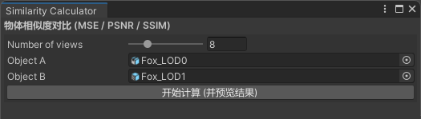
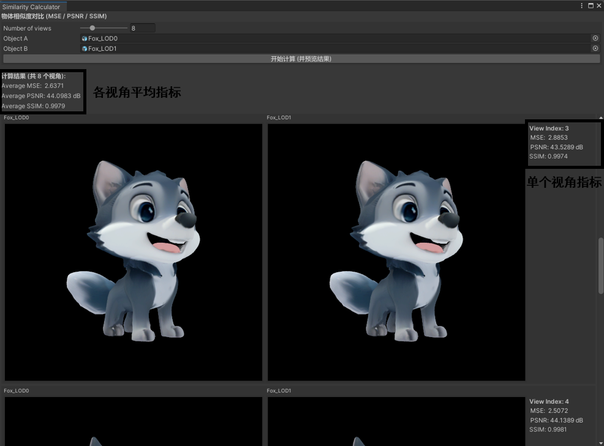

为了量化模型简化结果，AILOD提供了模型视觉相似度计算功能，支持评测不同工具生成的LOD模型与原始模型的视觉相似度，衡量低面数模型的视觉质量。具体步骤如下：

1. 顶部菜单栏选择“AILOD &gt; Similarity Calculator”。

   
2. 在“Similarity Calculator”窗口中进行设置，完成后点击“开始计算(并预览结果)”。

   

   | 配置项 | 说明 |
   | --- | --- |
   | Number of views | 评测视角数量。  建议8个及以上。  视角是均匀分布在环绕模型的球面上，详情请参见[Evenly distributing points on a sphere](https://extremelearning.com.au/evenly-distributing-points-on-a-sphere/)。 |
   | Object A | 选择一个game object对象的原始模型。 |
   | Object B | 选择该原始模型简化后的一个LOD模型。  支持评测AILOD工具或其它工具生成的LOD模型。 |
3. 在“Similarity Calculator”窗口中查看每个视角的相似度指标和平均指标。

   

   

   该三维模型《Stylized Cartoon Fox》由原作者发布于[Stylized Cartoon Fox](https://www.fab.com/listings/ce06022a-70e9-45c1-8f7c-991820a47a75)平台，本文依据[Creative Commons Attribution 4.0 International（CC BY 4.0）](https://creativecommons.org/licenses/by/4.0/)许可协议使用。

   | 指标 | 全称 | 简述 | 取值范围 |
   | --- | --- | --- | --- |
   | MSE | Mean Squared Error（均方误差） | 衡量两幅图像对应像素差值平方的平均值，反映整体误差大小。 | ≥ 0。  数值越小，表示两幅图像越相似。 |
   | PSNR | Peak Signal-to-Noise Ratio（峰值信噪比） | 基于MSE计算的信噪比，常用于衡量图像重建质量。 | (0, +∞)。  数值越大，表示两幅图像越相似。 |
   | SSIM | Structural Similarity Index（结构相似度） | 从亮度、对比度和结构信息三个方面衡量两幅图像的相似度。 | (0, 1)。  数值越接近1，表示两幅图像越相似。 |
4. 游戏场景中需要不同细节级别的LOD模型。

   您可以定量评测不同工具生成的LOD模型质量，并在不同画面细节表现中使用与原始模型较相似的LOD模型预制体。
