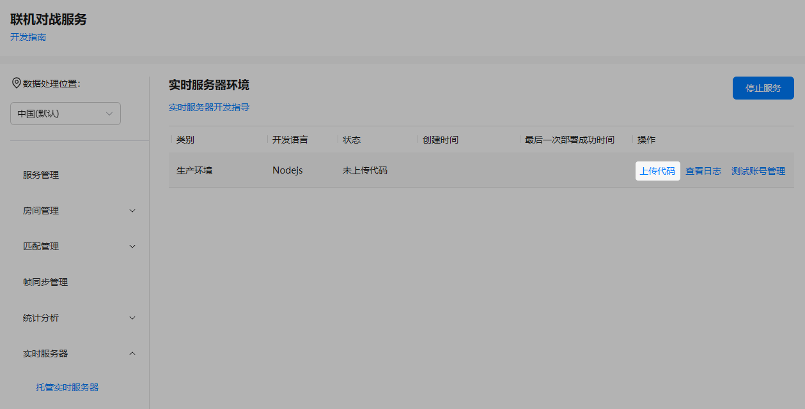
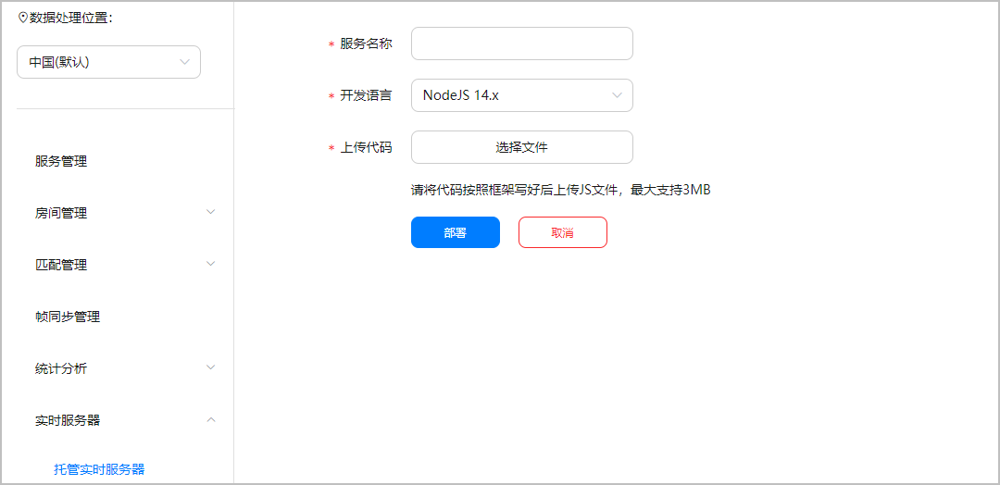
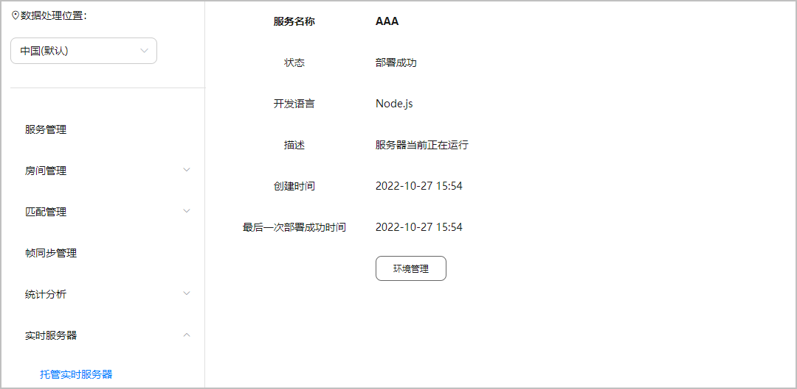
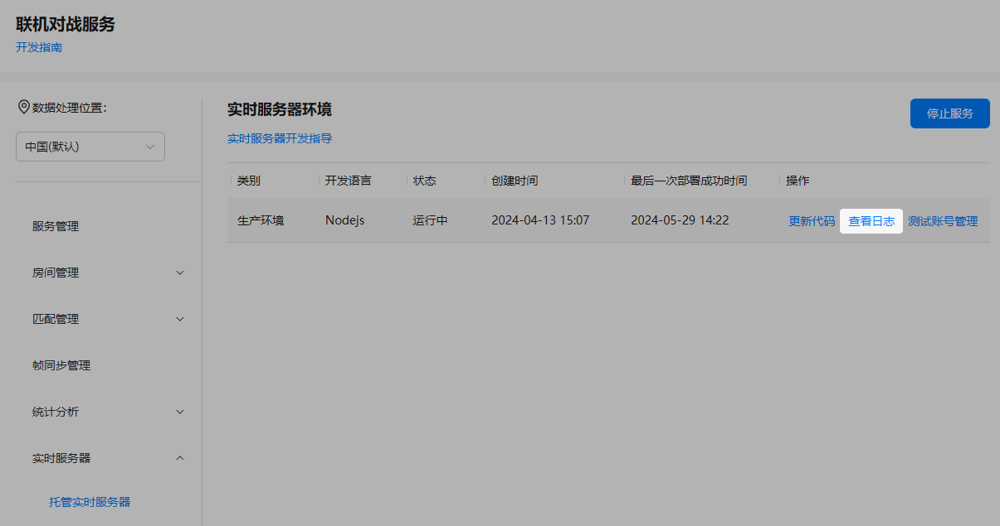
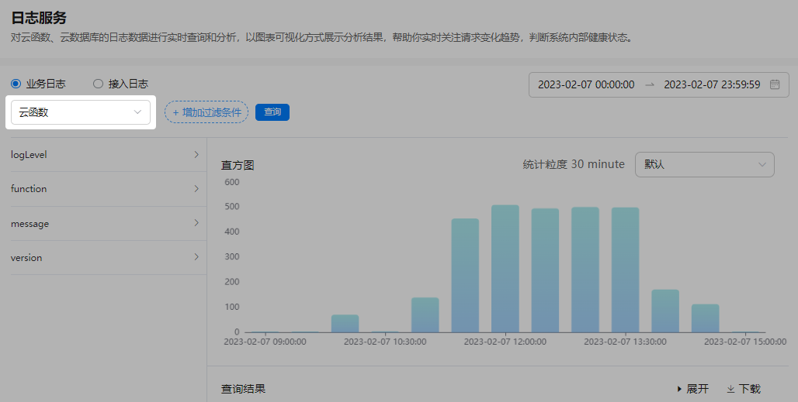

代码开发及本地调试完成后，需将代码托管到联机对战的实时服务器上。同时，在实时服务器的运行过程中，您还可以随时在AGC控制台查看服务器的运行日志。

## 上传代码到实时服务器

1. 在联机对战服务页面，选择“实时服务器 &gt; 托管实时服务器”。
2. 点击“生产环境”对应“操作”列的“上传代码”。

   
3. 自定义一个服务名称（长度64的字符串），选择开发语言，点击“选择文件”上传您的index.js文件（最大支持3MB）。

   
4. 点击“部署”，即可查看到部署结果。

   

## 查看运行日志

当前，日志功能需人工开通，可通过联系企业QQ：2851508860 / 2851508868进行申请，您需要向华为运营人员提供项目ID信息。

1. 在联机对战服务页面，选择“实时服务器 &gt; 托管实时服务器”。
2. 点击“生产环境”对应“操作”列的“查看日志”。

   
3. 跳转到相同项目下的“云监控 &gt; 日志服务”页面，在下拉选项中选择“云函数”，即可查看日志详情。您还可以通过右上角的时间筛选，查看不同时间段的数据，具体操作请参考[日志服务](https://developer.huawei.com/consumer/cn/doc/AppGallery-connect-Guides/cloudfunction-0000001432886916)。

   

   实时服务器日志中的message（消息内容）格式为“productId|message”。

   
