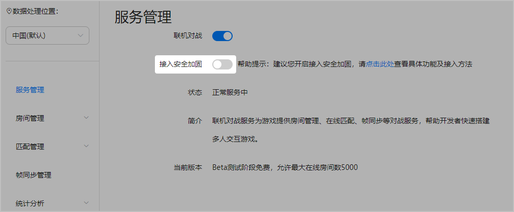
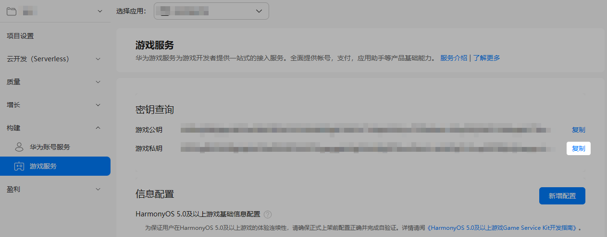
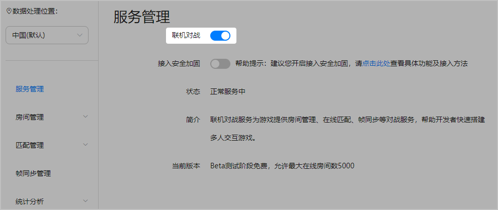

在服务管理页面，联机对战提供了当前服务状态展示、服务关闭及接入安全加固开启/关闭等功能。

## 前提条件

您已[开通联机对战服务](https://developer.huawei.com/consumer/cn/doc/games-guides/gameobe-enable-0000002395350369)。

## 操作步骤

1. 登录[AppGallery Connect](https://developer.huawei.com/consumer/cn/service/josp/agc/index.html)，点击“开发与服务”。
2. 在项目列表中找到您的项目，并在项目下的应用列表中选择您的游戏应用。
3. 在左侧导航栏中选择“构建 &gt; 联机对战服务”或点击左上角搜索“联机对战服务”，进入联机对战服务页面。

### 开启安全加固

开启安全加固功能，有助于增强服务的安全性。

1. 在联机对战服务管理页面，通过开关控件，选择开启安全加固功能。

   

   开启接入安全加固功能后，您还需要生成签名用于初始化SDK完成接入鉴权，具体请参见[使用签名初始化SDK](https://developer.huawei.com/consumer/cn/doc/games-guides/gameobe-signature-js-0000002395350417)。

   
2. 在弹出的提示框中，点击“确定”。

   

   如需停止使用接入安全加固功能，可通过开关控件，关闭该功能。关闭接入安全加固功能后，您的数据安全会存在潜在风险，请谨慎操作。
3. 计算签名需要使用您的游戏私钥，请先前往“构建 &gt; 游戏服务”开通游戏服务，并记录下“游戏私钥”信息。

   

### 关闭服务

关闭服务后，联机对战服务将立即停止，但游戏中的玩家在结束游戏前仍可继续进行对战。同时，关闭服务将会导致您的配置信息丢失，请您谨慎操作。

1. 在联机对战服务管理页面，通过开关控件，选择关闭服务。

   
2. 在弹出的确认框中，点击“确定”。
