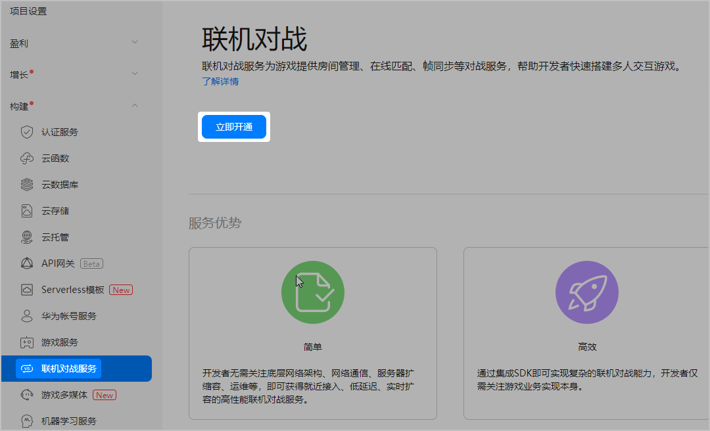

首次使用联机对战服务前，需要先开通此服务。如果您已经开通，可跳过本步骤。

1. 登录[AppGallery Connect](https://developer.huawei.com/consumer/cn/service/josp/agc/index.html)，点击“开发与服务”。
2. 在项目列表中找到您的项目，并在项目下的应用列表中选择您的游戏应用。
3. 在左侧导航栏中选择“构建 &gt; 联机对战服务”或点击左上角搜索“联机对战服务”，进入联机对战服务页面。
4. 在页面上点击“立即开通”。

   
