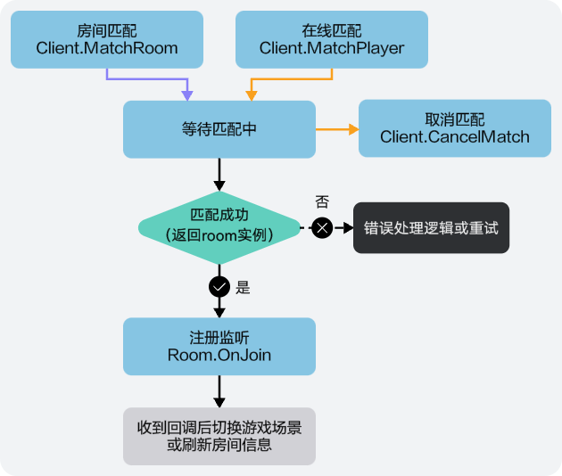
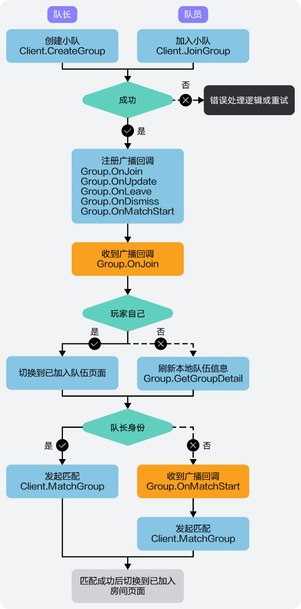

玩家还可以通过房间匹配、在线匹配和组队匹配的方式快速匹配房间，本章节主要介绍相关使用场景中的接口调用流程，接口详情请参见[API参考](https://developer.huawei.com/consumer/cn/doc/games-references/gameobe-overview-csharp-0000002361676000)文档。

## 房间/在线匹配

## 组队匹配

