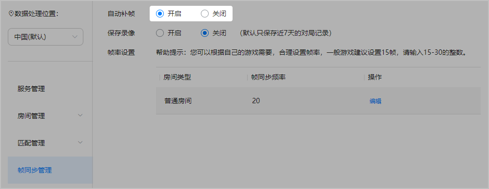
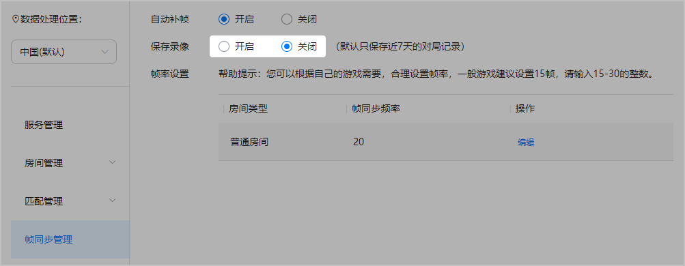
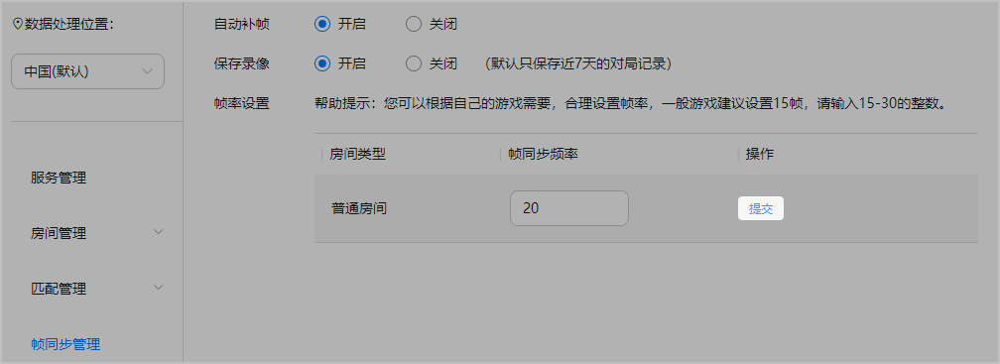

一般来说，高帧率能提供更流畅和更逼真的游戏画面，但同时也会增加对端测的游戏运行性能要求。然而，对于一些画面刷新率不高的游戏，则不需要那么高的帧率。因此，联机对战服务提供了帧同步管理功能，支持您根据游戏使用需要对帧率进行修改设置。同时，还提供了自主选择是否开启录像以保存游戏内数据的功能。

## 前提条件

您已[开通联机对战服务](https://developer.huawei.com/consumer/cn/doc/games-guides/gameobe-enable-0000002395350369)。

## 操作步骤

1. 登录[AppGallery Connect](https://developer.huawei.com/consumer/cn/service/josp/agc/index.html)，点击“开发与服务”。
2. 在项目列表中找到您的项目，并在项目下的应用列表中选择您的游戏应用。
3. 在左侧导航栏中选择“构建 &gt; 联机对战服务”或点击左上角搜索“联机对战服务”，进入联机对战服务页面。

### 自动补帧

选择“帧同步管理”，设置是否开启“自动补帧”功能。

“自动补帧”默认为开启状态。

### 保存录像

在“帧同步管理”页面，设置是否开启“保存录像”功能。

“保存录像”默认为关闭状态。如开启保存，则默认只保存近7天的对局记录。

### 帧同步频率

在“帧同步管理”页面，点击“帧率设置”中房间对应“操作”列的“编辑”，设置“帧同步频率”，并点击“提交”。

当前帧同步的帧率设置默认为20帧，您可以根据自己的游戏需要，在15帧~30帧范围内合理设置帧率，一般游戏建议您设置为15帧。帧率修改设置完成后实时生效，但已创建的房间仍使用原帧率。

