使用联机对战服务相关功能，必须集成联机对战SDK。

## 开发准备

您可选择下列引擎之一进行开发：

* Cocos Creator：2.4.4及以上版本
* 白鹭：5.4.1版本
* LayaAir：2.12.2版本

## 开发步骤

目前，联机对战服务JS SDK支持[Cocos Creator](#section151784012910)、[白鹭](#section205145111117)、[LayaAir](#section27087503112)游戏开发引擎进行游戏开发。

### Cocos Creator

1. 打开您的Cocos Creator工程，其目录示例如下。

   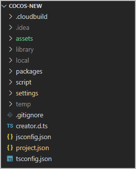
2. 下载联机对战服务[SDK脚本](https://developer.huawei.com/consumer/cn/doc/AppGallery-connect-Library/gameobe-sdkdownload-jssdk-0000001226603167)，建议单独创建目录用于存放SDK脚本。
3. 在资源管理器中，点击存放联机对战SDK脚本目录（如示例中的GOBE目录）中的js文件，并勾选“属性检查器”中的“导入为插件"，点击右上角的“应用”，将js脚本设置成“导入为插件”。

   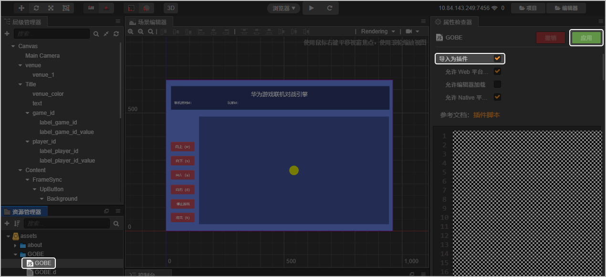
4. 在项目任意目录下，新建一个后缀名为.js或.ts的文件，用于后续实例化Client对象。

   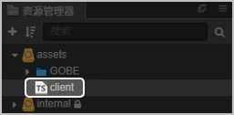
5. 若需要使用Cocos Creator引擎发布Android/HarmonyOS 5.0及以上游戏，则需要从JS SDK包体中取出endpoint-cert.cert证书，放到Cocos Creator工程目录下，然后在实例化Client对象时需传入对应的平台类型和证书路径（如下示例中，JS SDK提供的证书放在了resources目录下）。

   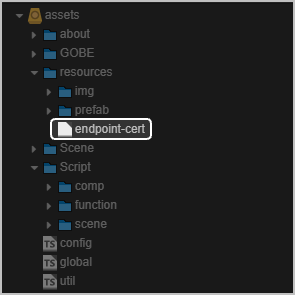

### 白鹭


由于Wing长期未更新，旧的环境可能引入不可预期的问题，因此推荐您使用VSCode + Chrome开发调试。

1. 打开您的Egret项目，其目录示例如下。

   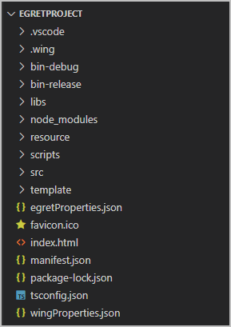
2. 下载联机对战服务[SDK脚本](https://developer.huawei.com/consumer/cn/doc/AppGallery-connect-Library/gameobe-sdkdownload-jssdk-0000001226603167)，在./libs目录下创建GOBE文件夹，将GOBE.js、GOBE.d.ts拷贝到GOBE文件夹，同时创建GOBE.js的副本并重命名为GOBE.min.js，用于发布时使用。

   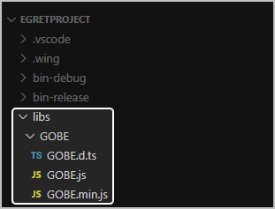
3. 编辑egretProperties.json文件，在modules数组中新增GOBE库的描述。

   ```
   {
       "name":"GOBE",
       "path": "./libs/GOBE"
   }
   ```

   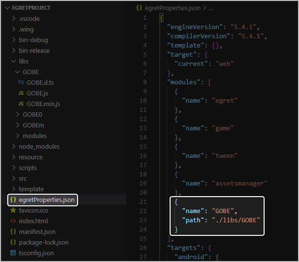
4. 使用如下命令编译或直接运行项目，完成联机对战SDK导入。
   * 编译

     ```
     egret build GOBE
     ```
   * 运行项目

     ```
     egret run -a
     ```

### Laya

1. 使用VSCode打开您的LayaAir工程，其目录示例如下。

   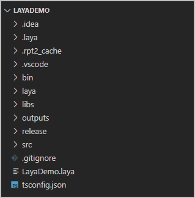
2. 下载联机对战服务[SDK脚本](https://developer.huawei.com/consumer/cn/doc/AppGallery-connect-Library/gameobe-sdkdownload-jssdk-0000001226603167)，并将下列不同文件拷贝到对应目录下。
   * 将**GOBE.d.ts**拷贝到**./libs**目录下。

     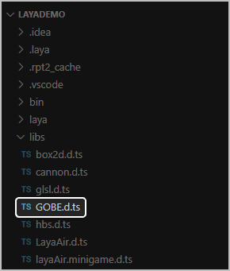
   * 将**GOBE.js**拷贝到**./bin/libs**目录下。

     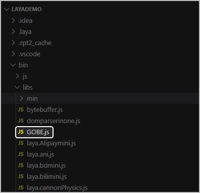
   * 同时创建**GOBE.js**的副本并重命名为**GOBE.min.js**，然后将**GOBE.min.js**拷贝到**./bin/libs/min**目录下，用于发布时使用。

     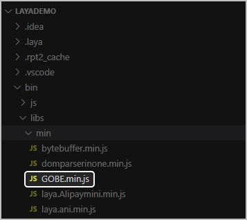
3. 在LayaAir IDE界面按F9打开“项目设置”，选择“类库设置”，勾选“GOBE.js”并点击“确定”。

   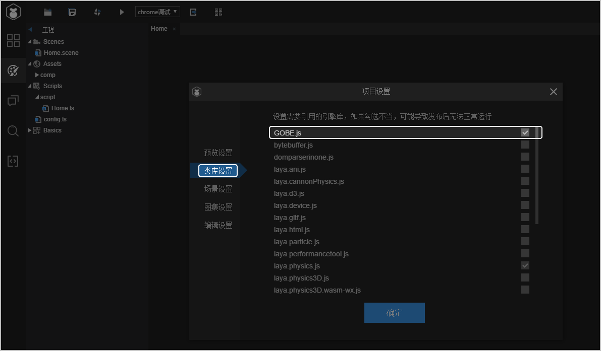
