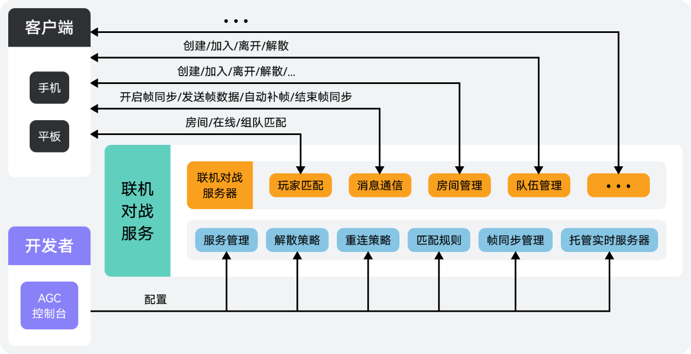

|  |  |
| --- | --- |
| 联机对战服务为多人联机游戏提供了房间管理、玩家匹配、队伍管理、消息通信等功能，具备优质的联网和服务端能力。您的游戏只需要接入SDK即可快速实现多人联机对战，提升游戏体验，并降低游戏开发成本。联机对战服务主要适用于回合制（棋牌类）、实时对战（休闲对战、[MOBA](#ZH-CN_TOPIC_0000002361670416__p881611376159)、[FPS](#ZH-CN_TOPIC_0000002361670416__p87268417152)类）等类型游戏。 |  |

## 主要功能

| 主要功能 | 功能描述 | |
| --- | --- | --- |
| 房间管理 | 为游戏玩家提供联机对战承载容器，支持玩家加入到房间中与其他玩家对战，并提供了更新自定义状态与属性、房间内发送消息、离开房间、解散房间等能力。 | |
| 玩家匹配 | 支持通过控制台自定义匹配规则，并提供了房间匹配、在线匹配和组队匹配三种方式，用于玩家不同游戏场景下的对战匹配。同时，还支持在玩家匹配不足的情况下自动填充机器人，可有效避免超时而导致匹配失败的问题。 | |
| 队伍管理 | 支持玩家通过发起组队匹配的方式匹配队员和对手，并提供了离开队伍、解散队伍等能力。 | |
| 消息通信 | 帧同步+帧数据存储与查询+端侧通信与交互 | 为游戏应用提供帧同步能力，保证不同终端联机对战时的帧数据同步，支持在发生帧数据丢失时进行自动补帧，并支持将对局中的帧数据以记录文件形式存储以便后续查询回放。同时，提供了不同客户端之间的通信能力，支持房间内玩家发送消息，并且还支持客户端与实时服务器之间的交互，可用于拓展客户端游戏逻辑。 |
| 托管代码到实时服务器 | 支持在实时服务器调试、部署并运行您的游戏逻辑代码，实现云侧计算与管理能力。 |

## 工作原理

集成联机对战服务SDK的客户端，将各类动作指令发送到联机对战服务器。服务器接收并汇总，然后直接帧广播给房间内的所有客户端，客户端根据收到的游戏动作来做运算和显示。您只需要将联机对战服务SDK集成到游戏中，并在AGC控制台进行简单配置，即可为您的游戏快速构建对战能力。

## 平台支持说明

| 一级分类 | 二级分类 | 支持的平台 |
| --- | --- | --- |
| 客户端SDK | JS SDK | HarmonyOS 5.0及以上 |
| Android |
| iOS |
| Web |
| 华为快游戏 |
| 微信小游戏 |
| 字节跳动小游戏 |
| macOS |
| C# SDK | HarmonyOS 5.0及以上 |
| Android |
| iOS |
| Windows |
| macOS |
| WebGL |

## 实现流程

| 序号 | 步骤 | 详情 |
| --- | --- | --- |
| 1 | 开通服务 | 首次使用联机对战服务时，您需在AGC控制台上[开通服务](https://developer.huawei.com/consumer/cn/doc/games-guides/gameobe-enable-0000002395350369)。 |
| 2 | 配置服务 | 在AGC控制台对[房间延时解散](https://developer.huawei.com/consumer/cn/doc/games-guides/gameobe-policy-configuration-0000002395190469#section3726630194418)和[玩家掉线重连](https://developer.huawei.com/consumer/cn/doc/games-guides/gameobe-policy-configuration-0000002395190469#section172221948194413)时间进行设置，并自定义[匹配规则](https://developer.huawei.com/consumer/cn/doc/games-guides/gameobe-ruleconfiguration-0000002361670428)用于玩家匹配，同时还可根据使用需要进行[帧同步管理](https://developer.huawei.com/consumer/cn/doc/games-guides/gameobe-framesync-management-0000002395350373)和[实时服务器托管](https://developer.huawei.com/consumer/cn/doc/games-guides/gameobe-codehosting-realtime-server-0000002361510732)操作。 |
| 3 | 集成SDK | 使用联机对战服务相关功能，必须集成联机对战SDK（[JS](https://developer.huawei.com/consumer/cn/doc/games-guides/gameobe-integratingsdk-js-0000002361670432)丨[C#](https://developer.huawei.com/consumer/cn/doc/games-guides/gameobe-integratingsdk-csharp-0000002395350421)）。 |
| 4 | 初始化SDK | 功能开发前，您需先完成联机对战SDK初始化（[JS](https://developer.huawei.com/consumer/cn/doc/games-guides/gameobe-initializing-js-0000002395350377)丨[C#](https://developer.huawei.com/consumer/cn/doc/games-guides/gameobe-initializing-csharp-0000002361510612)）。 |
| 5 | 功能开发 | 完成SDK初始化后，调用联机对战SDK的API执行创建房间、加入房间、匹配房间、更新自定义状态、更新自定义属性、更新房间信息、帧同步、发送消息、掉线重连、离开房间、解散房间等操作（[JS](https://developer.huawei.com/consumer/cn/doc/games-guides/gameobe-createjoinroom-js-0000002361670436)丨[C#](https://developer.huawei.com/consumer/cn/doc/games-guides/gameobe-createjoinroom-csharp-0000002395350425)）。 |

## 接入流程与耗时

| 接入操作 | 详情 | | | | 预估耗时（分钟） |
| --- | --- | --- | --- | --- | --- |
| 使用入门 | 创建项目和应用 | | | - | 5~10 |
| 准备游戏信息 | | | - | 2 |
| 开通服务 | | | - | 1 |
| 开启接入安全加固（可选功能） | | | - | 1 |
| 配置解散和重连策略 | | | - | 3 |
| 配置匹配规则 | | | - | 10~20 |
| 帧同步管理 | | | - | 2 |
| 托管实时服务器（可选功能） | | | - | 5~10 |
| 集成SDK | 集成联机对战SDK | | | JS丨C# | 3~5 |
| 初始化SDK | 方式一：不使用签名初始化SDK | | | JS丨C# | 15~20 |
| 方式二：使用签名初始化SDK | | | JS丨C# | 40~50 |
| 功能开发 | 加入房间 | 加入指定房间 | 创建房间 | JS丨C# | 15~20 |
| 加入房间 | JS丨C# | 5~10 |
| 获取可加入房间列表 | JS丨C# | 5~10 |
| 房间匹配 | | JS丨C# | 20~25 |
| 在线匹配 | | JS丨C# | 20~25 |
| 组队匹配 | 创建队伍 | JS丨C# | 15~20 |
| 加入队伍 | JS丨C# | 5~10 |
| 管理队伍 | JS丨C# | 15~20 |
| 移除队员 | JS丨C# | 5~10 |
| 离开队伍 | JS丨C# | 5~10 |
| 解散队伍 | JS丨C# | 5~10 |
| 队伍匹配 | JS丨C# | 25~30 |
| 取消匹配 | | JS丨C# | 5~10 |
| 管理房间 | 更新玩家自定义状态 | | JS丨C# | 5~10 |
| 更新玩家自定义属性 | | JS丨C# | 5~10 |
| 更新房间信息 | | JS丨C# | 5~10 |
| 获取房间最新信息 | | JS丨C# | 5~10 |
| 移除房间内玩家 | | JS丨C# | 5~10 |
| 离开房间 | | JS丨C# | 5~10 |
| 解散房间 | | JS丨C# | 5~10 |
| 消息通信 | 帧同步 | | JS丨C# | 50~60 |
| 发送客户端消息 | | JS丨C# | 25~30 |
| 发送服务端消息 | | JS丨C# | 10~15 |
| 掉线重连 | | | JS丨C# | 30~40 |
| 查询与回放对战录像 | | | JS丨C# | 25~30 |
| 伪随机数生成器 | | | JS丨C# | 5~10 |
| 实时服务器开发 | | | - | 60+ |

## 相关概念

| 名称 | 说明 |
| --- | --- |
| 帧同步 | 帧同步是联机手游普遍采用的一种同步技术，由客户端发送帧数据到服务器，服务器接收并汇总后，直接广播给所有客户端，客户端根据收到的帧数据来做运算和显示，同时支持客户端丢帧后进行补帧操作。目前，该技术主要用于多人实时对战游戏，通信协议支持Web Socket和UDP。 |
| MOBA | 英文全称：Multiplayer Online Battle Arena，多人在线战术竞技类游戏。这类游戏玩家通常被分为两队，两队在分散的游戏地图中互相竞争。 |
| FPS | 英文全称：First-Person Shooter，第一人称射击类游戏。这类游戏玩家以第一人称视角体验射击游戏。 |
