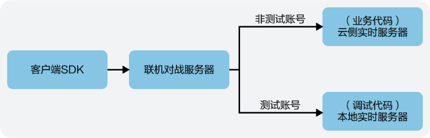

实时服务器支持本地调试模式，建议您先在本地完成代码调试，再部署到现网生产环境。



## 前提条件

您已[添加测试账号](https://developer.huawei.com/consumer/cn/doc/games-guides/gameobe-preparations-realtime-server-0000002395190633#section76912053712)。

## 环境准备

下载并安装Node.js（推荐LTS版本）

## 代码调试

1. 在解压实时服务器SDK的目录中，创建client.js和server.js脚本，具体可参考[脚本示例](https://developer.huawei.com/consumer/cn/doc/games-guides/script-local-debugging-realtime-server-0000002361670624)。
   * client.js：本地测试框架的客户端命令脚本，方便本地执行查询房间列表和加入房间等操作。
   * server.js：本地测试框架的服务端脚本，用于启动本地HTTP(S)服务，并自动完成实时服务器SDK初始化。
2. 使用[测试账号](https://developer.huawei.com/consumer/cn/doc/games-guides/gameobe-preparations-realtime-server-0000002395190633#section76912053712)客户端调用Client.createRoom方法创建房间。

   

   本地调试时，仅支持加入调用Client.createRoom方法创建的房间。
3. 运行如下命令，启动本地HTTP(S)服务，并自动完成实时服务器SDK初始化。

   ```
   node server.js
   ```
4. 运行如下命令，查询测试房间列表。如果已提前获取到roomCode或roomId信息，则可以跳过此步骤。

   

   当roomType参数为空时，则默认使用server.js文件中已配置的defaultRoomType值。

   ```
   node client.js getRoomList roomType = {roomType}
   ```
5. 运行如下命令，加入测试房间。

   ```
   node client.js joinRoom roomCode = {roomcode}
   ```

   或

   ```
   node client.js joinRoom roomId = {roomId}
   ```
6. 加入房间成功后，即可在本地调试您的实时服务器代码。

   

   如果代码逻辑有修改，需要重启HTTP(S)服务，请重复上述步骤3~5。
