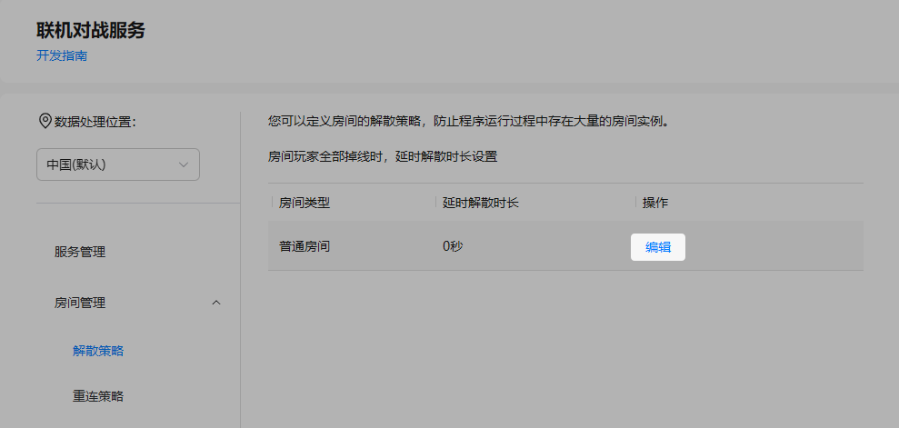
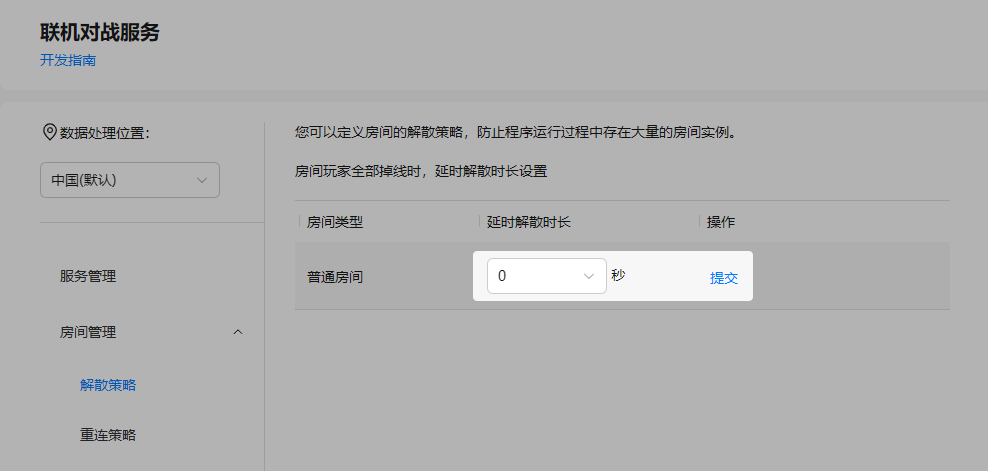
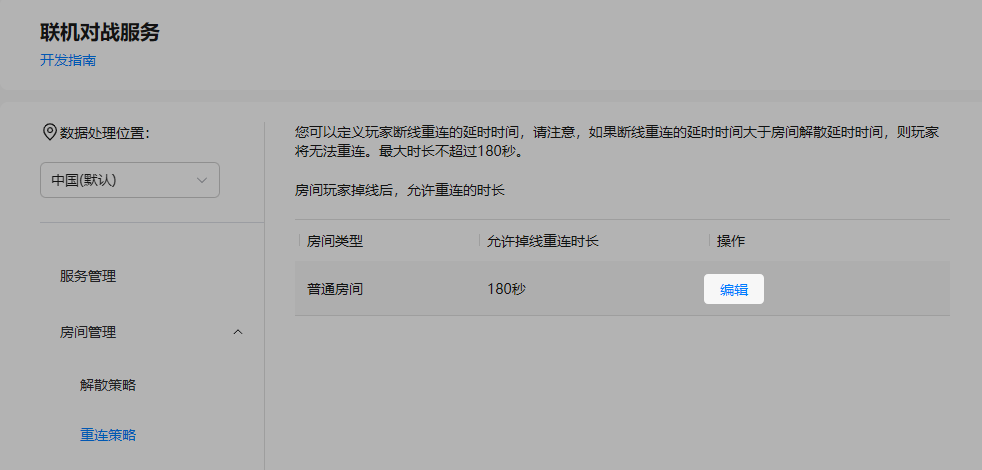
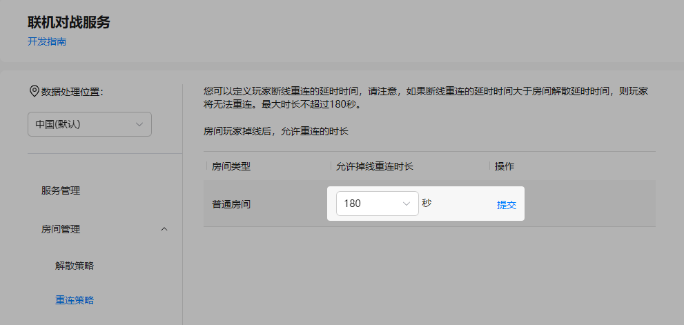

联机对战服务为每款游戏提供了房间管理功能，您可以在控制台对房间延时解散、玩家掉线重连时间进行设置。

## 前提条件

* 您已[开通联机对战服务](https://developer.huawei.com/consumer/cn/doc/games-guides/gameobe-enable-0000002395350369)。
* 您已规划房间延时解散和玩家掉线重连时长。

  

  时长可设置范围为0秒~180秒，“延时解散时长”应大于“允许掉线重连时长”。

## 解散策略

为了防止程序运行过程中存在大量的空闲房间实例，您可以在AGC控制台设置房间的解散策略。当房间内玩家全部掉线时，超过设置的延时解散时长，房间将自动解散并释放。

1. 登录[AppGallery Connect](https://developer.huawei.com/consumer/cn/service/josp/agc/index.html)，点击“开发与服务”。
2. 在项目列表中找到您的项目，并在项目下的应用列表中选择您的游戏应用。
3. 在左侧导航栏中选择“构建 &gt; 联机对战服务”或点击左上角搜索“联机对战服务”，进入联机对战服务页面。
4. 选择“房间管理 &gt; 解散策略”，点击房间对应“操作”列的“编辑”。

   
5. 设置“延时解散时长”，完成后点击“提交”。

   

   

   * “延时解散时长”默认为0秒，当房间内玩家全部掉线时，房间将自动立即解散并释放。最长可设置为180秒。
   * “延时解散时长”应大于[重连策略](#section172221948194413)中设置的“允许掉线重连时长”。

## 重连策略

在游戏过程中，因网络状况、操作不当等原因，可能会导致玩家掉线。为此，您可以在AGC控制台定义玩家掉线重连的延时时间。当房间内玩家掉线后，在设置的允许掉线重连时长内，仍可以重新回到房间继续游戏。

1. 登录[AppGallery Connect](https://developer.huawei.com/consumer/cn/service/josp/agc/index.html)，点击“开发与服务”。
2. 在项目列表中找到您的项目，并在项目下的应用列表中选择您的游戏应用。
3. 在左侧导航栏中选择“构建 &gt; 联机对战服务”或点击左上角搜索“联机对战服务”，进入联机对战服务页面。
4. 选择“房间管理 &gt; 重连策略”，点击房间对应“操作”列的“编辑”。

   
5. 设置“允许掉线重连时长”，完成后点击“提交”。

   

   

   * “允许掉线重连时长”默认为180秒（最长），最短可设置为0秒。超过设置的“允许掉线重连时长”，玩家将无法回到房间继续游戏。如果设置为0秒，则房间内玩家掉线后，无法回到房间继续游戏。
   * “允许掉线重连时长”应小于[解散策略](#section3726630194418)中设置的“延时解散时长”，否则玩家将可能无法重连，报错信息为：[ROOM\_NOT\_EXIST](https://developer.huawei.com/consumer/cn/doc/games-references/gameobe-errorcode-js-0000002361516108#ZH-CN_TOPIC_0000002361516108__p05805518562)。
