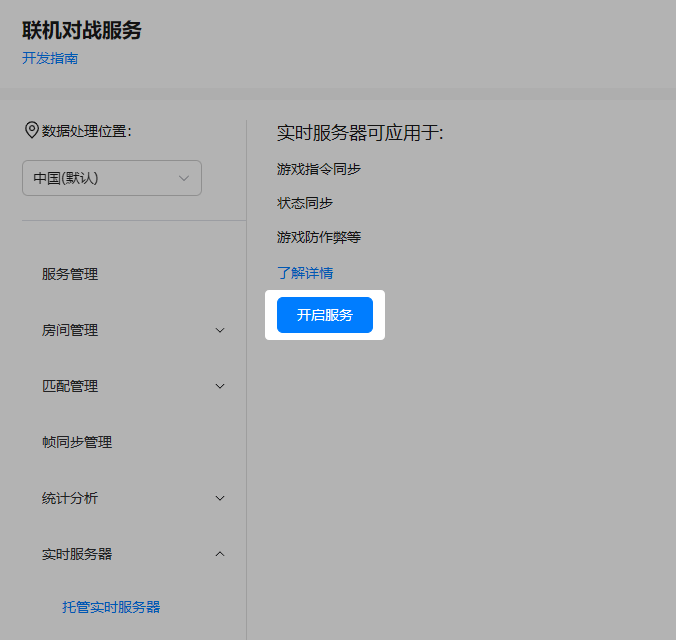
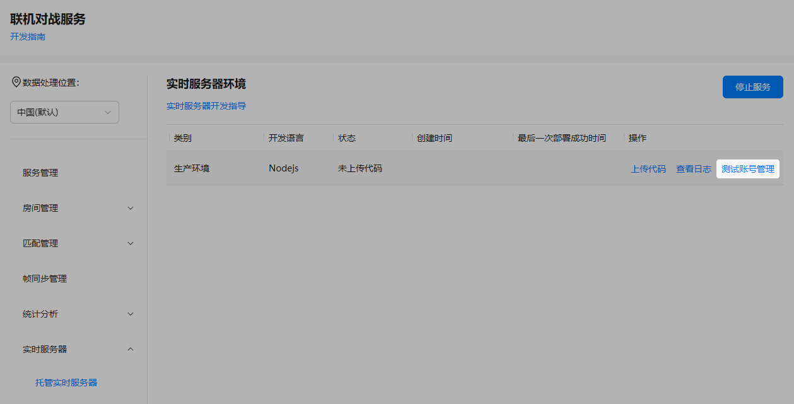
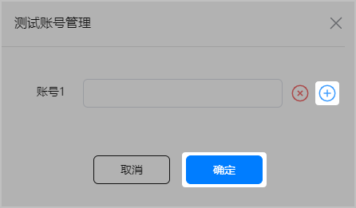

联机对战服务提供了实时服务器SDK，可用于服务端代码的开发。


由于实时服务器SDK已升级，如果您是基于原开发框架进行代码开发的，建议您将原开发框架内index.ts或index.js文件中的游戏逻辑代码迁移到新的实时服务器SDK对应文件中，以便进行本地调试工作。后续SDK版本升级，如需使用新版本，请参考此方法进行升级替换。

## 开启实时服务器

1. 登录[AppGallery Connect](https://developer.huawei.com/consumer/cn/service/josp/agc/index.html)，点击“开发与服务”。
2. 在项目列表中找到您的项目，并在项目下的应用列表中选择您的游戏应用。
3. 在左侧导航栏中选择“构建 &gt; 联机对战服务”或点击左上角搜索“联机对战服务”，进入联机对战服务页面。
4. 选择“实时服务器 &gt; 托管实时服务器”，点击“开启服务”。

   

## 添加测试账号

测试账号主要用于后续本地代码调试过程中，创建本地实时服务器测试房间。

1. 在联机对战服务页面，选择“实时服务器 &gt; 托管实时服务器”。
2. 点击“生产环境”对应“操作”列的“测试账号管理”。

   
3. 在“测试账号管理”弹窗中，添加测试账号（即联机对战初始化接口返回的playerId，仅支持纯数字），并点击“确定”。如需新增测试账号，点击“+”，最多可同时管理20个测试账号。

   

## 下载SDK

1. 下载与解压[实时服务器SDK](https://developer.huawei.com/consumer/cn/doc/AppGallery-connect-Library/gameobe-sdkdownload-servelesssdk-0000001675894156)，并保存到本地单独目录中。
2. 解压实时服务器SDK，目录结构如下。

   

   实时服务器SDK中提供了index.ts和index.js文件，一般建议您使用index.ts文件进行开发（本文以修改index.ts文件为例），开发完成后执行打包命令将index.ts编译为index.js用于后续的上传。

   | 文件 | 说明 |
   | --- | --- |
   | GOBERTS.d.ts | 类型声明文件。 |
   | GOBERTS.js | 实时服务器SDK代码。 |
   | index.js | 需要上传到实时服务器的文件。 |
   | index.ts | 业务代码文件。 |
   | package.json | 项目管理文件。 |
   | README.md | 使用指导文件。 |
   | rollup.config.js | 项目打包配置文件。  注意：  请勿随意改动该文件。 |
   | tsconfig.build.json | ts编译配置文件。 |
   | tsconfig.json | ts编译配置文件。 |

## 安装依赖

使用IDE工具打开实时服务器SDK，进入工程目录下，执行如下命令安装相关依赖。

```
npm install
```
