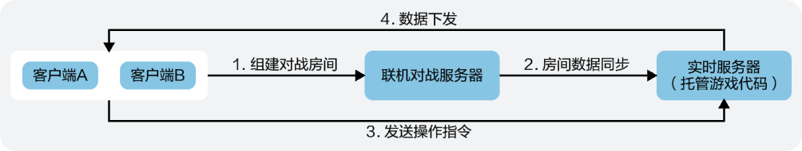

为了实现复杂的游戏逻辑，通常您需要搭建一个实时服务器。然而，自建实时服务器不仅成本高，而且运维工作量巨大。为此，我们提供了更安全、更稳定、更低成本的实时服务器托管游戏代码的功能，支持您将部分代码按照特定格式托管到实时服务器上，即可实现云侧计算与管理能力。

## 工作原理

在实时服务器部署并运行基于实时服务器SDK的游戏逻辑代码，监听联机对战服务和SDK客户端相关事件。根据客户端的玩家操作，实时计算游戏状态，并将最新的游戏状态下发到游戏客户端。

## 实现流程

| 序号 | 步骤 | 详情 | |
| --- | --- | --- | --- |
| 1 | [准备工作](https://developer.huawei.com/consumer/cn/doc/games-guides/gameobe-preparations-realtime-server-0000002395190633) | 开启实时服务器，下载实时服务器SDK，使用IDE工具打开并执行命令安装相关依赖。 | |
| 2 | 代码开发 | 客户端开发 | 参见前面章节，此处不再赘述。如需实现客户端与服务端的交互，您还需要参考发送服务端消息（[JS](https://developer.huawei.com/consumer/cn/doc/games-guides/gameobe-sendtoserver-js-0000002361670468)丨[C#](https://developer.huawei.com/consumer/cn/doc/games-guides/gameobe-sendtoserver-csharp-0000002395350497)）完成对应功能的开发。 |
| 服务端开发 | 联机对战服务端SDK提供了相关API，您可以根据业务需要完成对应[代码开发](https://developer.huawei.com/consumer/cn/doc/games-guides/gameobe-flowchart-real-time-server-0000002395350533)。 |
| 3 | [本地调试](https://developer.huawei.com/consumer/cn/doc/games-guides/gameobe-local-debugging-realtime-server-0000002395350541) | 建议您完成代码开发后在本地进行代码调试，查看代码逻辑是否符合预期。 | |
| 4 | [托管代码到实时服务器](https://developer.huawei.com/consumer/cn/doc/games-guides/gameobe-codehosting-realtime-server-0000002361510732) | 将编译后的index.js文件上传到联机对战服务提供的托管实时服务器上。同时，在实时服务器的运行过程中，您可以随时在AGC控制台查看服务器的运行日志。 | |
