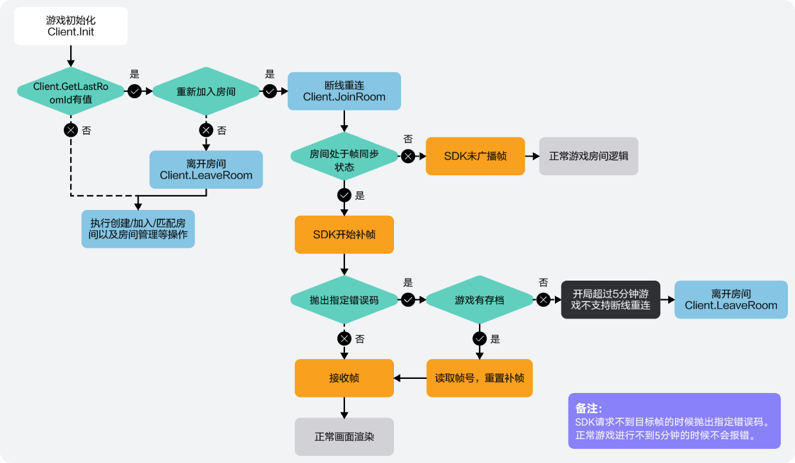
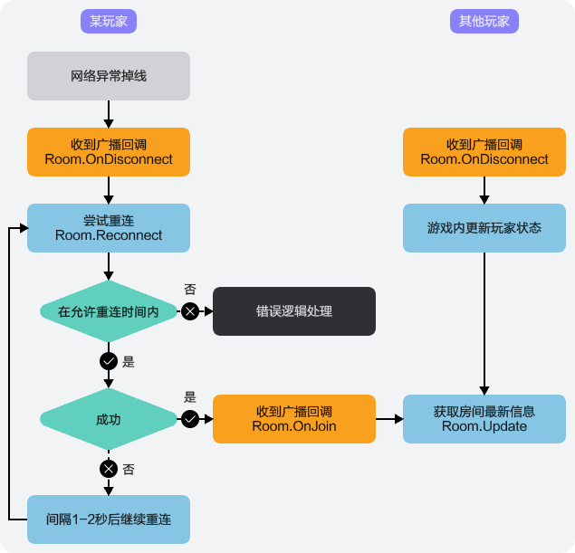

在游戏过程中，因网络状况不佳、操作不当等原因，可能会导致意外掉线的情况，玩家可通过掉线重连方式重新进入原队伍/房间。

## 前提条件

玩家已进入房间/队伍。

## 主动关闭客户端导致掉线的场景



玩家进入房间/队伍后，因主动关闭客户端而导致的掉线，需重新登录游戏并重连联机对战服务器。

1. 调用[Client.Init](https://developer.huawei.com/consumer/cn/doc/games-references/gameobe-client-csharp-0000002361516112#section138221670168)方法进行初始化，并通过Client.GetLastRoomId或Client.GetLastGroupId判断当前玩家是否存在已加入的房间或队伍。

   ```
   client.Init(response =>
   {
       if (response.RtnCode == 0)
       {
       // 初始化成功

       if (string.IsNullOrEmpty(GetLastRoomId())){
   			// 根据LastRoomId是否存在，判断当前玩家是否存在已加入的房间
   		}
       } else
       {
       // 初始化失败
       }
       if (string.IsNullOrEmpty(GetLastGroupId())){
   			// 根据LastGroupId是否存在，判断当前玩家是否存在已加入的队伍
   		}
       } else
       {
       // 初始化失败
       }
   });
   ```
2. 当前玩家存在已加入的房间或队伍时，可调用相关方法，重新连接服务器并进入房间/队伍。
   * 当前玩家存在已加入的房间时，可通过调用[Client.JoinRoom](https://developer.huawei.com/consumer/cn/doc/games-references/gameobe-client-csharp-0000002361516112#section13774175719619)方法，在[允许掉线重连时间](https://developer.huawei.com/consumer/cn/doc/games-guides/gameobe-policy-configuration-0000002395190469#section172221948194413)内重新连接服务器并进入房间。

     

     当房主超过[允许掉线重连的时间](https://developer.huawei.com/consumer/cn/doc/games-guides/gameobe-policy-configuration-0000002395190469#section172221948194413)未重新回到房间，房主权限将会被房间内的其他玩家接管。

     ```
     public void JoinRoomCallback(JoinRoomBaseResponse res)
     {
     	if (res.RtnCode == 0)
     	{
     		// 加入房间成功
     	}
     	else
     	{
     		// 加入房间失败
     	}
     }
     JoinRoomConfig joinRoomReq = new JoinRoomConfig()
     {
     	RoomId = "{RoomId}"// 通过LastRoomId加入房间
     };
     PlayerConfig playerInfo = new PlayerConfig()
     {
     	CustomPlayerStatus = 0,
     	CustomPlayerProperties = "{CustomPlayerProperties }"
     };
     Client client = Global.client; // 从Global类的client属性中获取初始化后的client对象
     Global.Room = client.JoinRoom(joinRoomReq, playerInfo, JoinRoomCallback);
     ```
   * 当前玩家存在已加入的队伍时，可通过调用[Client.JoinGroup](https://developer.huawei.com/consumer/cn/doc/games-references/gameobe-client-csharp-0000002361516112#section1685415211)方法，重新连接服务器并进入队伍。

     ```
     public void JoinGroupCallback(JoinGroupBaseResponse res)
     {
     	if (res.RtnCode == 0)
     	{
     		// 加入队伍成功
     	}
     	else
     	{
     		// 加入队伍失败
     	}
     }
     JoinGroupConfig joinGroupReq = new JoinGroupConfig()
     {
     	GroupId = "{GroupId}"// 通过GroupId加入队伍
     };
     Client client = Global.client; // 从Global类的client属性中获取初始化后的client对象
     Global.Group = client.JoinGroup(joinGroupReq, JoinRoomCallback);
     ```
3. 掉线玩家重连房间/队伍成功后，房间/队伍内的其他玩家将通过实现相关委托收到加入房间/队伍的通知。
   * 掉线玩家重连房间成功后，房间内的其他玩家将通过实现[Room.OnJoin](https://developer.huawei.com/consumer/cn/doc/games-references/gameobe-room-csharp-0000002395196057#ZH-CN_TOPIC_0000002395196057__p829416133915)委托收到加入房间的通知。

     ```
     Global.Room.OnJoin = playerInfo => { // 通过Global类的Room属性获取Room对象，绑定监听事件
       // 有玩家加入房间，做相关游戏逻辑处理
     };
     ```
   * 掉线玩家重连队伍成功后，队伍内的其他玩家将通过实现[Group.OnJoin](https://developer.huawei.com/consumer/cn/doc/games-references/gameobe-group-csharp-0000002361676004#ZH-CN_TOPIC_0000002361676004__p155771729183119)委托收到加入队伍的通知。

     ```
     Global.Group.OnJoin = playerInfo => { // 通过Global类的Group属性获取Group对象，绑定监听事件
       // 有玩家加入队伍，做相关游戏逻辑处理
     };
     ```
4. 掉线玩家重连成功后，可使用自动补帧或手动补帧方式进行补帧，并通过[Room.OnRequestFrameError](https://developer.huawei.com/consumer/cn/doc/games-references/gameobe-room-csharp-0000002395196057#ZH-CN_TOPIC_0000002395196057__p7118042001)进行补帧失败监听。若当前房间帧同步已开始5min以上，进行补帧时则会触发补帧失败，需要重置房间的帧ID并再次进行补帧。

   ```
   global.room.OnRequestFrameError((error) => {
     if(error.RtnCode === 10002){
       // 补帧失败，重置帧ID后重新补帧
       global.room.ResetRoomFrameId({frameId});
     }
   });
   ```

## 网络连接等异常导致掉线的场景

### 进入队伍后掉线重连

玩家进入小队后，因网络连接等异常导致掉线，在游戏客户端未关闭的情况下，当网络恢复正常或异常解决后，可重连小队。

1. 调用[Group.OnDisconnect](https://developer.huawei.com/consumer/cn/doc/games-references/gameobe-group-csharp-0000002361676004#section286065318386)方法监听玩家掉线事件。当根据返回的信息判断为当前玩家掉线时，则触发掉线重连逻辑。

   ```
   Global.Group.OnDisconnect = playerInfo => OnDisconnect(playerInfo); // 通过Global类的Group属性获取Group对象，绑定监听事件
   void OnDisconnect(FramePlayerInfo playerInfo) {
   	// 重连逻辑
   }
   ```
2. 当玩家发生掉线状况后，可通过调用[Group.Reconnect](https://developer.huawei.com/consumer/cn/doc/games-references/gameobe-group-csharp-0000002361676004#section7567415154414)方法重连小队。

   ```
   // 通过Global类的Group属性获取Group对象,绑定监听事件
   Global.Group.Reconnect(response => {
   	if (response.RtnCode == 0){
   		// 重连成功
   	} else {
   		// 重连失败
   	}
   });
   ```

### 进入房间后掉线重连



玩家进入房间后，因网络连接异常导致掉线，在游戏客户端未关闭的情况下，当网络恢复正常后，可重连联机对战服务器。

1. 调用[Room.OnDisconnect](https://developer.huawei.com/consumer/cn/doc/games-references/gameobe-room-csharp-0000002395196057#section286065318386)方法监听玩家断线事件。当根据返回的信息判断为当前玩家断线时，则触发掉线重连逻辑。

   ```
   Global.Room.OnDisconnect = playerInfo => OnDisconnect(playerInfo); // 通过Global类的Room属性获取Room对象，绑定监听事件
   void OnDisconnect(FramePlayerInfo playerInfo) {
   	// 重连逻辑
   }
   ```
2. 当玩家发生掉线状况后，可通过调用[Room.Reconnect](https://developer.huawei.com/consumer/cn/doc/games-references/gameobe-room-csharp-0000002395196057#section7567415154414)方法，在[允许掉线重连时间](https://developer.huawei.com/consumer/cn/doc/games-guides/gameobe-policy-configuration-0000002395190469#section172221948194413)内重新连接至服务器。

   

   当房主超过[允许掉线重连的时间](https://developer.huawei.com/consumer/cn/doc/games-guides/gameobe-policy-configuration-0000002395190469#section172221948194413)未重新回到房间，房主权限将会被房间内的其他玩家接管。

   ```
   Room room = Global.Room; // 通过Global类的Room属性获取Room对象
   Room.Reconnect(response => {
   	if (response.RtnCode == 0){
   		// 重连成功
   	} else {
   		// 重连失败
   	}
   });
   ```
3. 掉线玩家重连成功后，房间内的其他玩家将通过实现[Room.OnJoin](https://developer.huawei.com/consumer/cn/doc/games-references/gameobe-room-csharp-0000002395196057#ZH-CN_TOPIC_0000002395196057__p829416133915)委托收到玩家加入房间的通知。

   ```
   Global.Room.OnJoin = playerInfo => { // 通过Global类的Room属性获取Room对象，绑定监听事件
     // 有玩家加入房间，做相关游戏逻辑处理
   };
   ```
