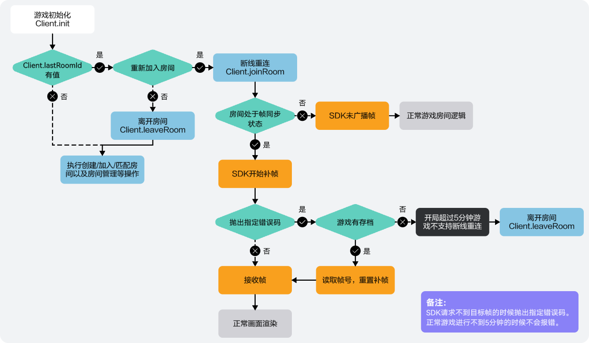
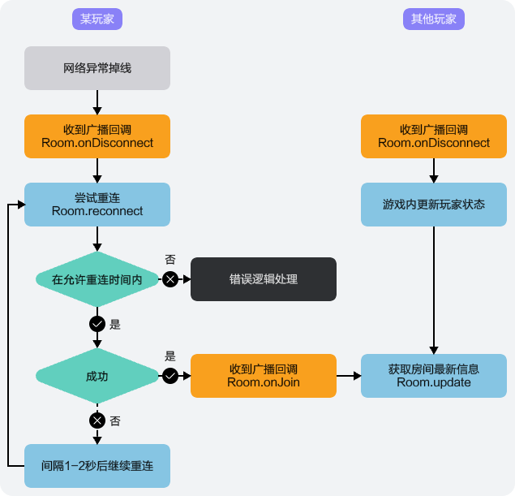

在游戏过程中，因操作不当、网络状况不佳等原因，可能会导致意外掉线的情况，玩家可通过掉线重连方式重新进入原队伍/房间。

## 前提条件

* 玩家已进入房间/队伍。
* 如需使用自动补帧方式进行补帧，应[开启自动补帧](/docs/dev/game-dev/gameobe-framesync-management-0000002395350373#section9730102310199)功能。

## 主动关闭客户端导致掉线的场景



玩家进入房间/队伍后，因主动关闭客户端而导致的掉线，需重新登录游戏并重连联机对战服务器。

1. 调用[Client.init](https://developer.huawei.com/consumer/cn/doc/games-references/gameobe-client-js-0000002361516044#section138221670168)方法进行初始化，并根据[Client.lastRoomId](https://developer.huawei.com/consumer/cn/doc/games-references/gameobe-client-js-0000002361516044#ZH-CN_TOPIC_0000002361516044__p7470755182920)或[Client.lastGroupId](https://developer.huawei.com/consumer/cn/doc/games-references/gameobe-client-js-0000002361516044#ZH-CN_TOPIC_0000002361516044__p15864428165110)是否有值判断当前玩家是否存在已加入的房间或队伍。

   ```
   global.client.init().then((client) => {
     // 初始化成功
     if(client.lastRoomId){
       /**
        * 当前玩家仍在上一个房间内，可根据lastRoomId重新加入房间；
        * 如果不想加入上一个房间，必须通过Client.leaveRoom离开房间，否则新建房间或匹配房间时会报错：玩家已在房间内。
       */
     }
     if(client.lastGroupId){
       /**
        * 当前玩家仍在上一个队伍内，可根据lastGroupId重新加入队伍；
        * 如果不想加入上一个队伍，可通过Client.leaveGroup离开队伍。
       */
     }
   }).catch(() => {
     // 初始化失败
   });
   ```
2. 当前玩家存在已加入的房间或队伍时，可调用相关方法，重新连接服务器并进入房间/队伍。
   * 当前玩家存在已加入的房间时，可通过调用[Client.joinRoom](https://developer.huawei.com/consumer/cn/doc/games-references/gameobe-client-js-0000002361516044#section13774175719619)方法，在[允许掉线重连时间](/docs/dev/game-dev/gameobe-policy-configuration-0000002395190469#section172221948194413)内重新连接至服务器。

     

     当房主超过[允许掉线重连的时间](/docs/dev/game-dev/gameobe-policy-configuration-0000002395190469#section172221948194413)未重新回到房间，房主权限将会被房间内的其他玩家接管。

     ```
     // 非必传
     const playerConfig = {
       customPlayerStatus: 1, // 玩家自定义属性，非必传
       customPlayerProperties: '玩家属性A', // 玩家自定义属性，非必传
     }
     global.client.joinRoom(client.lastRoomId, playerConfig)
     .then(() => {
       // 重连加入房间成功
     })
     .catch(() => {
       // 重连加入房间失败
     });
     ```
   * 当前玩家存在已加入的队伍时，可通过调用[Client.joinGroup](https://developer.huawei.com/consumer/cn/doc/games-references/gameobe-client-js-0000002361516044#section1685415211)方法，重新连接服务器并进入队伍。

     ```
     // 非必传
     const playerConfig = {
       customPlayerStatus: 1, // 玩家自定义属性，非必传
       customPlayerProperties: '玩家属性A', // 玩家自定义属性，非必传
     }
     global.client.joinGroup(client.lastGroupId, playerConfig)
     .then(() => {
       // 重连加入队伍成功
     })
     .catch(() => {
       // 重连加入队伍失败
     });
     ```
3. 掉线玩家重连房间/队伍成功后，房间/队伍内的其他玩家和重连成功的玩家将通过相关方法收到玩家加入房间的通知。
   * 掉线玩家重连房间成功后，房间内的其他玩家和重连成功的玩家将通过[Room.onJoin](https://developer.huawei.com/consumer/cn/doc/games-references/gameobe-room-js-0000002395195985#section11321164309)方法收到玩家加入房间的通知。

     ```
     global.room.onJoin((playerInfo) => {
       // 有玩家加入房间，做相关游戏逻辑处理
       if(playerInfo.playerId === global.room.playerId){
         // 玩家重连回房间
       } else {
         // 其他玩家加入房间
       }
     });
     ```
   * 掉线玩家重连队伍成功后，队伍内的其他玩家和重连成功的玩家将通过[Group.onJoin](https://developer.huawei.com/consumer/cn/doc/games-references/gameobe-group-js-0000002361675928#section18147174541018)方法收到玩家加入队伍的通知。

     ```
     global.group.onJoin((playerInfo) => {
       // 有玩家加入房间，做相关游戏逻辑处理
       if(playerInfo.playerId === global.group.playerId){
         // 玩家重连队伍
       } else {
         // 其他玩家加入队伍
       }
     });
     ```
4. 掉线玩家重连成功后，可使用自动补帧或手动补帧方式进行补帧，并通过[Room.onRequestFrameError](https://developer.huawei.com/consumer/cn/doc/games-references/gameobe-room-js-0000002395195985#section059433420611)进行补帧失败监听。若当前房间帧同步已开始5min以上，进行补帧时则会触发补帧失败，需要重置房间的帧ID并再次进行补帧。

   ```
   global.room.onRequestFrameError((error) => {
     if(error.code === 10002){
       // 补帧失败，重置帧ID后重新补帧
       global.room.resetRoomFrameId({frameId});
     }
   });
   ```

## 网络连接等异常导致掉线的场景

### 进入队伍后掉线重连

玩家进入小队后，因网络连接等异常导致掉线，在游戏客户端未关闭的情况下，当网络恢复正常或异常解决后，可重连小队。

1. 调用[Group.onDisconnect](https://developer.huawei.com/consumer/cn/doc/games-references/gameobe-group-js-0000002361675928#section388281874)方法监听玩家掉线事件。当根据返回的信息判断为当前玩家掉线时，则触发掉线重连逻辑。

   ```
   global.group.onDisconnect((playerInfo: PlayerInfo) => this.onDisconnect(playerInfo)); // 断连监听
   onDisconnect(playerInfo: PlayerInfo) {
          // 处理玩家重连逻辑
       }
   ```
2. 当玩家发生掉线状况后，可通过调用[Group.reconnect](https://developer.huawei.com/consumer/cn/doc/games-references/gameobe-group-js-0000002361675928#section7567415154414)方法重连小队。

   ```
   // 通过Global类的group属性获取group对象,绑定监听事件
   global.group.reconnect().then(() => {
         // 玩家重连小队成功
     }).catch((error) => {
         // 玩家重连小队失败
     });
   ```

### 进入房间后掉线重连



玩家进入房间后，因网络连接等异常导致掉线，在游戏客户端未关闭的情况下，当网络恢复正常或异常解决后，可重连联机对战服务器。

1. 调用[Room.onDisconnect](https://developer.huawei.com/consumer/cn/doc/games-references/gameobe-room-js-0000002395195985#section388281874)方法监听玩家断线事件。当根据返回的信息判断为当前玩家掉线时，则触发掉线重连逻辑。

   ```
   global.room.onDisconnect((playerInfo) => {
     // 当前玩家掉线
     if(playerInfo.playerId === room.playerId){
        // 重连逻辑
     }
   });
   ```
2. 当玩家发生掉线状况后，可通过调用[Room.reconnect](https://developer.huawei.com/consumer/cn/doc/games-references/gameobe-room-js-0000002395195985#section7567415154414)方法，在[允许掉线重连时间](/docs/dev/game-dev/gameobe-policy-configuration-0000002395190469#section172221948194413)内重新连接至服务器。

   

   当房主超过[允许掉线重连的时间](/docs/dev/game-dev/gameobe-policy-configuration-0000002395190469#section172221948194413)未重新回到房间，房主权限将会被房间内的其他玩家接管。

   ```
   global.room.reconnect();
   ```
3. 掉线玩家重连成功后，房间内的其他玩家和重连成功的玩家将通过[Room.onJoin](https://developer.huawei.com/consumer/cn/doc/games-references/gameobe-room-js-0000002395195985#section11321164309)方法收到玩家加入房间的通知。

   ```
   global.room.onJoin((playerInfo) => {
     // 有玩家加入房间，做相关游戏逻辑处理
     if(playerInfo.playerId === global.room.playerId){
       // 玩家重连回房间
     } else {
       // 其他玩家加入房间
     }
   });
   ```
