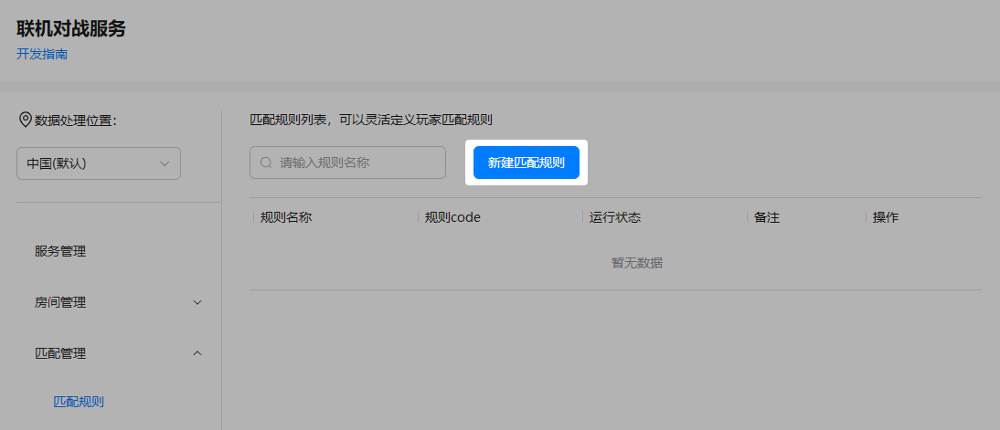
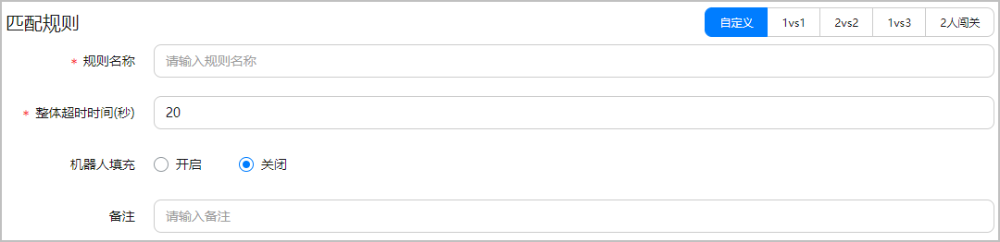
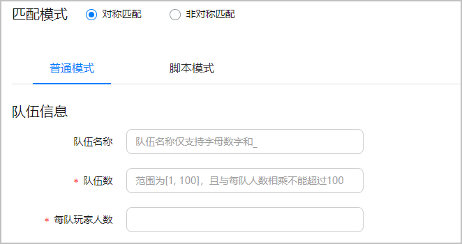
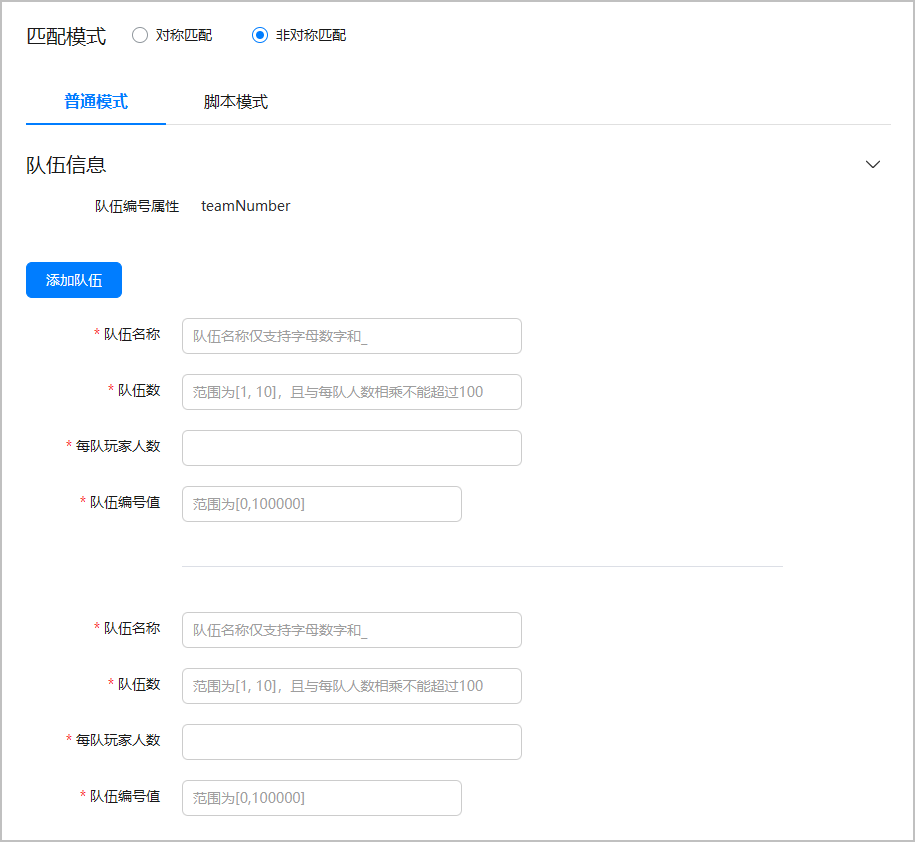
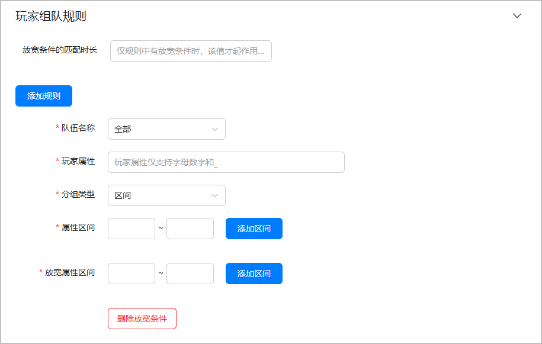
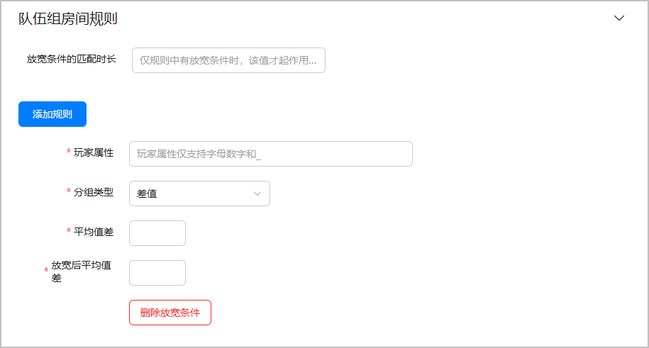
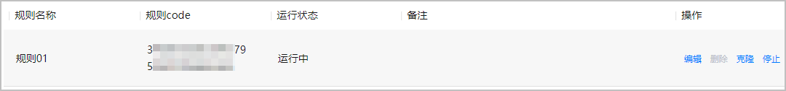

## 匹配机制

| 概念 | 说明 |
| --- | --- |
| 队伍 | 在对局游戏中，同属于一方阵营的玩家集合。 |
| 房间 | 对局游戏的承载容器。 |

进入匹配中的玩家，会自动被分配到一个匹配池中。联机对战服务将会根据您已[配置的匹配规则](#section11254127113416)，为进入匹配池中的玩家全力搜索符合条件的匹配对象并组成队伍，再将符合条件的队伍进行组建房间匹配。

针对匹配过程中可能出现的匹配玩家数量不足等问题，您可以为上述两个匹配阶段设置匹配超时时间。当玩家匹配等待时间超过第一轮匹配的最长匹配时长时，联机对战匹配机制可通过扩大匹配范围加速匹配成功，优化玩家匹配体验。同时，为了避免玩家超长时间等待导致游戏体验差的问题，您还可以为匹配过程设置一个整体超时时间。即当扩大匹配范围也无法解决匹配玩家不足的问题时，匹配等待时长超过整体超时时长时，匹配过程自动结束。如果您还开启了机器人填充功能，当匹配等待时长超过整体超时时长时，系统会自动为房间匹配机器人。

## 配置匹配规则

联机对战服务提供了匹配规则的管理功能，您可以在AGC控制台灵活定义玩家匹配规则，匹配规则可直接使用于在线匹配或组队匹配环节。

### 前提条件

您已[开通联机对战服务](/docs/dev/game-dev/gameobe-enable-0000002395350369)。

### 配置步骤

1. 登录[AppGallery Connect](https://developer.huawei.com/consumer/cn/service/josp/agc/index.html)，点击“开发与服务”。
2. 在项目列表中找到您的项目，并在项目下的应用列表中选择您的游戏应用。
3. 在左侧导航栏中选择“构建 &gt; 联机对战服务”或点击左上角搜索“联机对战服务”，进入联机对战服务页面。
4. 选择“匹配管理 &gt; 匹配规则”，点击“新建匹配规则”。

   
5. 配置匹配规则整体信息。

   

   系统预置了“1vs1”、“2vs2”、“1vs3”和“2人闯关”几种模式下的部分配置信息，如需使用上述几种模式，可选择对应模式进行快速配置。

   

   | 参数 | 必填/选填 | 说明 |
   | --- | --- | --- |
   | 规则名称 | 必填 | 自定义的匹配规则名称，要求1~32个字符。 |
   | 整体超时时间（秒） | 必填 | 玩家匹配过程的整体超时时间，取值范围为[5,300]。  说明：  整体超时时间应不低于玩家组队匹配中的“[放宽条件的匹配时长](#ZH-CN_TOPIC_0000002361670428__p121193153914)”和队伍组房匹配中的“[放宽条件的匹配时长](#ZH-CN_TOPIC_0000002361670428__p16613405351)”之和。 |
   | 机器人填充 | 选填 | 在玩家匹配不足的情况下自动填充机器人，可有效避免匹配超时而导致匹配失败的问题，默认为“关闭”状态。 |
   | 备注 | 选填 | 匹配规则的相关备注信息。 |
6. 选择对应的匹配规则类型及配置模式，并配置队伍信息。此处以“普通模式”配置匹配规则为例展开说明，如需了解“脚本模式”内容，请参见[脚本模式详解](/docs/dev/game-dev/script-mode-0000002395190665)。

   

   当“普通模式”切换成“脚本模式”时，控制台会自动将已配置内容生成为脚本。如果相关配置信息在“脚本模式”中被编辑，当您需切换回“普通模式”时，配置信息将会丢失，请谨慎操作。

   * 对称匹配

     

     | 参数 | 必填/选填 | 说明 |
     | --- | --- | --- |
     | 队伍名称 | 选填 | 自定义的队伍名称，要求1~32个字符，支持大小写字母（A-Z, a-z）、数字（0-9）和下划线（\_）。 |
     | 队伍数 | 必填 | 一个对战房间中的队伍数量，取值范围为[1, 100]，且与每队人数相乘不能超过100。 |
     | 每队玩家人数 | 必填 | 每个队伍的玩家人数，总人数之和最多不可超过100人。 |
   * 非对称匹配

     

     在非对称匹配规则中，至少要配置两种不同类型队伍的队伍信息，最多可配置十种不同类型队伍的队伍信息。

     

     | 参数 | 必填/选填 | 说明 |
     | --- | --- | --- |
     | 队伍编号属性 | 必填 | 用于玩家进入不同类型队伍的属性，固定为“teamNumber”。 |
     | 队伍名称 | 必填 | 自定义的队伍名称，要求1~32个字符，支持大小写字母(A-Z, a-z)、数字 (0-9)和下划线（\_）。 |
     | 队伍数 | 必填 | 一个对战房间中的队伍数量，取值范围为[1, 10]，且与每队人数相乘不能超过100。 |
     | 每队玩家人数 | 必填 | 每个队伍的玩家人数，总人数之和最多不可超过100人。 |
     | 队伍编号值 | 必填 | 用于区分不同类型队伍的编号值，取值范围为[1, 100000]。 |
7. 配置玩家组队规则。

   

   | 参数 | | 必填/选填 | 说明 |
   | --- | --- | --- | --- |
   | 放宽条件的匹配时长 | | 选填 | 放宽条件的待生效时间，即超过此时间后，玩家将根据设置的放宽条件（[放宽属性区间](#ZH-CN_TOPIC_0000002361670428__p13471531181510)丨[放宽后值差](#ZH-CN_TOPIC_0000002361670428__p956772717395)）进行组队匹配。取值范围为[5, 300]，默认为40秒。  说明：  仅在组队规则中设置了放宽条件时，才需要设置“放宽条件的匹配时长”，且与组房规则中“[放宽条件的匹配时长](#ZH-CN_TOPIC_0000002361670428__p16613405351)”之和，最长不可超过该条匹配规则的[整体超时时间](#ZH-CN_TOPIC_0000002361670428__p3255927143415)。 |
   | 队伍名称 | | 必填 | 选择当前规则适用的队伍，可选择全部队伍或某一特定的队伍。 |
   | 玩家属性 | | 必填 | 玩家的能力属性，例如：level（等级）、score（分数）、skill（技能点）等，支持大小写字母(A~Z, a~z)、数字 (0~9)和下划线（\_）。  说明：  一条组队规则中，不支持重复设置某一玩家属性的匹配规则。 |
   | 分组类型 | | 必填 | 玩家属性区间分组的类型，支持“区间”和“差值”类型。  说明：  一条匹配规则中，组队规则最多支持配置5组，且最多支持1组差值类型的规则。 |
   | 区间 | 属性区间 | 必填 | 玩家属性的分组区间，最多设置10组，取值范围为[0, 100000]。 |
   | 放宽属性区间 | 必填 | 超过[放宽条件的待生效时间](#ZH-CN_TOPIC_0000002361670428__p121193153914)后，用于玩家继续组队匹配的玩家属性分组区间。取值范围为[0,100000]，且最多设置10组。  说明：  “放宽属性区间”分组应是“属性区间”一个或几个分组的合并。例如，当“属性区间”分组配置分别为[1, 5]、[6, 10]、[11, 15]、[16, 20]时，“放宽属性区间”分组配置可以配置为[1, 10]、[11, 20]或者[1, 15]、[16, 20]。 |
   | 值差 | 值差 | 必填 | 玩家属性值的差值，取值范围为[0, 100000]。 |
   | 放宽后值差 | 必填 | 超过[放宽条件的待生效时间](#ZH-CN_TOPIC_0000002361670428__p121193153914)后，用于玩家继续组队匹配的属性值差值。取值范围为[0, 100000]，此值应大于“[值差](#ZH-CN_TOPIC_0000002361670428__p13446624113917)”，且最多设置1组放宽条件。 |
8. 配置队伍组房间规则。

   

   | 参数 | | 必填/选填 | 说明 |
   | --- | --- | --- | --- |
   | 放宽条件的匹配时长 | | 选填 | 放宽条件的待生效时间，即超过此时间后，队伍将根据设置的放宽条件（[放宽属性区间](#ZH-CN_TOPIC_0000002361670428__p13471531181510)丨[放宽后平均值差](#ZH-CN_TOPIC_0000002361670428__p021615483417)）进行组房匹配。取值范围为[5, 300]，默认为40秒。  说明：  仅在组房规则中设置了放宽条件时，才需要设置“放宽条件的匹配时长”，且与组队规则中“[放宽条件的匹配时长](#ZH-CN_TOPIC_0000002361670428__p121193153914)”之和，最长不可超过该条匹配规则的[整体超时时间](#ZH-CN_TOPIC_0000002361670428__p3255927143415)。 |
   | 玩家属性 | | 必填 | 玩家的能力属性，例如：level（等级）、score（分数）、skill（技能点）等，支持大小写字母(A-Z, a-z)、数字 (0-9)和下划线（\_）。  说明：  一条组房规则中，不支持重复设置某一玩家属性的匹配规则。 |
   | 分组类型 | | 必填 | 队伍属性分组的类型，支持“区间”和“差值”类型。  说明：  一条匹配规则中，组房规则最多配置5组，且最多支持1组差值类型的规则。 |
   | 区间 | 属性区间 | 选填 | 每个组房队伍中玩家属性平均值的分组区间，最多设置10组，取值范围为[0, 100000]。 |
   | 放宽属性区间 | 必填 | 超过[放宽条件的待生效时间](#ZH-CN_TOPIC_0000002361670428__p16613405351)后，用于队伍组房匹配的玩家属性平均值的分组区间。取值范围为[0,100000]，最多设置10组。 |
   | 值差 | 平均值差 | 必填 | 每个组房队伍中玩家属性平均值的差值，取值范围为[0, 100000]。 |
   | 放宽后平均值差 | 必填 | 超过[放宽条件的待生效时间](#ZH-CN_TOPIC_0000002361670428__p16613405351)后，用于队伍组房匹配的平均值差。取值范围为[0, 100000]，此值应大于“[平均值差](#ZH-CN_TOPIC_0000002361670428__p88588272491)”，最多设置1组放宽条件。 |
9. 点击“提交”，完成保存，已配置的规则将展示在匹配规则列表中。

   

   已保存的匹配规则默认为“运行中”状态，提交后5分钟内生效。如需使用该条匹配规则，可记录下对应的“规则code”，用于在线匹配或组队匹配。

   
10. 如需管理规则列表中的匹配规则，可通过点击“操作”列的按钮进行相关操作。
    * 编辑：可修改已配置的匹配规则。
    * 删除：可立即删除“停止”状态的匹配规则，但“运行中”状态的匹配规则无法删除。
    * 克隆：生成一个新规则名称的相同匹配规则，进入配置页面后，您可对克隆的新规则进行修改等操作。
    * 停止：可对“运行中”状态的匹配规则立即失效，但客户端中已使用该匹配规则且处于进行中的匹配不会受此影响。
