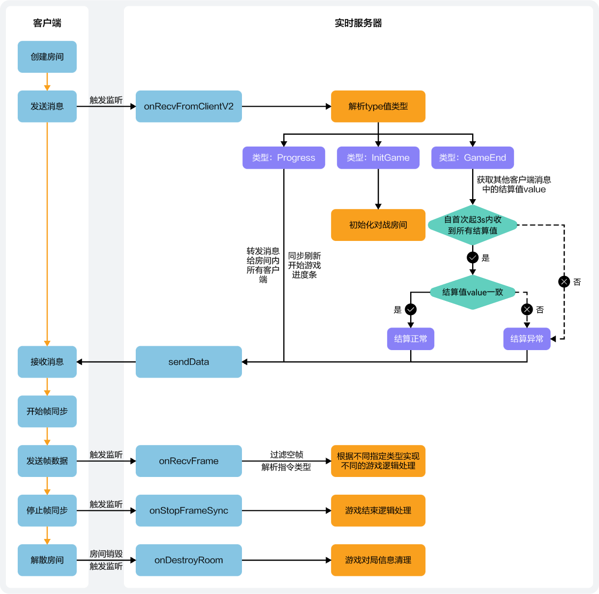

如下示例主要展示实时服务器与客户端交互等业务逻辑，具体内容请参见[示例代码](https://developer.huawei.com/consumer/cn/doc/games-samples/gameobe-samplecode-server-0000001630174649)。



* 当客户端创建房间后，通过发送消息接口将消息发送给实时服务器，实时服务器通过onRecvFromClientV2接口接收到消息，通过解析type值判断游戏状态并实现相关游戏逻辑。
  + 当type值为InitGame时，实时服务器会初始化对战房间。
  + 当type值为Progress时，实时服务器会将消息转发给房间内所有客户端，并同步刷新房间内玩家开始游戏的进度条。
  + 当type值为GameEnd时，实时服务器将获取客户端的结算值value，同样也会获取其他客户端的结算值value，根据结算值比对进行结算状态判断，并通过sendData方法通知所有客户端。
    - 自首次收到结算值起，3s内若未收到所有玩家的结算值，则直接判断当前为“结算异常”状态。
    - 自首次收到结算值起，3s内收到所有玩家的结算值，则会根据结算值比对进一步判断当前结算状态。
      * 结算值value一致时，则当前为“结算正常”状态。
      * 结算值value不一致时，则当前为“结算异常”状态。
* 当客户端开始帧同步后发送帧数据时，实时服务器通过onRecvFrame接口接收到帧数据，在过滤空帧后进一步解析指令类型，以实现不同的游戏逻辑处理。
* 当客户端停止帧同步时，实时服务器通过onStopFrameSync接口监听到帧同步停止事件后，则会实现游戏结束逻辑处理。
* 当客户端解散房间时，实时服务器通过onDestroyRoom接口监听到房间销毁事件后，则会对游戏对局信息进行清理。

实时服务器Demo新增框架目录如下：

```
├── realtime-server-demo   // 实时服务器Demo
     └──Game.ts          // 游戏主要逻辑
     └──GameManage.ts     // 游戏对局管理
     └──GameInterface.ts   // 接口定义
```
