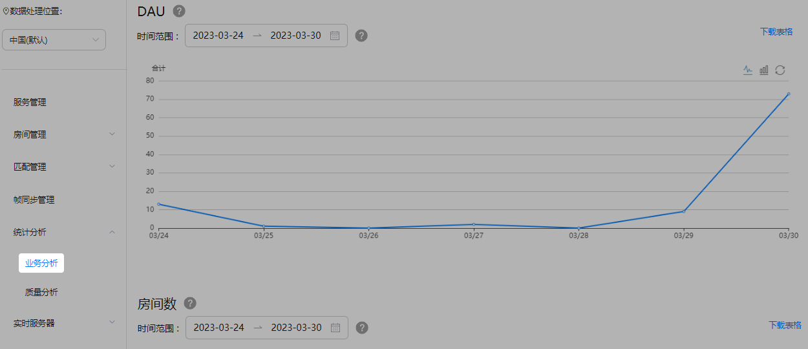
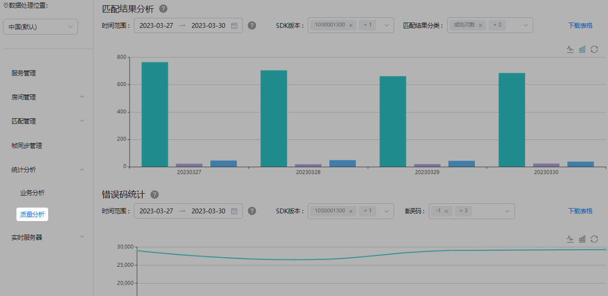
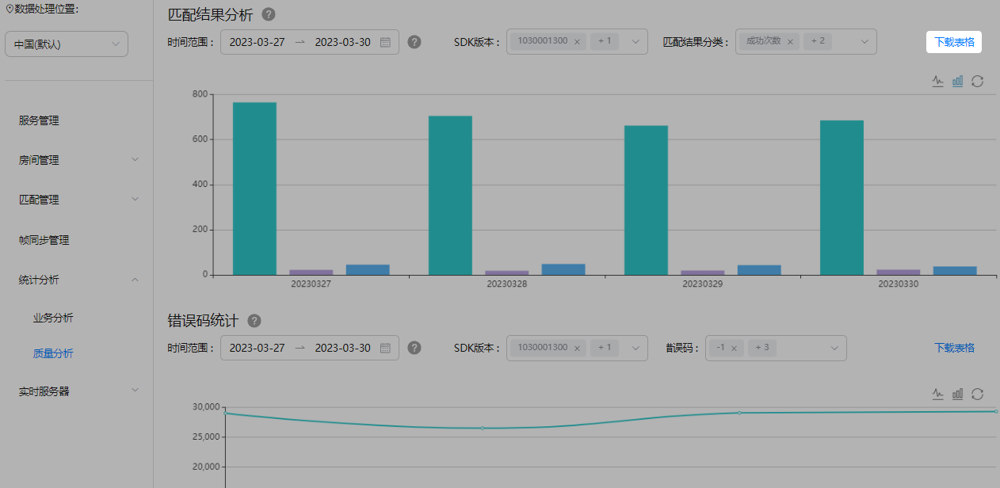

联机对战服务使用后，AGC控制台会自动统计DAU、房间数、用户停留时长、匹配结果、错误码、登录成功率以及延时趋势等数据。您可以通过查看相关数据统计图，了解联机对战服务的使用效果。

## 前提条件

* 您的应用已集成联机对战SDK（[JS](https://developer.huawei.com/consumer/cn/doc/games-guides/gameobe-integratingsdk-js-0000002361670432)丨[C#](https://developer.huawei.com/consumer/cn/doc/games-guides/gameobe-integratingsdk-csharp-0000002395350421)）。
* 您已[开通联机对战服务](https://developer.huawei.com/consumer/cn/doc/games-guides/gameobe-enable-0000002395350369)。

## 数据查看

1. 登录[AppGallery Connect](https://developer.huawei.com/consumer/cn/service/josp/agc/index.html)，点击“开发与服务”。
2. 在项目列表中找到您的项目，并在项目下的应用列表中选择您的游戏应用。
3. 在左侧导航栏中选择“构建 &gt; 联机对战服务”或点击左上角搜索“联机对战服务”，进入联机对战服务页面。
4. 选择“统计分析”，您可根据使用需要，前往“[业务分析](#section34990115459)”或“[质量分析](#section9998151171610)”页面查看相关数据统计报表。

### 业务分析

在“业务分析”页面，您可以看到DAU、房间数和用户停留时长数据统计图。通过左上角的时间筛选框，您可以选择查看当前日期（不含）前最长30天跨度的数据。

| 数据 | 说明 |
| --- | --- |
| DAU | 每日活跃用户数量统计，按照playerID去重。 |
| 房间数 | 每日房间使用量统计。 |
| 用户停留时长 | 玩家加入房间到离开房间的平均时长。 |

### 质量分析

在“质量分析”页面，您可以看到匹配结果、错误码、登录成功率、时延趋势数据统计图。通过左上角的时间筛选框，您可以选择查看当前日期（不含）前最长30天跨度的数据。

| 数据 | 说明 |
| --- | --- |
| 匹配结果分析 | 在线匹配/组队匹配过程中，玩家匹配成功、匹配失败以及取消匹配的次数统计。  说明：  在在线匹配/组队匹配时，如果等待时间较长，可能会导致玩家匹配超时或取消匹配，建议您通过添加机器人/缩短匹配时间等方式提升用户体验。 |
| 错误码统计 | 联机对战SDK错误码次数统计。  说明：  使用JS SDK集成13.1.1.300及以上版本、C# SDK集成13.0.1.300及以上版本，可支持错误码数据统计。 |
| 登录成功率 | 端侧登录的成功率统计。  说明：  使用JS SDK和C# SDK集成13.1.1.300及以上版本，可支持端侧登录成功率数据统计。 |
| 时延趋势 | 客户端下行报文和服务器之间的延时平均值。  说明：  使用JS SDK和C# SDK集成13.1.1.300及以上版本，可支持端侧登录成功率数据统计。 |

## 报表导出

如需下载统计数据，可通过点击页面右上角的“下载表格”，将报表导出保存到本地。

当前，下载表格中的统计结果，为已指定“时间范围”内所有SDK版本打点上报的指标及其统计数据。

