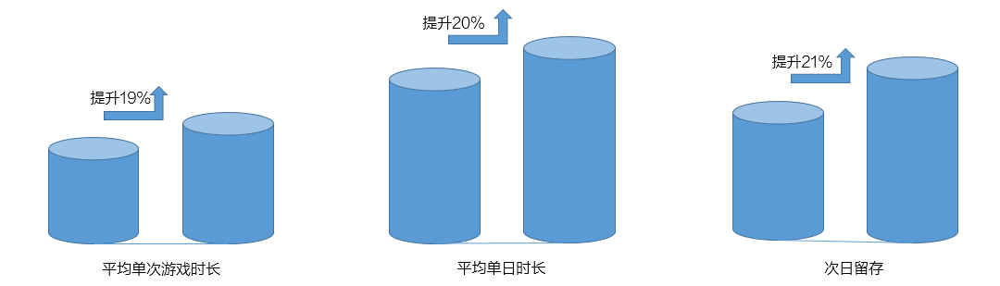

## 客户需求

作为一款策略性游戏，《火柴人战争》操作简单，老少咸宜。开发者团队希望在原有的单机模式下，新增竞技的玩法，以增加游戏的趣味性，同时提升游戏活跃度。

## 华为解决方案

华为游戏中心推出的联机对战服务，则为开发团队解决了这一难题。推出“联机”模式后，《火柴人战争》玩家之间可以通过联机的方式进行竞技，加入联机对战玩法后的用户平均单次游戏时长提升了19%，平均单日时长提升了20%，次日留存也提升了21%，社区热度也有明显提升。

