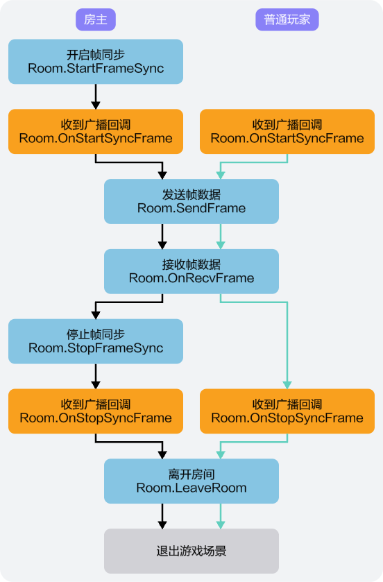

您可以通过调用联机对战服务相关接口，实现帧同步，保证端与端之间的稳定通信。同时，联机对战服务还提供了两种补帧方式，可用于补帧相关使用场景。

## 前提条件

玩家已进入房间。

## 帧同步



玩家进入房间后，可通过如下相关接口，实现帧同步。

1. 玩家通过创建或加入房间操作进入游戏房间后，获得room实例，且实现[Room.OnStartSyncFrame](https://developer.huawei.com/consumer/cn/doc/games-references/gameobe-room-csharp-0000002395196057#ZH-CN_TOPIC_0000002395196057__p06041922181714)、[Room.OnStopSyncFrame](https://developer.huawei.com/consumer/cn/doc/games-references/gameobe-room-csharp-0000002395196057#ZH-CN_TOPIC_0000002395196057__p7915134291712)、[Room.OnRecvFrame](https://developer.huawei.com/consumer/cn/doc/games-references/gameobe-room-csharp-0000002395196057#ZH-CN_TOPIC_0000002395196057__p17555155514183)委托，分别用于接收帧同步开始通知回调、帧同步停止通知回调和帧同步信息回调。

   ```
   // 添加帧同步开始通知回调
   Global.Room.OnStartSyncFrame = () => { // 通过Global类的Room属性获取Room对象，绑定监听事件
   // 接收帧同步开始通知，处理游戏逻辑
   };

   // 添加帧同步停止通知回调
   Global.Room.OnStopSyncFrame = () => { // 通过Global类的Room获取Room对象，绑定监听事件
   // 接收帧同步停止通知，处理游戏逻辑
   };

   // 添加接收帧同步信息回调
   Global.Room.OnRecvFrame = (msg) => { // 通过Global类的Room属性获取Room对象，绑定监听事件
     // 处理帧数据msg
   };
   ```
2. 通过调用[Room.StartFrameSync](https://developer.huawei.com/consumer/cn/doc/games-references/gameobe-room-csharp-0000002395196057#section1231911283719)方式开启帧同步，开启帧同步后，房间内其他玩家将从[Room.OnStartSyncFrame](https://developer.huawei.com/consumer/cn/doc/games-references/gameobe-room-csharp-0000002395196057#ZH-CN_TOPIC_0000002395196057__p06041922181714)委托中收到帧同步开始通知，联机对战服务将会按固定帧率向该房间内所有玩家广播帧数据信息。

   ```
   // 开启帧同步
   Room room = Global.Room; // 通过Global类的Room属性获取Room对象
   Room.StartFrameSync(response =>
   {
   	// 开始帧同步
   });
   ```
3. 帧同步开始后，房间内玩家可通过[Room.SendFrame](https://developer.huawei.com/consumer/cn/doc/games-references/gameobe-room-csharp-0000002395196057#section142231447462)方法向联机对战服务端发送游戏操作数据，房间内其他玩家将从[Room.OnRecvFrame](https://developer.huawei.com/consumer/cn/doc/games-references/gameobe-room-csharp-0000002395196057#ZH-CN_TOPIC_0000002395196057__p17555155514183)委托中收到房间内操作玩家的帧数据信息。

   ```
   // 发送帧数据，房间内玩家可通过该方法向联机对战服务端发送帧数据
   string[] frameDatas = new string[] { frameData };
   Room room = Global.Room; // 通过Global类的Room属性获取Room对象
   Room.SendFrame(frameDatas, response => {});
   ```
4. 通过调用[Room.StopFrameSync](https://developer.huawei.com/consumer/cn/doc/games-references/gameobe-room-csharp-0000002395196057#section373813363816)方法停止帧同步，其他玩家将从[Room.OnStopSyncFrame](https://developer.huawei.com/consumer/cn/doc/games-references/gameobe-room-csharp-0000002395196057#ZH-CN_TOPIC_0000002395196057__p7915134291712)委托中收到帧同步停止通知。

   ```
   // 向联机对战后端发送停止帧同步请求
   Room room = Global.Room; // 通过Global类的Room属性获取Room对象
   Room.StopFrameSync(response => {
   	// 停止帧同步;
   });
   ```

## 补帧方式

在游戏过程中，可通过“[自动补帧](#section367473210212)”或“[手动补帧](#section102576506211)”两种方式进行补帧，用于掉帧后补帧或游戏回放等特定场景。

### 自动补帧

SDK提供了自动补帧的能力，如果您在AGC控制台已[开启了自动补帧](/docs/dev/game-dev/gameobe-framesync-management-0000002395350373#section9730102310199)（默认开启）功能，当玩家发生掉线状况后重新加入到原游戏中，SDK识别到帧数不连续，客户端会自动发起请求进行补帧。

### 手动补帧

除SDK自动补帧方式外，还可以通过手动方式进行补帧。


如果您使用手动补帧方式，需前往AGC控制台确认[自动补帧功能已关闭](/docs/dev/game-dev/gameobe-framesync-management-0000002395350373#section9730102310199)，否则可能会导致补帧功能异常。

1. 如需手动补帧，可通过调用[Room.SendRequestFrame](https://developer.huawei.com/consumer/cn/doc/games-references/gameobe-room-csharp-0000002395196057#section155902554211)方法实现。

   ```
   int beginFrameId = 123; // 起始帧Id
   int size = 100; // 请求帧数
   Global.Room.SendRequestFrame(beginFrameId, size, response => {});
   ```
2. 手动补帧后，玩家可通过[Room.OnRecvFrame](https://developer.huawei.com/consumer/cn/doc/games-references/gameobe-room-csharp-0000002395196057#ZH-CN_TOPIC_0000002395196057__p17555155514183)监听接收帧信息。

   ```
   // 添加接收帧同步信息回调
   Global.Room.OnRecvFrame = (msg) => { // 通过Global类的Room属性获取Room对象，绑定监听事件
     // 处理帧数据msg
   };
   ```
3. 当手动补帧失败时，玩家可通过[Room.OnRequestFrameError](https://developer.huawei.com/consumer/cn/doc/games-references/gameobe-room-csharp-0000002395196057#ZH-CN_TOPIC_0000002395196057__p7118042001)监听接收到补帧失败的结果。

   ```
   // 添加接收帧同步信息回调
   Global.Room.OnRequestFrameError= response => this.OnRequestFrameError(response);

   private void OnRequestFrameError(BaseResponse response){
     // 处理帧请求补帧失败结果
   }
   ```
