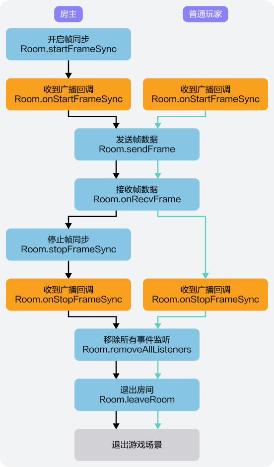

您可以通过调用联机对战服务相关接口，实现帧同步，保证端与端之间的稳定通信。同时，联机对战服务还提供了两种补帧方式，可用于补帧相关使用场景。

## 前提条件

玩家已进入房间。

## 帧同步



玩家进入房间后，可通过如下相关接口，实现帧同步。

1. 玩家通过创建或加入房间操作进入游戏房间后，获得room实例，且实现[Room.onStartFrameSync](https://developer.huawei.com/consumer/cn/doc/games-references/gameobe-room-js-0000002395195985#section78275211657)、[Room.onStopFrameSync](https://developer.huawei.com/consumer/cn/doc/games-references/gameobe-room-js-0000002395195985#section95221436957)、[Room.onRecvFrame](https://developer.huawei.com/consumer/cn/doc/games-references/gameobe-room-js-0000002395195985#section82186813610)回调方法，分别用于接收帧同步开始通知回调、帧同步停止通知回调和帧同步信息回调。

   ```
   // 添加帧同步开始通知回调
   global.room.onStartFrameSync(() => {
     // 接收帧同步开始通知，处理游戏逻辑
   });

   // 添加帧同步停止通知回调
   global.room.onStopFrameSync(() => {
     // 接收帧同步停止通知，处理游戏逻辑
   });

   // 添加接收帧同步信息回调
   global.room.onRecvFrame((msg: RecvFrameMessage || RecvFrameMessage[]) => {
     // 处理帧数据msg
     if (Array.isArray(msg)) {
        // 处理补帧数据
    }else {
        // 处理实时帧数据
    }
   });
   ```
2. 通过调用[Room.startFrameSync](https://developer.huawei.com/consumer/cn/doc/games-references/gameobe-room-js-0000002395195985#section1231911283719)方式开启帧同步，开启帧同步后，房间内其他玩家将从[Room.onStartFrameSync](https://developer.huawei.com/consumer/cn/doc/games-references/gameobe-room-js-0000002395195985#section78275211657)回调方法中收到帧同步开始通知，联机对战服务将会按固定帧率向该房间内所有玩家广播帧数据信息。

   ```
   // 开启帧同步
   global.room.startFrameSync();
   ```
3. 帧同步开始后，房间内玩家可通过[Room.sendFrame](https://developer.huawei.com/consumer/cn/doc/games-references/gameobe-room-js-0000002395195985#section142231447462)方法向联机对战服务端发送游戏操作数据，房间内其他玩家将从[Room.onRecvFrame](https://developer.huawei.com/consumer/cn/doc/games-references/gameobe-room-js-0000002395195985#section82186813610)回调方法中收到房间内操作玩家的帧数据信息。

   ```
   // 发送帧数据，房间内玩家可通过该方法向联机对战服务端发送帧数据
   global.room.sendFrame(frameData: string | string[]);
   ```
4. 通过调用[Room.stopFrameSync](https://developer.huawei.com/consumer/cn/doc/games-references/gameobe-room-js-0000002395195985#section373813363816)方法停止帧同步，其他玩家将从[Room.onStopFrameSync](https://developer.huawei.com/consumer/cn/doc/games-references/gameobe-room-js-0000002395195985#section95221436957)回调方法中收到帧同步停止通知。

   ```
   // 向联机对战后端发送停止帧同步请求
   global.room.stopFrameSync();
   ```

## 补帧方式

在游戏过程中，可通过“[自动补帧](#section1372814614564)”或“[手动补帧](#section1436652055611)”两种方式进行补帧，用于丢帧后补帧或游戏回放等特定场景。所有帧数据均含有补帧标识，可用于对于补帧数据的特殊处理。

### 自动补帧

SDK提供了自动补帧的能力，如果您在AGC控制台已[开启了自动补帧](https://developer.huawei.com/consumer/cn/doc/games-guides/gameobe-framesync-management-0000002395350373#section9730102310199)（默认开启）功能，当玩家发生掉线状况后重新加入到原游戏中，SDK识别到帧数不连续，客户端会自动发起请求进行补帧。

### 手动补帧

除SDK自动补帧方式外，还可以通过手动方式进行补帧。


如果您使用手动补帧方式，需前往AGC控制台确认[自动补帧功能已关闭](https://developer.huawei.com/consumer/cn/doc/games-guides/gameobe-framesync-management-0000002395350373#section9730102310199)，否则可能会导致补帧功能异常。

1. 如需手动补帧，可通过调用[Room.requestFrame](https://developer.huawei.com/consumer/cn/doc/games-references/gameobe-room-js-0000002395195985#section155902554211)方法实现。

   ```
   const beginFrameId = {beginFrameId}; // 起始帧ID
   const size = {size};         // 请求帧数
   global.room.requestFrame(beginFrameId,size);
   ```
2. 手动补帧后，玩家可通过[Room.onRecvFrame](https://developer.huawei.com/consumer/cn/doc/games-references/gameobe-room-js-0000002395195985#section82186813610)监听接收帧消息。

   ```
   global.room.onRecvFrame((msg) => {
     // 处理帧消息，做相关游戏处理逻辑
   })
   ```
3. 当手动补帧失败时，玩家可通过[Room.onRequestFrameError](https://developer.huawei.com/consumer/cn/doc/games-references/gameobe-room-js-0000002395195985#section059433420611)监听接收到补帧失败的结果。

   ```
   global.room.onRequestFrameError((error) => {
     // 补帧失败，做相关游戏处理逻辑
   })
   ```
