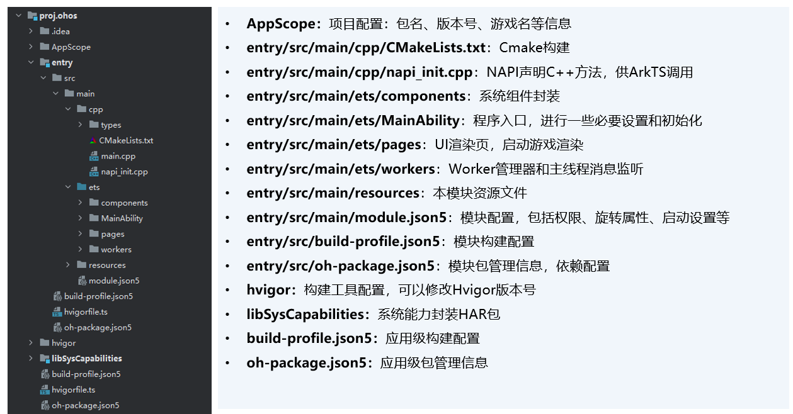

将对应引擎版本中适配HarmonyOS 5.0及以上的相关代码增量合入开发者游戏引擎，主要涉及如下：

* 增加HarmonyOS 5.0及以上平台的宏定义。
* audio、base、platform等模块涉及平台分支的部分做HarmonyOS 5.0及以上系统的适配。
* lua-bindings/spidermonkey脚本适配（Lua工程、JS工程涉及）。
* HarmonyOS 5.0及以上平台的三方库。
* CMakeList中添加新增文件及三方库目录路径、链接HarmonyOS 5.0及以上平台的三方库及系统库等。
* 游戏语言（C++/Lua/JS）相应引擎样例工程拷贝到项目工程下（通常与其他平台同一目录），工程结构如下：

  
