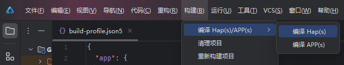
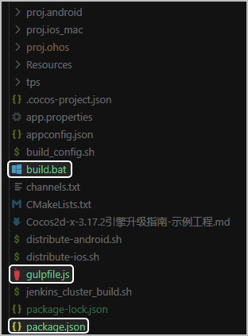
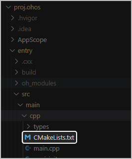

HarmonyOS 5.0及以上的HAP包需要通过DevEco工程构建，因此您需要为游戏生成对应的DevEco工程。

您可以[在DevEco Studio中构建HAP包](#section410919387581)，或者[通过工程构建工具](#section827164516582)自动在Cocos游戏工程下生成HarmonyOS 5.0及以上工程。

## 方式一：在DevEco Studio中构建HAP包（推荐）

在DevEco Studio顶部菜单栏选择“构建 &gt; 编译 Hap(s)/APP(s) &gt; 编译Hap(s)”。



将在如下路径下生成两种HAP包。

```
模块名/build/outputs/default/模块名-default-signed.hap
```

两种HAP包区别如下：

| HAP包类型 | 开发模式 | 是否需要配置签名 |
| --- | --- | --- |
| \*-unsigned.hap | Debug模式 | 无需配置签名。  编译后自动生成未签名包。 |
| \*-signed.hap | Release模式 | 需要配置签名。  在配置签名后生成签名包。 |

## 方式二：在Windows上使用工程构建工具

你可以通过工程构建工具自动在Cocos游戏工程下生成HarmonyOS 5.0及以上工程。

### 操作步骤

1. 下载[OpenHarmony工程构建工具.zip](https://alliance-communityfile-drcn.dbankcdn.com/FileServer/getFile/cmtyPub/011/111/111/0000000000011111111.20260424184840.98467474012236452408894341584813%3A20260603103802%3A2800%3A81E2ED92975E3ACB64DEBBF149E2ED8C2AF599FBC7E69EEC53479FE14F4FC9A9.zip?needInitFileName=true)，并解压到本地。

   

   该工程构建工具暂不支持Mac。
2. 将工具包中的**build.bat**、**gulpfile.js**、**package.json**放至游戏工程同级目录下。

   
3. 以文本方式打开**build.bat**，修改如下参数的值。

   ```
   ::设置本地cocos引擎cpp-tests或lua-tests模板路径
   set tempPath=D:\***\cocos2d-x-3.17.2-ohos\tests\cpp-tests

   ::设置HarmonyOS工程的生成路径
   set openHarmonyPath=D:\***-client\code\proj.ohos

   set buildMode=ab
   ```

   | 参数 | 说明 |
   | --- | --- |
   | **tempPath** | HarmonyOS适配代码中样例模板所在的本地路径，一般在tests目录下。  * 例如，您的游戏使用C++语言，则配置为cpp-tests的路径地址，如“D:\\*\*\*\cocos2d-x-3.17.2-ohos\tests\cpp-tests”。 * 例如，您的游戏使用Lua，则配置为lua-tests的路径地址，如“D:\\*\*\*\cocos2d-x-3.17.2-ohos\tests\lua-tests”。 |
   | **openHarmonyPath** | 生成的HarmonyOS工程的本地路径，例如，“D:\\*\*\*-client\code\proj.ohos”。 |
   | **buildMode** | 构建模式。  生成HarmonyOS工程请设置为“ab”。  buildMode的详细取值说明请参见[构建模式说明](#section31998554552)。 |
4. 根据游戏的实际情况，手动修改**.\proj.ohos\entry\src\main\cpp\CMakeLists.txt**游戏相关配置。如添加游戏相关三方库的链接、特殊的编译选项配置等。

   
5. 手动修改**.\proj.ohos\local.properties**中SDK路径配置。
   * **nodejs.dir**：Node.js的本地安装路径，可在DevEco工程的“File &gt; Settings &gt; Build, Execution, Deployment &gt; Node.js and npm”页面查看。
   * **hwsdk.dir**：HarmonyOS SDK的本地安装路径，可在“File &gt; Settings &gt; SDK”页面查看。
6. 双击运行**build.bat**。

   运行成功后在指定目录下查看生成的HarmonyOS 5.0及以上工程。

### 构建模式说明

| buildMode设置的值 | 实现的功能 |
| --- | --- |
| buildMode=a | 仅从引擎样例拷贝HarmonyOS 5.0及以上的工程。 |
| buildMode=b | 仅下载安装gulp依赖，执行gulpfile.js。 |
| buildMode=c | 自动签名，并且生成Hap包。 |
| buildMode=ab | 1. 从引擎样例拷贝HarmonyOS 5.0及以上的工程。 2. 下载安装gulp依赖，执行gulpfile.js。 |
| buildMode=bc | 1. 下载安装gulp依赖，执行gulpfile.js。 2. 自动签名，并且生成Hap包。 |
| buildMode=abc | 1. 从引擎样例拷贝HarmonyOS 5.0及以上的工程。 2. 下载安装gulp依赖，执行gulpfile.js。 3. 自动签名，并且生成Hap包。 |

### HarmonyOS 5.0及以上工程结构说明

在DevEco Studio中打开HarmonyOS 5.0及以上的工程，工程目录结构说明如下：


