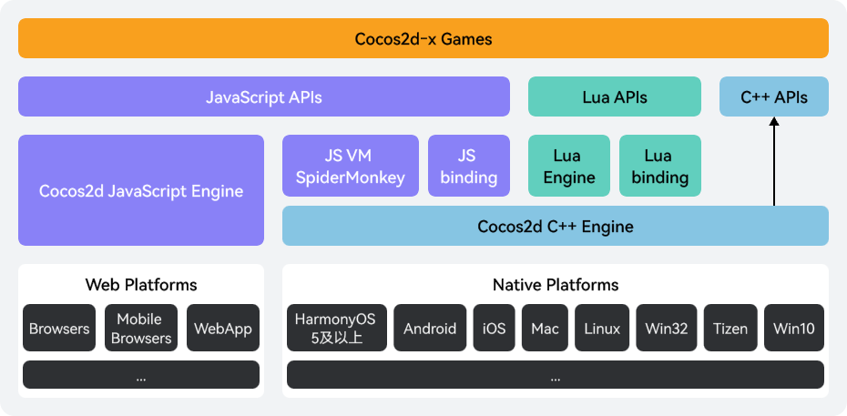

本文主要介绍基于Cocos2d-x架构的游戏适配HarmonyOS 5.0及以上系统的适配方案。

## 适配原理

Cocos2d-x引擎适配HarmonyOS 5.0及以上系统的工作主要集中在下图所示的Cocos2d C++ Engine，C++ APIs，Lua Engine，Lua binding，JS VM（SpiderMonkey），JS Binding、Native Platform（Open Harmony平台）等模块以及三方库适配上。

主要模块和原理参见下表：

| 模块 | HarmonyOS适配工作 |
| --- | --- |
| Cocos2d-x核心C++代码的适配 | 使用HarmonyOS NDK重新编译。 |
| Cocos2d-x依赖的部分三方开源库的适配 | 使用HarmonyOS NDK重新编译。 |
| Cocos2d-x对接的系统接口的HarmonyOS适配 | * HarmonyOS NDK提供了C++的系统接口，可在C++层直接调用。 * HarmonyOS NDK只提供了JS的系统接口，使用HarmonyOS的NAPI框架对接。 |
| Lua引擎的适配 | 使用HarmonyOS NDK重新编译。 |
| JS引擎的适配 | Cocos2d-x预置了Spider Monkey这个JS引擎，而HarmonyOS上要使用ArkJs引擎。Cocos2d-x的JS游戏其本质是JS游戏业务逻辑代码通过调用Cocos2d-x C++层的渲染、物理、音频、视频等能力接口来运行。在不同的JS引擎下，JS调用C++接口的实现方案不同，需要针对ArkJs做专门的适配。 |

## 适配流程

Cocos2d-x游戏适配HarmonyOS 5.0及以上的流程如下：

| 序号 | 操作 | 说明 |
| --- | --- | --- |
| 1 | [适配准备](/docs/dev/game-dev/games-2dx-preparation-0000002255894088) | 为了顺利适配HarmonyOS 5.0及以上系统，您需提前做好一些准备工作。 |
| 2 | [游戏适配](/docs/dev/game-dev/games-2dx-works-0000002314916974) | 包括引擎适配、游戏代码适配、系统能力适配在内的适配工作。 |
| 3 | [隔离三方SDK代码](/docs/dev/game-dev/games-2dx-isolate-third-library-0000002296285206) | 对游戏内使用的SDK进行隔离（拆分），去掉不支持的SDK。 |
| 4 | [三方库适配](/docs/dev/game-dev/games-2dx-adapt-third-library-0000002290527381) | 将游戏内的三方库针对HarmonyOS 5.0及以上系统进行编译。 |
| 5 | [构建发布工程](/docs/dev/game-dev/games-2dx-release-0000002255894092) | 在Cocos2d-x引擎中构建出游戏的HarmonyOS 5.0及以上的工程。 |
| 6 | [运行调试](/docs/dev/game-dev/games-2dx-run-0000002255997160) | 运行并调试游戏的功能和性能，并前往AppGallery Connect提交上架申请。 |
